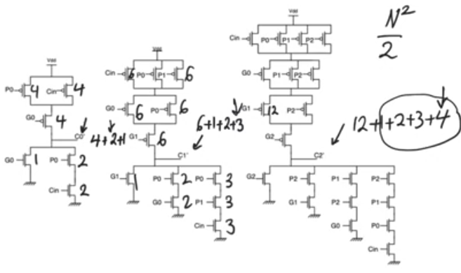
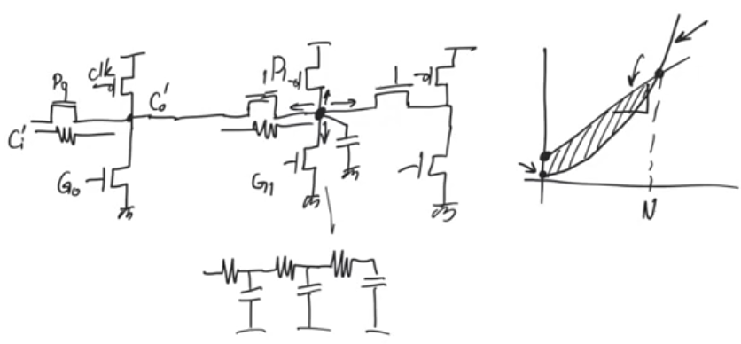

# Lookahead adder

## Introduction
- In the generate propagate logic we had an expression of C0 (the first carry out) in terms of Cin (the input carry), G and P
    - C0 = G0 + P0 Cin
- and an expression for C1 in terms of C0, C1 = G1 + P1 C0
- so we can substitute C0 from the first equation to get C1 in terms of Cin
    - C1 = G1 + P1 (G0 + P0 Cin) = G1 + G0 P1 + P0 P1 Cin
    - This expression of C1 doesn't contain anything that is not ready at time = 0
- same with C2 ... Cn 
- At any carry position the expression for that carry out can be calculated using inputs that are all available at time = 0 
- so we finally have an adder whose delay doesn't depend on the number of input bit N

- This is misleading cause each expression is larger so its delay is longer, we are basically recalculating all previous carries instead of waiting for the previous result
- so the delay of the lookahead adder increases quadratically with the number of bits

## Lookahead adders with manchester carry path
- If we used manchester carry chain, removing the buffers, the delay will be quadratic like an RC ladder 
- but good thing about machester chain is that it's very simple, so it has a low y intercept
- so for very low number of bits the delay will be small, but for large number of bits the slope is more important
- so for some interval of N, manchester carry chain without intervening buffer has some appeal cause of its simplicity

## Lookahead practically
- Used in large adders in which case we divide the adder into sections of K bits each 
- then use a lookahead adder to calculate the carry out from the very last position, and a ripple carry adder to handel the rest of the K bits
- so the next block doesn't have to wait for the input from the whole ripple carry adder for the next block to start calculating.
- lookahead adders can be used to speed up large adders with larger number of bits by calculating the carryout from certain bit positions to allow the adder to start calculating in later bit positions sooner

