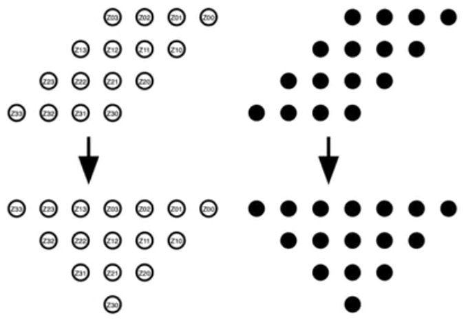
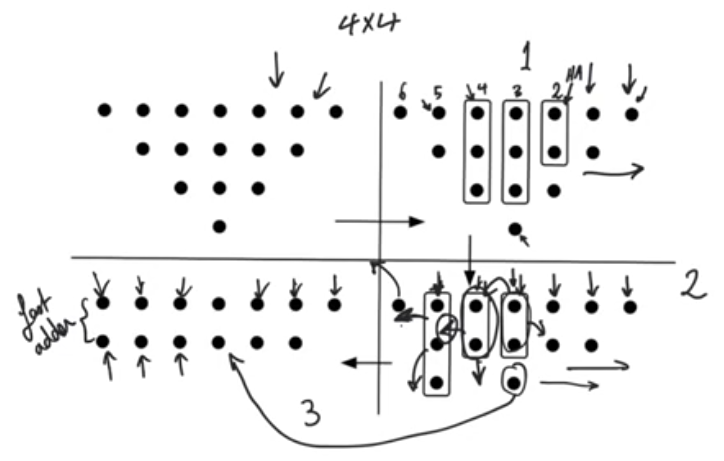
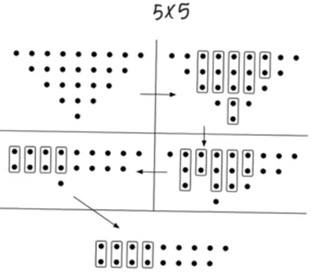
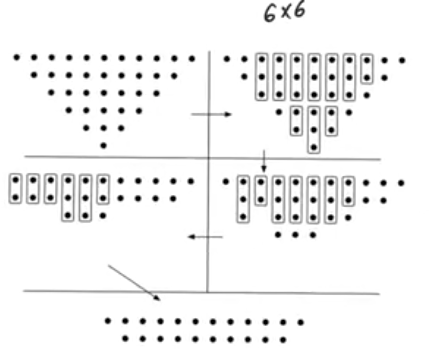

# Wallace tree mutliplier
source [this](https://www.youtube.com/playlist?list=PLyWAP9QBe16qnuE-nw0RkUq0IwRkzqyhD) playlist on arithmetic circuits.

## Introduction
- Majority of effort expanded in multipliers is expanded in combining the summands to produces the product
- partial products have to be combined at every bit position using either half adder or full adder
- It doesn't matter the order of combining the bits in every bit position, you should add all the bits in the current bit position and that's all that we care about
- How can we combine all of these bits so we can end up with one product word at the end in the least number of steps possible
    - using the only two available tools the half adder (2:2 compressor) and the full adder a (3:2 compressor)
- so you can restate the mutliplication operation in terms of how to achieve maximum coverage of partial products inorder to reach a final product
    - the labeling on the partial products is not important
    - solid dots either present partial products or carry outs that came from previous bit positions

## Wallace tree
- Approach to combine the bits to combining the bits which gives a fast multiplier, faster than the array multiplier
- At every step it's gonna use the maximum number compressors to cover the maximum number of bits that it can cover
    - if it has 2 bits available it's gonna use a half adder
    - 3 bits available it's gonna use a full adder
    - 5 bits, a half adder and a full adder and so on
- it'll only stop once every position has only two bits remaining

### Example
- If we have 2 bits and everything before it only has 1 bit we don't use an adder.
- If we have 3 bits and everything before it only 1 or 2 bits we use half adder
- the reason why we didn't use HA or FA in some location is that it would have been redundant, as at the end all the results is gonna be fed to a fast adder so we keep 2 bits every operation

## Delay
- The delay is controlled by the number of steps we have to go through before we endup with only two bits in every bit position
- All these compression operations are being done in parallel, so the only the number of steps that really matter
- we start with r0=number of bits of the multiplier r0=N
- then we start calculating rj+1, r1,r2 and so on
- we stop when r=2, at that point j is the number of steps we have to take
- for r0=4, r1=3, r2=2, then we have two steps which can be confirmed from the figure
- the delay grows logarithmically but it's not log base 2
    - it's not linear, and it's not log2(n)
    - but it's definitely faster than an array multiplier

