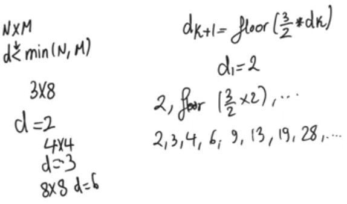
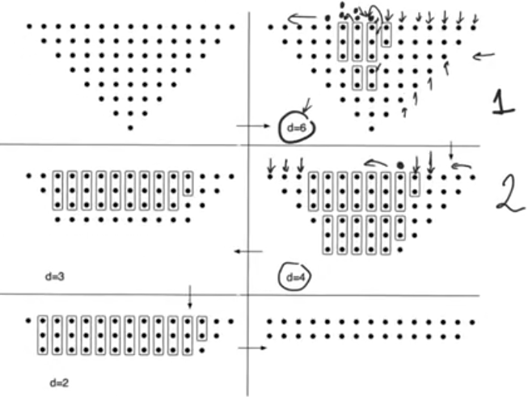

# Dadda multipliers
source [this](https://www.youtube.com/playlist?list=PLyWAP9QBe16qnuE-nw0RkUq0IwRkzqyhD) playlist on arithmetic circuits.

## Introduction
- One major critisim of [wallace tree mutlipliers](11-wallace-tree-multiplier.md) is area,
    - cause it tends to cover as many bits as possible at every single step without any attention to area or the number of full adders and half adders used.
    - which tends to produce very large multipliers
- Dadda multipliers are a similar alternative which don't aim to cover the maximum number of bits at a single step, so they might leave some possibility uncovered
    - It's aim is to preserve the same number of steps as the wallace tree multipliers while reducing the number of full adders and half adders used
    - The algorithm in determening the number of half adders and full adders is alot more complicated
    - It's alot more complicated to determine how to perform coverage

## Dadda mutliplier
- It begins with a certain sequence of integers that can be determined using
    - `dk+1 = floor( (3/2) dk)` , and `d1 = 2`
    - similar to wallace tree multipliers sequence because both have to do with the full adders being 3:2 compressors
    - Fixed number of sequence that don't have to be calculated everytime and can be stored
- For an NxM multipliers we choose d<min(N,M), d is smaller than the smallest between N and M

## Algorithm
- We start with d calculated above, (`d=6` in case of 8x8 multiplier)
- We visit the bit positions from the LSB going forward to MSB,
- At every bit position if the number of bits is less than `d` we move on
- If the number of bits = d+1 we use a single half adder to compress the d+1 bits into d bits, then we move on
- If we have more than d+1 bits we use a full adder to compress, we push the carry bit to the next bit position, and keep the sum bit at the current bit position
    - If we still have more than d+1 bit we use another full adder,
    - if we still have more we keep using full adders,
    - If we only have d+1 bits we only use a half adder.
    - and then we move on.
- so we don't move on until the particular bit positon has only d bits left
- Once we reach the MSB we use the next smaller d in the sequence of numbers,
- we keep going until we reach d=2

### Example of 8x8 multiplier
- In step 1, d=6, we don't use adders till the 7th column
    - Use a half adder in the 7th column, it produces a sum and a carry to the 8th column
    - The 8th column has 8 bits and 1 carry bit so it has now 9 bits so we use a full adder and a half adder to compress the count to 6 bits
    - The 8th column gave two carry outs to the 9th column which started out with 7 bits, so it has now 9 bits so we use a full adder and a half adder
    - The 9th column gave two carry outs to the 10th column so it now has 8 bits, so we use a full adder
    - The 10th column gave 1 carry to the next bit position and we end up with 6 bits = d so we don't use adders and nothing happens till we reach MSB
- In step 2 we use the next lower d=4 and we use the same algorithm, and same for steps 3, 4
- Finally we end up with two words, at every bit position there are only two bits
    - Therefore we can feed them to a fast adder that produces final product
- The number of steps in the dadda multiplier is equal to the number of steps in wallace tree multiplier but the number of full adders and half adders used is smallers

