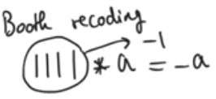
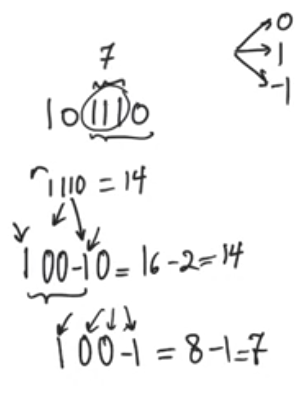
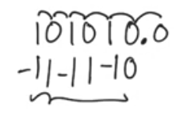
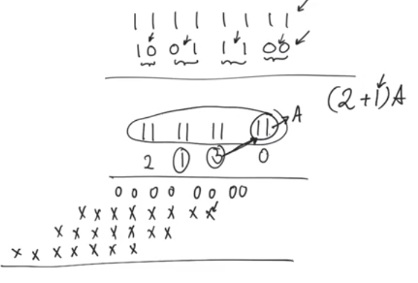
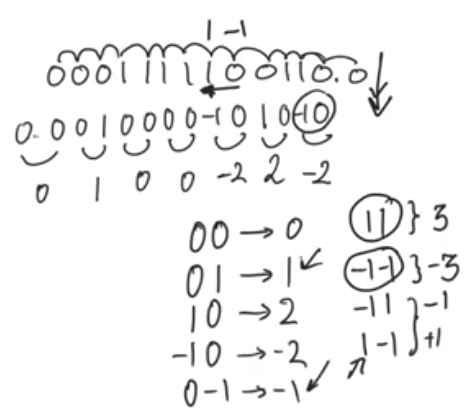

# Booth recoding
source [this](https://www.youtube.com/playlist?list=PLyWAP9QBe16qnuE-nw0RkUq0IwRkzqyhD) playlist on arithmetic circuits.

## Introduction
- The difference between a full multiplier and a constant multiplier is that there are specific mutliplier operands were particularly easy to multiply by
- specifically those multiplier operands that are powers of two like 4,16,32, ...
    - The reason these operands are particularly easy is that they only have a single 1 and the remainder of their bits is null (0)
    - So when we expand the summands we find that we only have one active summand and the rest are trivial,
    - so we don't have to do any additions, we end up shifting the mutlipland by as many bits as the active bit location in the multiplier
    - This happens when we have long string of zeros in the multiplier operand which allows us to trivialize most of the summand

## Booth recoding algorithm
- Allows us to benefit from long strings of ones not just zeros
- The worst case in a multiplier is to be all ones (all M bits are ones), cause that means it has all active summands
    - The hard way is to add the multiplicand M shifted times as a summand
    - The easy way is to recognise that all ones simply means -1 in twos complement, and the result of this is simply (- the multiplicand)
- The booth recoding algorithm recognizes that long strings of ones can be represented in two's complement as -1
- It utilizes this by recoding multiplier operand to remove long strings of ones and reduces them to long strings of zeros
- This can also be applied if the long strings of ones are in the middle of the multiplier and even if we are using unsigned numbers

### Example of ones in the middle
- 101110 have 111 in the middle = 7, in thier position 1110 = 14
- 1110 can be recoded so that the higher bit position = 1, then we have 00 and -1 at the LSB of the string of one then the last zero 0 (100-10)
- now we are using not a binary but a trinary representation of numbers where each bit can be represented as -1, 0, 1
- This is useful because we have reduced the number of the active ones in the multiplier operand by compressing the sequence of ones into a sequence of -1,0,1

## Recoding systematically
- Cover overlapping pairs of bits within the multiplier operand
- whenever you see 00 you interpret this as a zero
    - 01 you interpret this as a 1
    - 10 you interpret this as a -1
    - 11 you interpret this as a 0
- we always begin by adding a zero before the binary point even if the number is purely integer
- we look at the pairs of bits, and we always look at each bit twice
- if you don't have enough bits on the MSB side you should sign extend so that you have an even number of bits
- Why does this translation makes sense?
    - if we see a 00 in the pairs of bits that means we are moving through a string of zeros, therefore that gets interpreted as a zero
    - if we see a 01 means we are exiting the string of ones, and according to the example, when you are exiting the string of ones, you have to add a one at the highest MSB to compensate for the -1 at the LSB, therefore that gets interpreted as a one
    - if we see a 10 in the pairs of bits that means we are Entring the string of ones, which means you add a -1 to the LSB
    - if we see a 11 means we are within a string of ones, which after booth recoding it's reinterpreted as a string of zeros, so pairs of ones are interpreted as a zero
- We add a zero before the binary point cause if you have a 1 as a LSB you need a 0 before it to allow you to interpret properly

## Worst case
- Without booth recoding the worst case was all ones, but now it's nearly the best case after all zeros
- The worst case with booth recoding is if you have alternating ones and zeros
- We end up with more nontrivial summands than we had in the origianl operand
- This means the booth recoding doesn't always work to reduce the number of non trivial summands
- But statistically it'll work, cause in large number it's alot less likely to see numbers with alternating ones and zeros then to see blocks of zeros and blocks of ones

# Modified Booth recoding

## Introduction
- Mutliplying N bits multiplier by M bits multiplicand
- Convert radix 2 multiplicands (M bits) to radix 4 (becomes M/2 bits)
- Using this we can reduce the number of summands that we produce out of multiplication, which could greatly influence the complexity of the multiplier
- in the multiplication instead of shifting the summands one bit to the left we shift 2 bits to the left
- Instead of having M summands we now have M/2 summands which reduces the number of additions that we have to use
- There is a hidden complexity which is the complexity of calculating the partial products
    - in the example multiplying by 3 is equivalent to shifting then adding
    - which means that we are implicitly within calculating the partial products, we are doing another summand addition
    - so we haven't actually reduced the complexity of anything
- On the other hand if we first encode the multiplicand operands then we reach something very useful called the modified booth algorithm

## Modified booth algorithm
- Do normal booth recoding
- Take pairs of bits without overlapping and do sign extend if needed, and convert to radix 4
- The possibilties that comes from covering pairs of bits here are 0, -1, -2, 2
    - `0` trivial
    - `-1` two's complement
    - `2` shift to the left
    - `-2` shift to the left and a two's complement
- So you don't need to calculate partial productes that are any more complicated than the partial products you normally calculate
- The rest of the cases can never be seen if you do booth recoding first
    - you can't see a -1-1 because -1 means you are entring a string of ones, so you can't enter another string of ones without exiting the first one 
    - you can't see a 11 because 1 means you are exiting a string of ones, so you can't exit another string of ones without entering. 

