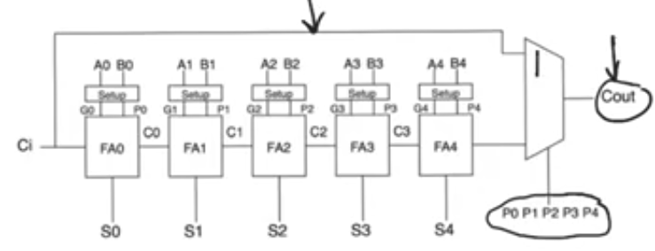
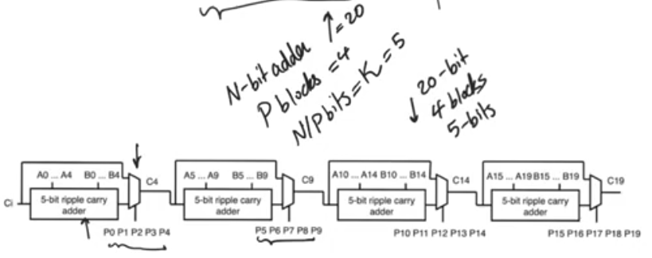
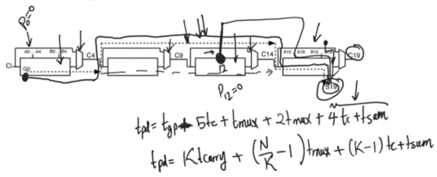
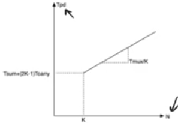
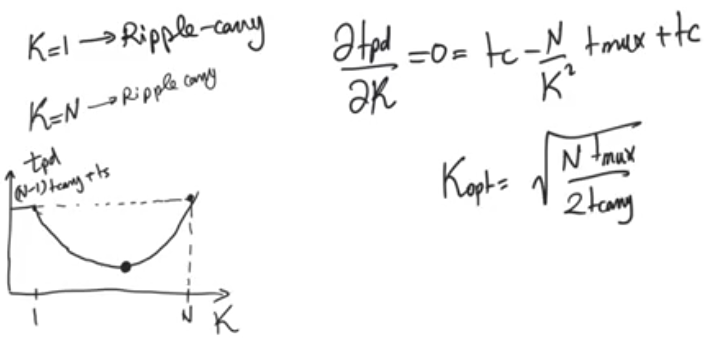

# Carry bypass adder
source [this](https://www.youtube.com/playlist?list=PLyWAP9QBe16qnuE-nw0RkUq0IwRkzqyhD) playlist on arithmetic circuits.

## Ripple carry adder
- Ripple carry adder is an adder whose delay increased in an order of N O(N)
- The delay is linearly dependant on the number of bits

## Introduction
- Carry bypass adder wouldn't be possible without the [generate propagate logic](generate-propagate.md)
- makes a very simple observation
    - if we have an N-bit adder, the final carry out doesn't have to be calculated if every bit position within the adder is propagating 
    - Carry out doesn't have to be calculated and can be bypassed from Carry in
- so we can multiplex the Cout's source to be from Cin if all bit postitions are propagating
- it's still a ripple carry adder cause the critical path (worst case) doesn't improve

- A true carry bypass adder doesn't take this shape but it still informs of how to design a carry bypass adder

## Carry bypass adder
- A true carry bypass adder consists of multiple blocks similar to the one above
- for a 20 bit adder, it consists of 4 blocks of 5 bit carry bypass adder
- For an N bit adder consists of P blocks each block with N/P=k bits
 
- 

## Critical Path
- the critical path passes through the first ripple carry adder, then (N-2) intermediate blocks bypass path then the last ripple carry path till the last sum bit

### WHY the critical path bypasses the intermediate blocks? 
- In any block if you have to go through the ripple carry path, then that means that the MUX's selector is not equal to 1 
- which means that the product of all propagates isn't equal to 1 
- which means at least one of the propagate bits is not equal to 1
- if at least one of the propagates in not equal to 1 then that means at least one generate or delete in the path is equal to 1 as they are mutually exclusive
- this means somewhere in the ripple carry path, some bit is generating or deleting 
- so in the N-bit adder if we assume that some bit in an intermediate block isn't equal to 1, this means that the bit in this position is either generating or deleting a carry
- but if you go back to the definition of generate and delete they mean that the carry out can be calculated without waiting for the carry in 
- so this means that this position have the carry out bit without waiting for the carry in coming from the previous position
- this means that the path starts from this bit, and this can't be the critical path cause it's a very short path
- so we find that the lognest critical path is for the bit at position 0 to be generating or deleting and then every other bit is propagating even in the last block
- otherwise if some bit other than bit 0 is generating or deleting then the path starts from this bit which is shorter than the critical path
- In the critical path the last block is propagating, but for the critical path we take the output at the last sum bit which takes longer then Cout.
- so the propagation delay Tpd = K Tcarry + (N/K-1) Tmux + 4Tc + Tsum 

### Optimizing delay
- This delay is linear O(N/K) instead of O(N) which is some improvement than the ripple carry adder 
- if you look at this you would think that increasing K(number of bits per block) as much as possible is good
- but the intercept with y, the initial delay depends on 2*k so increasing K increases the intercept 

- so the K value for optimal delay can be calculated by differentiating with the delay with respect to K

