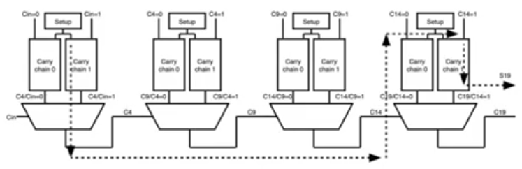
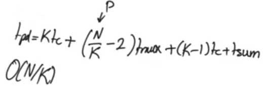
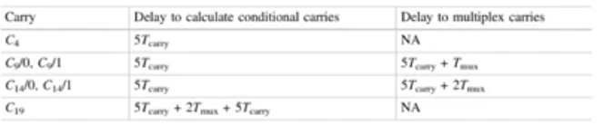
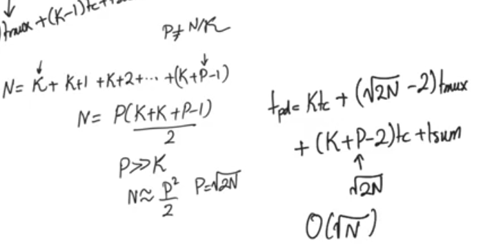

# Carry select adder
source [this](https://www.youtube.com/playlist?list=PLyWAP9QBe16qnuE-nw0RkUq0IwRkzqyhD) playlist on arithmetic circuits.

## Introduction
- It was popular when the silicon area was considered cheap relative to needed performance, still pretty much true
- it sacrifice area to get performance 
- Divide a large adder into smaller blocks
- each block waits for the carry bit from the previous block which could be either 0 or 1
- so what if we have two ripple carry chains per block, and each of them assuming that the carry bit coming from the outside is either 0 or 1
- this allows this carry chain to calculate all its sums and all its carrys but for every position it's gonna calculate two sums and two carrys 
- so every block doesn't have to wait for the previous carry, it can calculate and when the carry comes it selects the correct result using a mux

## Critical path
- the critical path is gonna pass through the first ripple carry path
- and from then on it's gonna pass through the multiplexers in the middle
- till it reaches the last block where it has to pass through the whole carry chain
- for every block when the first adder finishes all blocks' adders would have finished, and we gonna add the muxes delays
- for the last block we are intersted in the Sum bit so we have to wait for the carry chain of the last block

## optimize to obtain sublinear delay behaviour 
- All the blocks results are ready at the same time
- we don't use a block's result until a number of multiplexers delays, depending on the block's location 
- blocks down the road wait for more muliplexers' delays than the earlier ones 

- so we can make the blocks down the road larger then the earlier ones (number of bits per block)
- assuming the multiplexer delay = carry delay Tmux = Tcarry 
- we get square root dependance on N the number of bits

- In case multiplexer delay is not equal to carry delay Tmux != Tcarry
- The square root dependance on N too

