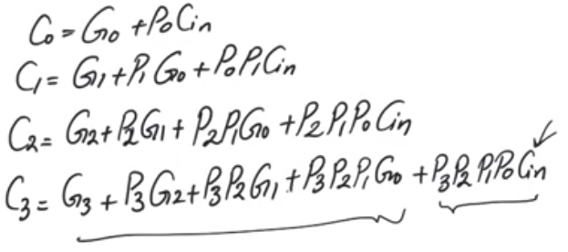
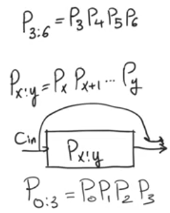
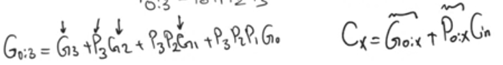
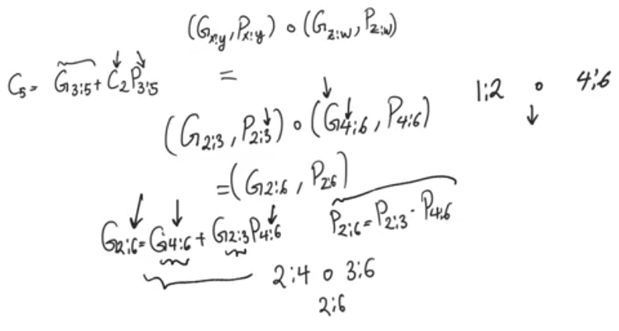

# Group generate and propagate
source [this](https://www.youtube.com/playlist?list=PLyWAP9QBe16qnuE-nw0RkUq0IwRkzqyhD) playlist on arithmetic circuits.

## Introduction 
- Examining the expressions for carry outs at different bit positions we see patterns 
- last term contains carry in and only propagates, all the terms before it contains generate bits and propagate bits not carry in 

## Group propagate
- means that the range of the bit positions you are describing is all propagating
- the product of all the propagates in the range

## Group generate
- means within the range of bits 
- some bit position one or more is generating a carry out
- and this carry out has enough propagates active so that it can show at the output

## Carry at any position
- CarryX = Group0:X + P0:X Cin
- Carry3:5 = Group 3:5 + P3:5 C2
    - this means either carry 2 is propagating to  carry 5 or there is a generated carry in range 3 : 5 which manages to propagate to C5

### Dot operator
- acts on ranges of group generate and propagate to combine them
- doesn't work on ranges that have gaps
- the order of operands is important
- Implemented using 
    - two cmos gates the produce the resultant group propagate (AND gate)
    - sum of product that gives you the group generate

