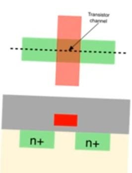
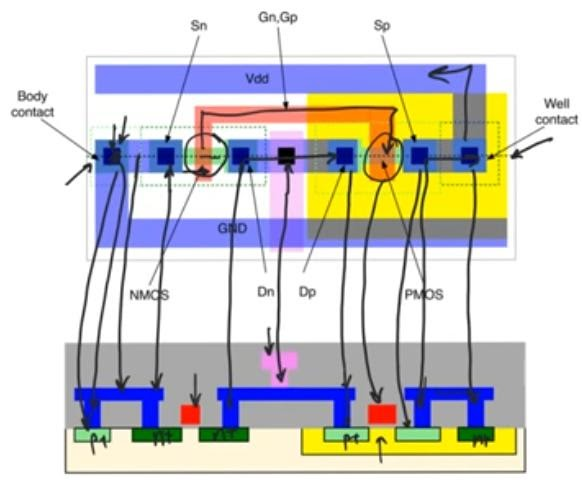
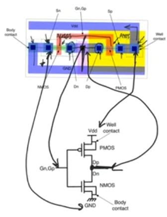

# layout
<https://www.youtube.com/playlist?list=PLyWAP9QBe16qWQzq_IQtGKO9Yz8QvCWvY>
* represents the masks that’ll be used in the fabrication, color coded masks
* It’s a top view of the design
* It’s the input to  the fabrication 
## reading layouts
* Diffusion or active layers color coded in green (thin oxide).
 - Define areas where the wafer will be covered in a thin oxide in the locos process, where the sources and drains are
 - Intersection of n+ and p+ select masks with the active areas are the areas where we implant heavy donors or acceptors
 

* Poly layer (gate) color coded in red
* Intersection between poly track and a diffusion or active track this is a transistor
 - In the self aligning process of LOCOS we fabricate poly silicon first (gate) and then we implant the sources and the drain 
 - If this interaction happens outside the n-well in a single well process then that’s an n-mos
 - If this interaction happens inside the n-well in a single well process then that’s a p-mos
* Look at how polysilicon and metal lines of the layout are used to connect nodes to make intelligent conclusions to determine the terminals of the mosfet (sources and drains) then determine where the supply and ground are.

> *last modified 15/04/2020*