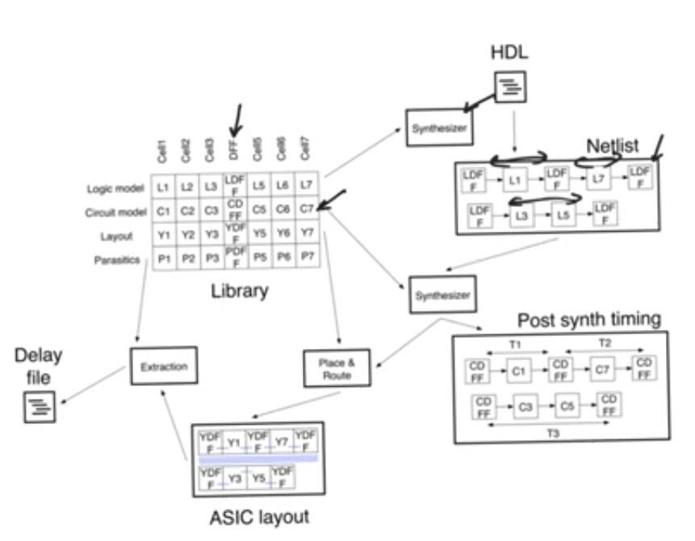

# Asic design flow
source: [this](https://www.youtube.com/watch?v=e8rD04mBgtk&list=PLyWAP9QBe16qWQzq_IQtGKO9Yz8QvCWvY&index=15&t=0s) video from the series on ASIC design flow

## ASIC design flow

## Exceptions to constraints
- Sometimes there are paths in a circuit that stops the PAR tool from achieving closure, yet these paths are not true paths

### Multicycle path
- Multi cycle paths are paths that exists between a register pairs, however the values that are supposed to be stored in the output registers aren’t supposed to be stored in one cycle, they can take multi cycle to settle
- The case for configuration registers, sometimes set then we don’t reset them for a very long number of cycles.
- if we insist that this path needs to be updated every cycle that’s gonna impose a condition on the PAR tool that does not need to be there

### False paths
- False paths are paths that exist but any time (setup, hold) violations should be ignored because these paths don’t actually exist 
- The case in synchronizers that are used to synch data that comes from a clock domain to data that come to another clock domain 
- The intermediate path between those two registers which form a synchronizer is a false path, it doesn’t do anything, it’s expected and normal at this point for the data to be corrupt (metastability)
  

> *last modified 15/04/2020*