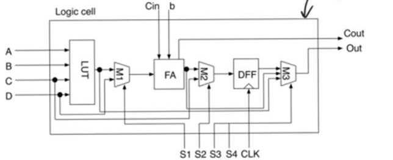
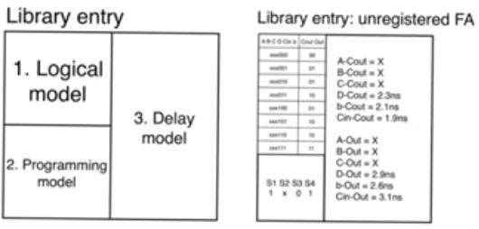
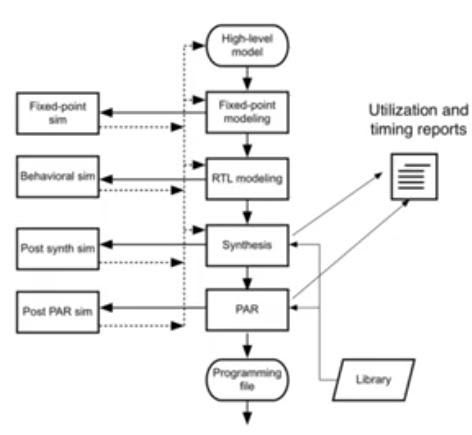
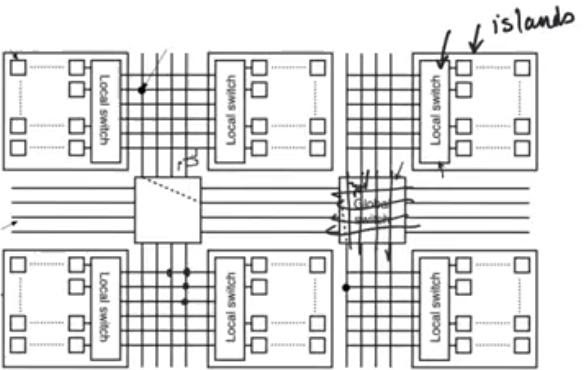

# FPGA
source: [this](https://www.youtube.com/watch?v=ysGYXWeA61I&list=PLyWAP9QBe16qWQzq_IQtGKO9Yz8QvCWvY&index=16&t=0s) and [this](https://www.youtube.com/watch?v=isBQ4Icn3Gk&list=PLyWAP9QBe16qWQzq_IQtGKO9Yz8QvCWvY&index=17&t=0s) video from the series on ASIC design flow

## FPGA
- Array of cells like a standard cell library, but the difference is that all cells are identical in the FPGA, an FGPA cell is called a logic cell.
- Each of these cells are reconfigurable, so that we can reconfigure the hardware to do something different

## Logic cells
- A sample logic cell consists of lookup table, DFF, full adder, multiplexers, 
- Multiplexers reconfigure the cell 
- DFF, FA, LUT allow us to perform a bunch of functions based on multiplexers arranging 
- LUT allow you to perform any kind of combinational logic you want

## FPGA design flow
- FPGA design flow is similar to ASIC design flow because FPGA have the same concept of a library 
- FPGA library is a library of configuration of logic cells, provided by the vendor, each entry describes a way to reconfigure the logic cell, or a bunch of logic cell and connect them together to perform a certain function 
- Logical model: truth table of the ip/ops
- Programming model corresponds to the layout in std cell lib, the bits that we provide to the select lines of the MUXs so that we achieve the logic function in the truth table
- Delay model: transition from each input changing to each output changing

## Tools flow
- Utilization report: tells how many cells we used from FPGA
- Synthesizer adds the multiplexer settings for each of the logic cells to the programming file
- Programming file: bits we need to provide the FPGA to perform the function

## Place and route
- FPGA consists of sub arrays called islands, connected by local switches
- Logic cells in FPGA are arranged in the islands, communications between the cell in the same array is through local switch network (bunch of multiplexers)
- Communication between different islands is through global switch (horizontal and vertical lines usually done by pass transistors enabled/disabled)
- So the placement and routing tool will add to the programming file the controls that we need to provide to the switch fabric inorder to connect logic cells together
- Once placement and routing done, we can do a post PAR simulation which is gonna include interconnect delays and we also have the programming file.

## Modern FPGAs
- Most modern FPGA includes 
- specialized logic cells like multipliers 
- specialized rams to create large register files or large memories to avoid the use of distributed memory which is created by using only the FF in a logic cell
- This increases the efficiency of the FPGA
- Placement and routing in FPGA are not done with very tough constraints

> *last modified 15/04/2020*