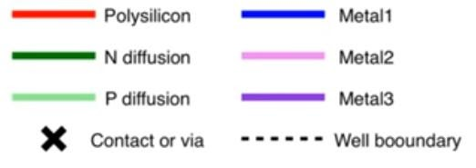
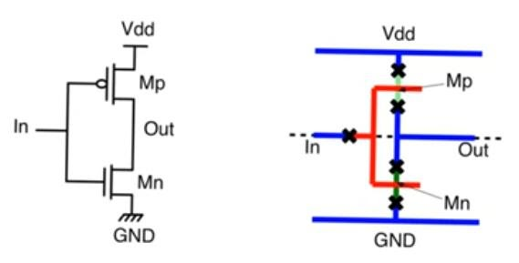
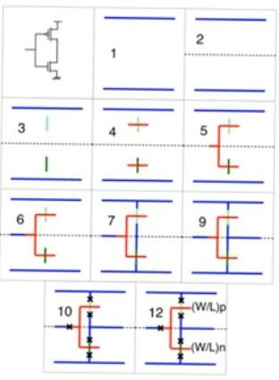
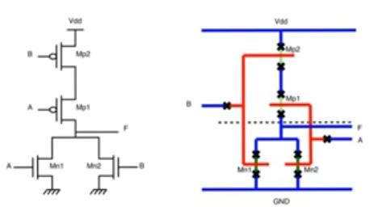
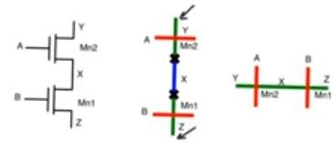
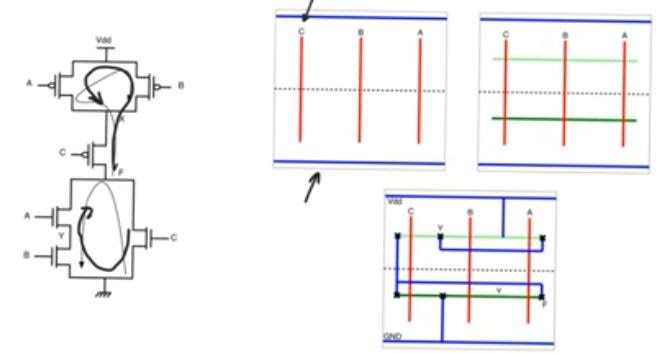
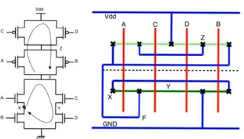
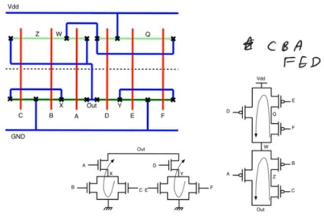

# Stick diagram
source: [this](https://www.youtube.com/watch?v=95qSpUGG8yY&list=PLyWAP9QBe16qWQzq_IQtGKO9Yz8QvCWvY&index=3&t=0s) and [this](https://www.youtube.com/watch?v=kDux-3JRf-I&list=PLyWAP9QBe16qWQzq_IQtGKO9Yz8QvCWvY&index=4&t=0s) video from the series on ASIC design flow

## Why use stick diagram?
- Can be drawn manually without paying attention to design rules and does not require precise positioning of different tracks, or encode the sizes of different tracks
- Not gonna use active masks, but different colors for n+ and p+  and when a polysilicon wire and an n+ or p+ track intersects we are gonna have a transistor
- A connection is made when there is an explicit contact or via or when we intersect tracks of the same material with each other, if different they are just crossing over not creating a contact, but if a polysilicon and a diffusion tracks intersect then that’s a transistor 
- Dotted line indicate the separation between a substrate and the well, so all pmos above the dotted line and all nmos below it

### Drawing stick diagrams
   - Step 11, check if we are moving between metal wires. We don't try to make a move between a metal wire and another metal wire that’s not immediately above or below it in one via, if we found this we have to move it in multiple vias 
    - Some processes allows stack via which allows you to move from say metal 1 to metal 5 in one via but many processes don’t allow this
   - Step 12 we write the aspect ratios of the transistors on the circuit

   - Another example

   - Previous approach does not give the optimal stick diagram 
    - When you look at two transistor in series, if you translate the schematic directly into a stick diagram you’ll end up with using two diffusion tracks for example two n+ in a two input nand
   - This is inefficient and unnecessary because we can use single track of n+ diffusion and cross it with two polysilicon and create the same two transistors
  - Node x is the drain of Mn1 and the source of Mn2 so they can share the same diffusion (n+) area saving a huge  area overhead for the metal and the contact vias and their clearance according to design rules

- In the case of transistors in series we can do this just by inspection, but even transistors in parallel, or with much more complicated connection could share diffusion tracks using euler path approach.

### Euler path approach 
- Algorithm used in other areas of engineering and can be applied here to answer the question how can we implement the circuit using a single diffusion track
- Can you find a path in the PDN and in the PUN that does the following: 
    - Covers every single transistor
    - The order it covers transistors in the PDN is the same as the order in the PUN
    - It visits every node at most twice or less no more 
    - This means that this path is an euler path and we can implement the circuit using a single nmos and a single pmos diffusion tracks
- Steps: 
    - Draw polysilicon lines vertically, and their order should be the order of how the variables(inputs) appear in the path (CAB) or (CBA) in our example which visits node x twice 
    - Draw p+ diffusion tracks across the top and n+ in the bottom then we have 3nmos transistors and 3 pmos transistors
    - The fact that we have an euler path ensures that there is a some connection of nodes that guarantees that the circuit in the second box can be made to function as the circuit in the schematic

- Another example (euler path: ACDB) visits node Z twice 

- Euler path approach could be extended to networks in which we cannot find a single path that covers all the nodes
    - In the following example we can do it using two euler path (CBA) and (FED)
    - We can use a single diffusion of each of them but they will be separated and point OUT and connected using metal wires and vias because they can be joined at the PDN but not the the PUN
- Euler path approach gonna give us the minimum number of diffusion strips that we can use in any circuit but this does not necessarily correspond to the best stick diagram in terms of area or speed or any metric, it often does correspond positively to area, and sometimes there can be hand optimization that the designer can do.

> *last modified 15/04/2020*