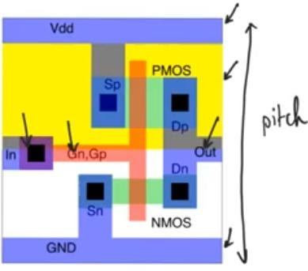
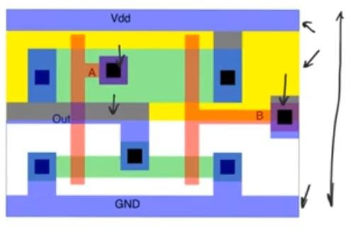
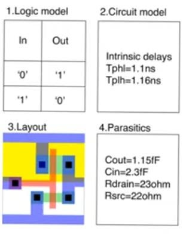

# Standard cell library
source: [this](https://www.youtube.com/watch?v=bmfOQSyVUWM&list=PLyWAP9QBe16qWQzq_IQtGKO9Yz8QvCWvY&index=5&t=0s) video from the series on ASIC design flow

## standard cell library 
-  Hand drawn layouts are usually used to create full custom asics and they are usually used in analog circuits, in digital circuits they are used in really critical parts of the circuits to speed them up, majority of digital circuits are of a category called standard cell asics.
-  They arrange the layout of std cells in neat rows
-  Standard cells are many layouts of basic building blocks (logic, arithmetic)
-  Have the same height so when arranged next to each other, they will fit in rows
-  Designer doesn’t specify the standard cell to use, he writes the description of the circuit in an HDL, and intermediate cad tools gonna translate this into the necessary std cells, once picked, the std cells need to be arranged and connected to each other.
-  CAN tools picks the std cells from a library which is a collection of std cells, the library is vendor specific (fabricator).
-  The std cell in the lib will be an entry that contains information about the std cell, about the logic function, a truth table for comb circuits and state transition table* for sequential circuits, and the layout and standard delay information (propagation delays) and information about parasitics
    - a state-transition table is a table showing what stat a finite-state machine will move to, based on the current state and other inputs

### Rules about std cells
-  Height of the cells constant and it’s called the pitch
    -  So that when arranged in rows they will make neat rows
-  Metal 1 wire at the top for VDD and another one at the bottom for GND, both of a specific width
-  N-well (for pmos) needs to cover the top half of the std cell 
-  Inputs and outputs in metal 1
-  The more complex the std cell the wider it would be, but height has to be the same
-  Example of an inverter

  

-  Example of a two input nor gate  

-  Entry for an inverter library 

  

> *last modified 15/04/2020*