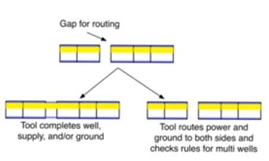
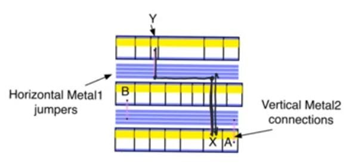
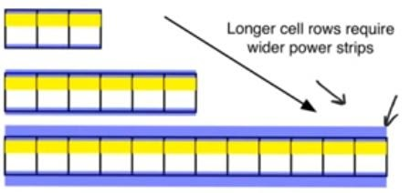
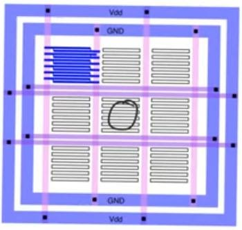

# Routing and power in standard cells
source: [this](https://www.youtube.com/watch?v=9RLP8_WZNX8&list=PLyWAP9QBe16qWQzq_IQtGKO9Yz8QvCWvY&index=6&t=0s) video from the series on ASIC design flow

## routing and power
- Cells are arranged in rows that wouldn’t the same number of cells as their width differ depending on complexity, but their height (pitch) is the same
- Cells ground and supply rails will abutt, and they form a complete ground and supply rail that runs across the entire standard cell row, same happens for the wells, they join together and form a big well together
- Around the perimeter of the ASIC we have an empty piece of interior state which will be used to form ponding pads for the pins of the chip 
- In Between the rows of std cells we have metal tracks usually in the metal 1 layer used to do horizontal routing 
- When cells are arranged next to each other, sometimes the routing tool needs to leave an opening between the cells often used for routing
- In such case the tool can needs to make a decision about how to handle the wells and the power supply and ground rails, either by completing them or routing them from both sides

### Connecting cells together after arranged in the rows
- Layers available for routing
- Diffusion layer: not used for long range routing because of its resistance, can be used to create single diffusion strips as with the euler path within the cell
- Poly silicon: used within the cell to connect the gates of transistors to save space, sometimes used for routing between cells in the same row only done with processes less than 3 metal layers otherwise we will never use polysilicon for routing outside the cell
- Metal 1: used to route supply and ground, horizontal metal tracks between rows of std cells, and within the cell to connect circuits within the cell, inputs and outputs of the cell
- Metal 2: local connection within the row when more than 3 metal layers are available, otherwise used for vertical connections inter-row (between rows)
- Metal 3-N: generalized routing, long range routing, higher the layer longer the routing normally vertical 
- Highest metal layer used to distribute supply and ground.

### Routing between cells 
When cells not in the same row using vertical tracks of metal, as well as the horizontal tracks available between cell rows using higher metal layers for vertical routing

### Routing supply and ground
- When we abutt cells together we expect  them to form continues supply and ground rail which they do
- However if we have a longer row of std cells the tool has to thicken the supply and ground rails for that row so the longer row the thicker the supply and ground rails because metal lines will have a resistive drop because of length of the rails and the current drawn from them, so the last cell in the row will see a lower value of the supply then the 1st cell of the row and a higher value of ground unless we make the wire wider

- Supply and ground are distributed using horizontal and vertical metal layers, the farthest point will see the lowest supply and highest ground, and highest drop so different organizations are made to guarantee minimum drop

> *last modified 15/04/2020*