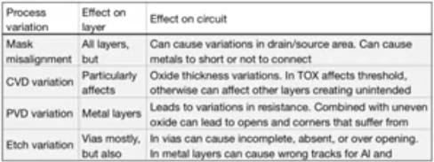
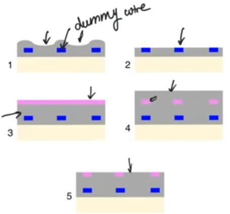
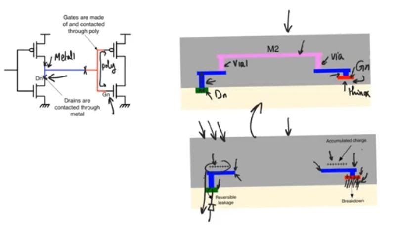
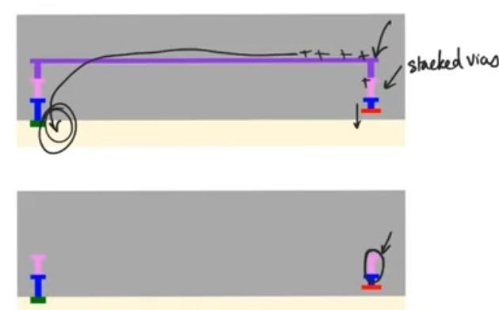
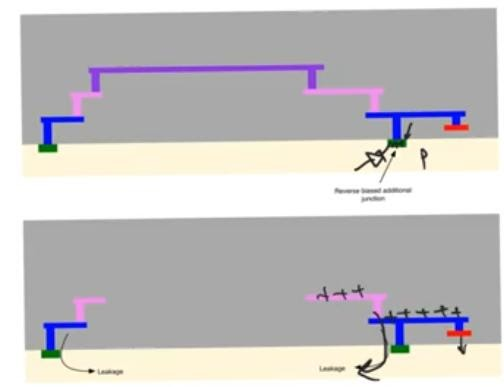
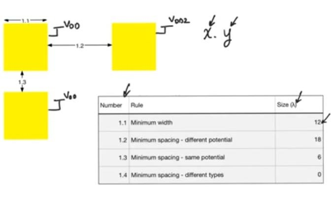
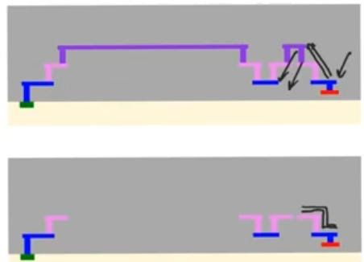

# Design rules
source: [this](https://www.youtube.com/watch?v=wwnKjjcKejA&list=PLyWAP9QBe16qWQzq_IQtGKO9Yz8QvCWvY&index=7&t=0s), [this](https://www.youtube.com/watch?v=NK0qL5sohNE&list=PLyWAP9QBe16qWQzq_IQtGKO9Yz8QvCWvY&index=8&t=0s) and [this](https://www.youtube.com/watch?v=QfTeg4n9q88&list=PLyWAP9QBe16qWQzq_IQtGKO9Yz8QvCWvY&index=9&t=0s) video from the series on ASIC design flow
# Design rules
## process variation
- Fabricated chips might not work because there is a defect in the chip, and defects happens because we fail to transfer the pattern that we drew on the layout onto the chip because:
- Impurities land on the chip that change the electrical properties of the material they come in contact with creating insulating layer, change the type of semiconductor, and when they come in contact with oxide they create trap states
- Trap states are states in bandgap of a material, they catch electrons that tries to cross the bandgap leading to devastating effect on transistors by changing their threshold voltage overtime 
- Temperature variations that translates through fabrication steps that lead to variations in the results, variations in ion implantation, photoresist spreading as it shrinks when it dries out and it might tear in some locations leading to incorrect itching
- Mask misalignment when moving from one step to another, creating unintended short and open circuits
- Variations in oxide thickness, thin thickness lead to variation in threshold voltage, and even thick oxide deposited in the top of the wafer can lead to major problems like variations in wire deposition specially copper wires because they depend on a fully planar oxide
- Vias itching, the longer we itch (specially wet itching) the more lateral itching there will be, if it’s too long can lead to creation of shorts and open, and if it’s too short we might not manage to open the vias to begin with, specially in the higher metal layers because the oxide separating the metal wires and the metal wires themselves tend to be thick so deeper vias are necessary  

## protection against those variations 
- Design rules: Rules about how the layouts are drawn
    - limits on what the designer can draw.
    - guarantee minimum return, max yield (percentage of chips that are working when they come back from the fab)

- Four categories of design rules
    - Minimum width for every layer drives from variation in deposition
    - Minimum separation: minimum distance between two tracks in the same layer or different layers drives from misalignments
    - Minimum enclosure: certain layer have to surround another layer by at least a certain amount usually has to do with contacts and vias drives from the itching variations
    - Special design rules
        - Minimum density rule
        - Antenna design rules
### Minimum density rule 
- Related to wires and oxide, successive wire layers and oxide that separating these layers
- Metal wires in the same layer have to be drawn with a minimum density 
- if there is no necessary wire to suffice the required density, we create a dummy wire open circuit 
- it’s just there so that when we deposited silicon dioxide the valleys between metal wires aren’t deep enough so that when you CMP (chemical mechanical polishing) you endup with a wafer that looks fine to grow silicon dioxide on top of it.

- Rule would say you have to have X minimum number of wire per square per meter or it could say that there cannot be metal wires in a single layer that are separated by more than X micrometer 

### Antenna design rules
- Only seen during fabrication, the antenna effect only appears in the intermediate steps during fabrication 
- There is no radiation happening, it’s about the accumulation of the static charges in the metal wires
- Static charge can and will accumulate
- There is no radiation happening, it’s about the accum on the metal lines during fabrication
- Have a bad effect on the thin oxide that exists below the gates of the transistors
- In the example what we are worried about is that the connection in the metal 2 will not be completed immediately at some step we would have ( n+, gate, metal 1, vias) but not the metal 2, so a lot of static charge would gather on the metal 1 wire in this transition state, charges on metal 1 wire connected to sources and drains is not dangerous because these sources and drains create a reverse biased pn junction to the substrate so the charges are gonna leak to the substrate and it’ll return to its original state
- On the gate side this charge will create a field from polysilicon to the substrate, this electrics field can be huge because the electric charges are large and the oxide is extremely thin so it’ll break down and it’ll destroy the transistor

#### solution to antenna effect
- In processes that allows stacked vias we go up to the up most metal layer immediately so it’ll limit the amount of metal wires that will be created before connection

- In processes that don’t allow stacked vias
    - We go up on the gate side we go up to the highest metal layer first and then we go down and we let the routing tool take care of this so we limit the total area that we are exposed to on the gate side
    - Another solution is to create an area of n+ or p+ (dummy pn junction) that provides a path for any charge that gathers on the metal wires to leak down   

#### Antenna design rules
- They say do one of these things that prevent that damage during fabrication.
- if you're not gonna do this then you have to obey a certain rule about the total area of metal wires and the total area of polysilicon wires, and this rule state:
- phi = (sum of the areas of metal layers connected to the polysilicon other than the highest)/(area of polysilicon track) 
- Phi < a number defined by the vendor
- If this happens then we will not suffer from antenna damage
- Because the problem was that the more wire area, the more charge allowed to gather and this charge will distribute over the area of the polysilicon wire to create a field.
- so the less the metal area the less charges metal can capture, the more the polysilicon area, the more area to distribute this charge

* amount of charge of antenna effect is very high when using dry itching, because dry itching using plasma phase itchent which are ionized and very rich in free charges

## General design rules
- Rules have to do with the sizes and the separations of the different layers of layout 
    - Scalable design rules
    - Unscalable design rules: state the sizes and dimensions and separations of tracks in the layout in terms of micrometers, it’s vendor and technology specific

### Scalable design rules
- Does not state anything in terms of absolute dimensions, instead everything is stated as multiples of a constant lambda,  this constant is equal to half the minimum channel length that could be fabricated in the technology node.
    - Allow us to draw the layout and make the DRC independent of the vendor or the specific technology and after settling on the technology we can state everything in terms of nanometers by substitute the values of lambda
    - Because it’s scalable it’s very conservative, it’ll use large separations and large dimensions much larger than it actually needs
### Example of scalable design rules
- Rules X.Y: X refers to the layer we are considering(for example 1:the well), and Y the serial number of the row
- Layers are ordered from bottom to top, and they correspond to the order of fabrication  

#### Overglass layer
Very thick layer of silicon dioxide deposited on top of the wafer once it’s fully fabricated to protect the die from scratches 

> *last modified 15/04/2020*