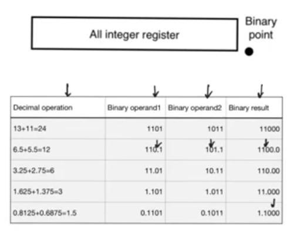
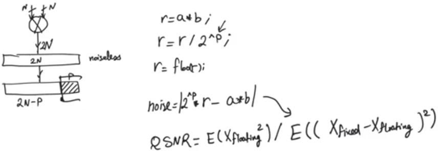

# Fixed point
source: [this](https://www.youtube.com/watch?v=HBQ9yjPS84A&list=PLyWAP9QBe16qWQzq_IQtGKO9Yz8QvCWvY&index=10&t=0s) and [this](https://www.youtube.com/watch?v=v_E9IJ5EONg&list=PLyWAP9QBe16qWQzq_IQtGKO9Yz8QvCWvY&index=11&t=0s) video from the series on ASIC design flow

##  fixed point registers
- System engineer that creates the application simulation on matlab, C have an infinite floating point (word length) arithmetic availability on general purpose processors, this isn’t the case for the asic or fpga, so we need to transform the floating point to fixed point
- This transformation will produce a penalty that needs to be taken into consideration, so we need to simulate the system again using fixed point numbers and operations to know the impact of quantizing the floating point
- In floating point the position of the fraction point is variable (floating) and determined based on the exponent, in the fixed point case it’s fixed so the integer part and the fraction part are fixed length
## generating a fixed point in a floating point machine
- Use integer instead of float multiplying each number by the location of the fixed point (2^n) and after finishing the arithmetics divide by the (2^n)

  

## fixed point operations
- Adding two N bits numbers might require N+1 bit to store the result 
- Adding M N-bits numbers requires additional log2(M) bits to store the result
- So down the line we will need wider registers, and wider adders (slowers)
- Solution to this is to use only N bits to store the result removing the MSB allowing the result to overflow, this is not viable cause it changes the result totally, it’s used in floating point arithmetics because it’s registers are huge so it will overflow only in extreme numbers
- Another option is to accept that it needs N+1 bits this is viable but we have to understand that adders down the line are gonna need to be larger
- Another solution is to remove the LSB but this will lead to quantization noise for odd numbers (1101) > (110) when restored (1100) this option is viable and used largely in multipliers 
### quantization error (quantization noise)
- Noise that results from truncating the result to a smaller register than the noiseless register
- Much more apparent when dealing with multipliers, because a noiseless result in (N*N) bits multiplier needs 2N bits so the multipliers will keep growing down the line, the area grows quadratically with the number of input bits so this option is not viable
- The metric used to calculate the noise is quantization signal to noise ratio (QSNR), it’s the power of the floating point number to the difference between fixed and floating power

- P (the number of bit to truncate ) is chosen based on the application and the performance metrics 

> *last modified 15/04/2020*