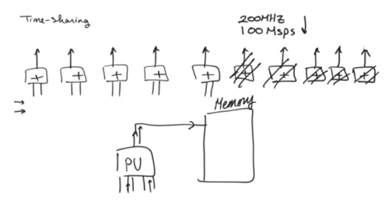
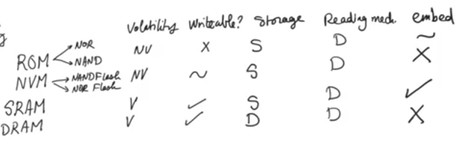
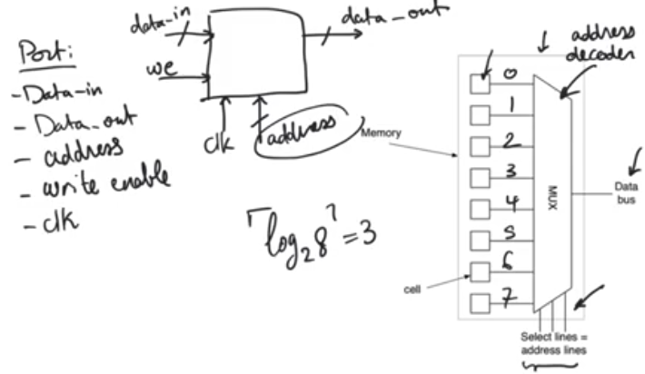
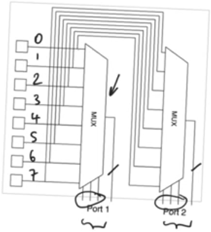
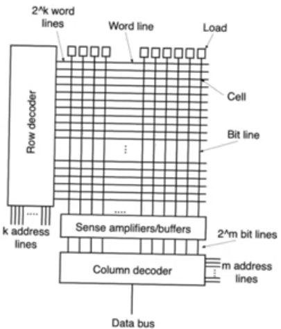
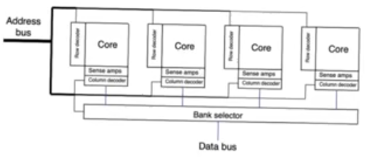

# Memories
- Source [this](https://www.youtube.com/playlist?list=PLyWAP9QBe16oYW_JFv1lptjfArS4eI4GC) playlist on memories.

## Introduction
- Memories are large storage devices
- Other storage devices like latches (level sensetive) and registers (edge sensetive)
- Memories are mass storage devices, arrat structures of identical elements that are repeated
- Memories have two main concerns density and speed
    - For random logic the cost of silicon area is generally small, and the trend has been for silicon area to be cheaper and cheaper
    - But for memories we want to cram as much storage as possible in a small area and therefore density matters alot

### Time-sharing
- It's a phenomenon that we have to deal with because processing units are becoming very fast (faster than we need to)
- Assume processing units that have a throughput more than needed (produces output faster than needed)
    - we can underclock all processing units and get the throughput needed
    - we can use half the number of processing units, in the first cycle provide the input of the first half, the second cycle provide the inputs of the second half
    - This is called time-sharing and it will provide the required throughput
- The problem with time-sharing is at some point you are gonna have alot of intermediate data to store
    - the immediate instinct is to store them in a register
    - but if you imagine having many of the processing units and parallel inputs and outputs then this becomes a takes that requires a mass storage device (memory)

## Memories
- The problem with digital design is always how to figure how many memory banks needed
    - Because memories tend to be faster than processsing units so they can provide inputs and outputs multiple times per each processnig unit cycle
    - Some time that's not even enough and you need to divide the memory into multiple banks
- Memories and their bandwidth are significantly important even more important than the frequency of operation of random logic
    - you need to pay attention not only to the amount of data you can store in the memory but also to how fast you can read and write this data

## Memory Classification
- Roms (read-only memories) A memory that could only be written a signle time
    - Nor roms
    - NAND roms
    - They form nor and nand dynamic logic gates in the memory columns
- NVM (Non-volatile memories) Memories whos contents gonna stay there wether there is a power supply or not, and they are also rewritable in a way (programability)
    - NAND Flash
    - Nor Flash
- RAM SRAM and DRAM
- Storage mechanisim 
    - Dynamic nodes: storing on a capacitor
    - Static nodes: based on positive feed back and pairs of inverters
    - NVMs and ROMs don't store on capacitive node or a positive feedback loop, they store or don't sotre based on the presence of lack of a transistor
- Dynamic reading means that memories form dynamic gates along the columns 
- Some of these memories can be created using standard cmos, some of them need weird things to happen inorder for them to be implemented
    - Memories that cann't be embedded in an ASIC operation either require a very difficult process that involves non std cmos combined with std cmos or will be off chip memory
    - Effictive roms are very difficult to embed
    - Efficient DRAMs need special processing and often uesd as off chip main memories in micro processors 
    - SRAMs can be embedded using std cmos and it's what we mean when we say memories when we design digital circuits, its disadvantage is that it's huge, a signle SRAM cell is bigger than a signle cell of any other memory type

# Memory array architecture

## Memory port
- A memory is a collection of storage locations that share a signle port or multiple ports in some cases
- A port is a collection of buses that cab be used to access the memory locations, A single port will contain:
    - Data-in bus, Data-out bus, address bus
    - write-en to tell wethere we are reading or writing to the address indicated by the address bus
    - clock (optional) because some memories are asynchronous, but most practical memories are synchronous
    - A collection of all these buses is called a port
    - Address bus cannot be absent for a port, ports are distinguished by address bus, how many address buses we have determines how many ports we have
    - memory locations can be multiple bit locations as long as they are all storing the same number of bits and its size is the same as the data bus

### Multi-port memory
- A two port memory contains two address buses, this allows us to read from two independant memory locations simultaneously
- Address bus indicates that there is an indenpendant address decoder dedicated to it
- In a read-write memory you can have multiple ports and some of them might be read-only, write-only or read-write as long as you have an independant address decoder for each of the independant ports
- This way of arranging the memory core (the memory locations) is extremly inefficient cause it's a linear memory array
    - because typical memory is not 8 bits long, it's millions of bits and words long.
    - so for a large memroy it's gonna have a very strange aspect ratio, it's gonna be much much longer than it's wide
    - This is gonna make its layout a nightmare and gonna make the chip more expensive for no reason at all

## Square arrays
- Practical memories are square arrays instead of a linear array
- Vertical wires are called bit lines
- Horizontal wires are called word lines
- At the intersection of every bit line and word line you'll find a cell that contain a zero or a one
- If we have `2^m` bit lines and `2^k` word lines 
    - this memory contains `2^kx2^m` locations = 2^(k+m) bit memory
    - word lines can be decoded using k*2^k row decoders
    - bit lines can be decoded using 2^m*1 column decoders
- A reading operation is started by providing an address of k+m bits
    - k bits to the row decoder
    - m bits to the column decoder
- The row decoder decodes the `k` bits and decide which row of the `2^k` we want to access and enable it, so outputs will be available on `m` bit lines
- so the column decoder (A multiplixer) that takes a `2^m` bit lines and produces a single output line depending on the `m` bits of the address
- Array elements
    - the core (array of cells)
    - row and column decoders
    - sense amplifier
    - buffers
- Buffers are used in read-write memories to drive the values of the column decoder to specific values when writing
- Sense amplifiers resolve a fundamental contradiction about the cell design
    - we need cells to be small because density is really important to memories
    - if a cell is a small, it has a reduced ability to drive the huge capacitance of the columns or the bit lines, and speed it also important for the memories
    - sense amplifier help reduce this conflict

## Practical memories
- Consists of multiple square arrays called cores
- These multiple arrays can then have one more level of multiplexing and decoding between them called the bank selection level
- Delay of memories is more or less contingent on the length of the columns and the rows 
- In practical arrays it helps to divide them into smaller arrays to keep the length of the word lines and bit lines limited

