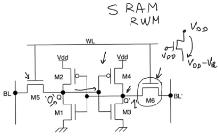
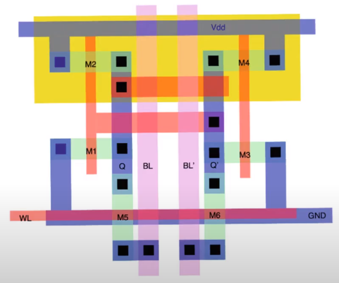
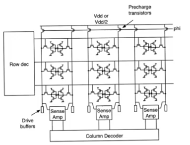
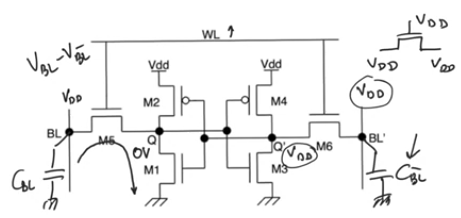
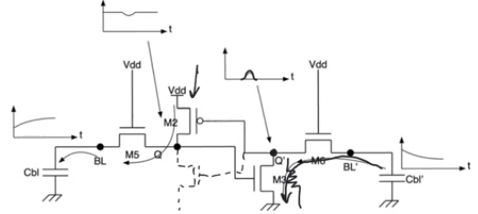
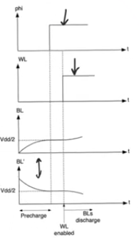
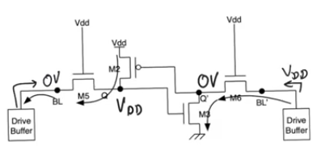

# SRAM
- Source [this](https://www.youtube.com/playlist?list=PLyWAP9QBe16oYW_JFv1lptjfArS4eI4GC) playlist on memories.

## Introduction
- RAM (random access memory) is misnor it has to do with historical reasons to distengish rams from sequential access memories
- RAMs don't have to access the data in any specific sequence
- you can access any random bit within the memory, this applies to all the memory discussed roms and nvms
- A better naming for ram is read write memory

## SRAM cell
- SRAM: Static RAM because storage mechanism is static
- The way we store data in SRAM cell is by two inverters connected in positive feedback
    - The two static cmos transistors M1 to M4
- pretty much the same strucutre of the static latch
- The two inverter M1 to M4 are exactly the same as the inverters in the static latch
- The two access transistors M5 and M6 that give us access to the contents of storage in the nodes Q and Q' are similar to access transistors in static latches and registers
- The only difference is that in latches the access transistors were transmission gates, here we are using nmos transistors instead of transmission gates to save area 
    - Transmission gates were used to allow passing a strong one and zero
    - In SRAM we won't be able to pass a strong one because we are using nmos only
    - This is accepted inorder to get good area out of the cell
- the SRAM cells store data in the intverter pair 
    - If we have a zero in the Q side, this is an input to the other inverter
    - producing a one at the Q' side and so on the two nodes keep renforcing each other
- The SRAM cell is storing one bit cause Q and Q' are always logic complements of each other
- The biggest storage cell in terms of area bigger then rom, flash ,dram
- There is no other type of memory having this high reading and writing speed
    - it's used to create the cache memory in processors because it's the fastest rewrite memory can be made

## Layout
- SRAM has supply and ground rail for each row of the array
- and six transistors for each cell
- the layout doesn't use any special layers
    - It can be implemented in standard cmos
    - that's why sram is the memory of choice when embedding a memory

## SRAM array
- Supply and ground rail for each row of the array
- All sram cells are differential, they have two outputs instead of one, representing one bit of data
- each of cells is gonna have two bit lines instead of one
    - one called bit line
    - the other bit line bar
    - representing complement data in reading
- row of precharge pmos transistors on the top to precharge the bit line and bit line bar before we start reading
    - reading is through a dynamic process, but the memory is called static ram because storage mechanism is static
- There is a row decoder that produces word lines just like with roms
- The bit line and bit line bar carry data, that is then fed to the sense amplifier then the column decoder

## Read in SRAM cell
- Q contain 0v and Q' Vdd
- Precharge the bit line and bit line bar to Vdd
    - Word line will be zero while precharging
    - The bit lines will be floating capacitors that charges to Vdd
- Once precharging finish, we enable the cell by raising word line to Vdd, enabling transistors M5 and M6
- bit line capacitor CBL discharges through transistor M1 (it's gate connected to Q' so it's on)
- CBL' is gonna remain at the same voltage cause M3 transistors is off and M4 is ON so the terminal at Q' have Vdd
    - transisrtor M6 is gonna be cutoff cause all it's terminals connected to Vdd
- To find the value stored all you need to do is watch the voltage on CBL is dropping or not
    - It's better to look at the differential voltage between CBL and CBL' (VBL-VBL') and see which direction it's going -ve or +ve

- precharging the bit line and bit line bar to Vdd has disadvantages
    - difference of bit line and bit line bar is being created by a signle side of the cell
        - all of the effort to charge or discharge the capacitors is being done by the side storing zero, the other side finds itself in a steady state case and doesn't need to do any effort
        - therefore to create a certain (VBL-VBL') you propably have to wait longer because only one side is making an effort
    - A situation when storing a zero at node Q' and one at node Q,
        - when CBL' is being discharged the current discharging CBL' leaves a resistive drop one M3
        - Node Q' is gonna rise for a transient time until we manage to fully discharge CBL'
        - The problem here is that Q' is also the input to other inverter, M2 and M1 depends on Q' to keep them in a specific state
        - If Q' rises so much that M2 starts to turn Off and M1 On then the state of the cell will flip
        - this will start a positive feed back loop where it also tells the other inverter to switch state and they will flip states just because we are reading
        - we can gurantee that this won't happen by making sure the resistance of M3 is relatively small relative to resistance of M6 (so the voltage divider between the two won't let VQ' to be high enough to turn M1 on)

- It's better to precharge the value of bit line and bit line bar to a value of VDD/2
    - so we use a value of VDD/2 at the sources of the precharge transistors
    - it's very importent for these two bit lines to be at the exact same voltage
- When we enable the word line the side which stores a one is gonna continue charging CBL to Vdd and the other side is gonna discharge it down toward zero

## Write in SRAM cell
- Flipping the state of the cell (storing Vdd at Q and 0 at Q')
- Drive the values to be written using drive buffers on the bit lines
    - When reading the bit lines are left at high impedance for the cell to drive them, when writing we have to drive the bit lines using low impedance drive buffers
- The drive buffer at the side storing zero is gonna sink alot of current causing the value of VQ' to drop so M2 turns off and M1 turns on
- on the other side the buffer is gonna source alot of current leaving a high drop on M3 this will raise the value of VQ' so M3 turns off and M4 turns on
- Then the cell itself will takecare of the writing, it'll flip its own state
- so the drive uffer don't need to drive VQ and VQ' all the way to VDD and zero,
    - they just need to press them beyond Vm (inverter logic threshold)

- There is a huge contradiction in designing sram, 
    - you need to make the cell small (transistors small) so that you promote density
    - you need to make the cells large because they are supposed to drive the capacitance of the entire bit line while reading and that capacitance is huge
    - This is resolved using [sense amplifiers]()
