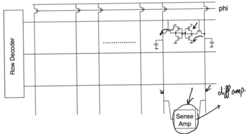
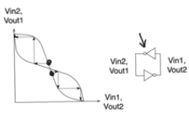

# Sense Amplifier

## Introduction
- The fundamental problem with all memory arrays specificaly with [SRAM](11-12-sram.md) is the contradiction between 
    - the need to size cells small so that we can promote density
    - and the need to make the cells larger so that they would be able to charge or dicharge the bit lines
- There is no way to resolve this contradiction without using an external force which is sense amplifier

## Sense amplifiers
- They are analog circuits
- There is a sense amplifier per column in any array (roms, proms, drams, srams ...etc)
- For SRAMS there is one sense amplifier per column which means one sense amplifier per pair of bit lines
    - Sense amplifiers because they deal with differential values between bit line and bit line bar are also usually differential amplifiers
    - Having signle sense amplifier per column allows us to size sense amplifiers so that they have excellent delay without having to worry much about their area or density cause there is only one per column

## Differential amplifier
- CMOS differential amplifier
- Transistor Nc acts as a current source 
    - Voltage Vcs supposed to put it in the on region and create a current Is flows through it
    - because Nc acts as a current source the drain voltage Vx should keep it in saturation region
- the driver transistors M1 needs to be in the saturation region at least for a large portion of their voltage swing that they will produce
- The current mirror transistors M2 and M4 need also to be in the saturation region
- The supply voltage Vss should be at least enough to provide enough headroom so that the transistors the current mirror M2, the driver M3, and the current source Nc are all saturated
    - This is called the headroom calculations and its very important to the design of diff amp
- For sram arrays one side of the differential amplifier is gonna be connected to the bit line and the other side gonna be connected to the bit line bar
    - the bit line and bit line bar are always driven by the same cell that is activated by the currently active word line picked by the row decoder
- When the cell is active (reading from the cell) BL and BL' will move in opposite directions
    - one of the is gonna increase and the other decrease
    - the problem is their rate will be small because the cell is small and CBL is a very large capacitance
        - CBL is large because it's the capacitance of the metal line that passes through all the cells and it's loaded by the drains of all the access transistors in all the sram cells
- When BL and BL' at their initial voltage of VDD/2 this is called the common mode of the amplifier
    - This common mode is only enough to turn M1 and M3 on and to keep Nc in saturation
- Because M1 and M3 observing the same voltage and their aspect ratio is equal, the are gonna share the current Is from the current source equally
    - as the voltage increases on one side that side is gonna take more of the current and the other side lose some
- Vout will be equal to the gain of the differential amplifier multiplied by its differentail input (
    - differentail input `DelatVBL` is the difference between VBL and VBL'
    - The gain of the amplifier is the transconductance of the driving transistor M1 divided by the transconductance of the current mirror M2
    - `Vout= DeltaVBL *  gm1/gm2`
    - Vout will be larger than `DeltaVBL` which is what we need
    - We need the diff amplifier to amplify `DeltaVBL` so that we can read faster
    - We can size so that we get gm1 and gm2 that gives a high gain cause we only have one sense amplifier per column
- For sense amplifiers gain is not the most important thing 
- The speed at which we switch the current source current from one side to the other
    - For the smallest DeltaVBL possible we wanna switch the majority of the current to the side with higher voltage
    - so we are sensing in which direction the cell wants to move the bit lines and we are responding by overreacting on it and moving the current to one side rahther than the other
- So what we care about is the delay or the slew rate at the output, how fast Vout changes
    - This delay will be `DeltaT=Cout*DeltaVout/Iavailable` this comes from the current voltage equation of a capacitor
        - This is the amout of delay to see a DeltaVout at the output
        - DeltaVout required is the full range switching Vout going either to Vdd or ground
    - This can be imporved by increasing `Iavailable`
        - `Iavailable` will be at maximum the current `Is` from the current source Nc
        - Which is why we need to switch the current available to the side which need to take it as fast as possible for the least amount of delay
    - `Cout` is not the capacitance of the bit line which is one of the reasons that sense amplifiers work cause they don't have to deal with the capacitance of the entire bit line.

## Sense amplifier in an sram circuit
- This kind of sense amplifier is popular with srams and roms but it's much more popular with drams and it's called the latch based sense amplifier 
- It's a couple of cmos inverters connected back to back
- The whole point of latch based amplifier is you put the latch in the metastable (high gain) region and then you allow it to work
    - Because a pair of inverters in a metastable region cannot stay there for long, they will try to exit it really fast
- Transistors from M1 to M5 form the sense amplifier

### Sequence of events
- Precharge the bit lines to Vdd/2
    - The transistor Meq1 (equalizer) is gonna work on `phi=0`, it'll be on at the same time the precharge transistors are on to guarantee that bit line and bit line bar are shorted to each other
        - because if they aren't equal that will affect out total delay
    - Once `VBL=VBL'=VDD/2` you can raise `phi=1` disabling the precharge transistor and Meq1
- raise the word line allowing the sramc cell to start working
- There is a third signal called `SE` sense enable that enables the sense amplifier
    - SE=0 at first when the word line is one,
    - during this period the cell is enabled, and the sense amplifier is not
    - Ms1 and Ms2 are nmos transistors with `SE'=1` at their gates so they are on connecting SA and SA' to BL and BL'
- With the cell enabled we start to develop a `DeltaVBL=VBL-VBL'` driven by the sram cell, and it develops very slowly
    - we are gonna wait for it to develop enough of a difference between VBL and VBL'

- Then we enable the sense amplifier `SE=1` so MS1 and MS2 turns off and M5 turns on connecting the supply voltage to the pair of inverters M1 through M4
- M1 and M4 are a pair of static cmos inverters
    - we are feeding them a differential voltage which puts thier inputs in the high gain region
    - Because they are in positive feedback with each other, they are gonna escape from this and go to stable region where one = Vdd and one = Zero
- So SA and SA' will widen their gap much faster then BL and BL' because they are now driven by the pair of inverters
- The differential voltage between SA and SA' is gonna increase exponentially from the starting point given (DeltaVBL)

