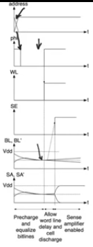
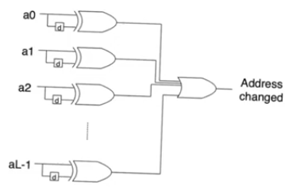
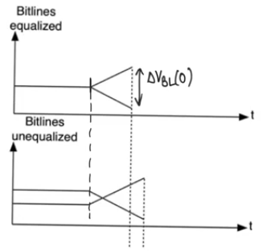
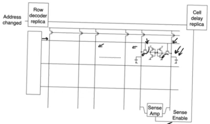
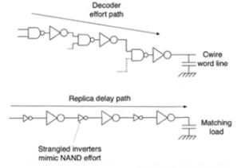
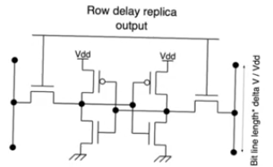

# Self timing in SRAM
- Source [this](https://www.youtube.com/playlist?list=PLyWAP9QBe16oYW_JFv1lptjfArS4eI4GC) playlist on memories.

## Reading in memory
- Whether your memory is synchronous or asynchronous
- At the clock signal, change the address, after a specific amount of time passed (defined by the maximum operating frequency of the memory), Dout bus of the memory is expected to have a correct data
    - you expect everything to be done between the time the address has been presented to memory and till the next clock cycle comes
- you only have one control signal coming from the outside the change of address, it's the thing that triggers the read operation from the memory
    - Therefore if you extra control signals to govern the sequence of operations that happens after that they need to be generated internally
    - Memory needs to time itself, it needs to do self timing

## Sequnce of operations and dependancies
- It all starts with an address change
- This should trigger a precharge `phi=1`
    - Then you want to make sure that VBL and VBL' are equalized
- Then we disable the precharge signal `phi=0` and enable the word line from the row decoder
    - we have to wait until the word line signal has reached the last cell of the array
    - Then we have to wait till the last cell has developed enough DeltaVBL
- Then we enable the sense amplifier
    - It'll very quickly generate a large `DeltaVSA=SA-SA'`
    - This can be readout on the output databus of the memory
- There has to be a compromise between the delay waited and the output voltage from the sense amplifier
- If you enable the sense amplifier quickly and don't wait for enough `DeltaVBL` to develop
    - this opens up the array to noise more,
    - this can flip the way the sense amplifier interprets the `VBL, VBL'`
    - especially because the sense amplifier is a differential amplifier
    - which is really senstive to mismatches in devices between the two sides of the amplifier

## Delays
- precharge delay can be calculated exactly the same way as in the [rom](3-4-nor-roms.md#precharge-delay) array
    - you have a long capacitance in the metal bit line
    - it's being precharged using the impedance of the pmos transistor
- word line delay is also exctly the same way as in [rom](3-4-nor-roms.md#word-line-delay)
    - except that each cell now loads the word line with two gate capacitances instead of one
- cell delay (the time that that the cell takes to develop `deltaVBL`) is also gonna be calculated exactly the same way as [rom](3-4-nor-roms.md#cell-delay)
    - because it's also the resistance of the cell discharging CBL
    - except that the resistance here is either gonna be a series resistance of the access transistor and the cell nmos or the access transistor and the cell pmos

## Generating the control signals
- how to generate all the control signals given the fact that we have only one real external control signal which is the clock (address change) which triggers the whole operation
- We have a single bit control signal that is true when the address changes
    - Calculate the difference between the previous address and the new address
    - using registers and XOR gates and OR gate
    - The output will be 1 whenever there is a change of any bit of the address
- the change of the address immediatly triggers the precharge operation, so the complement of the signal is used as a precharge control signal
    - it's not wasteful to precharging at every cycle 
    - Because if we hadn't read at the previous cycle we won't waste any energy because the liens are already at Vdd/2
    - if we had read then it's okay to precharge now and read later

- while precharging we have to guarantee that the bit lines are equalized
    - the main reason is if you want a certain `DeltaVBL` (the initial voltage presented to the cell amplifier)
    - if you start by VBL and VBL' equalized it's gonna take alot less time for this DelataVBL to develop
    - cause otherwise it'll need to equalize then create the voltage difference

- Then we will trigger the word line shortely after precharging and we have to wait for the signal to travel from the row decoder all the way to the end of the row
    - once this cell is enabled it'll start to create the minimum acceptable `DeltaVBL`
    - all previous cells would have created a larger `DeltaVBL`
- Once `DeltaVBL` has been created, we enable the sense amplifier and let it take it from here
- The sense enable signal is particularly hard to generate because it comes at the end after alot of other operations has concluded
    - The sense enable signal is generate from the address change
    - then we have to give it enough time to account for the time that it takes for the word line signal to travel through the entire the word line this is called rows decoder replica
    - then we give it enough time to simulate the time it takes the cell to generate enough `DeltaVBL`
- Row decoder and cell delay replica introduce delays to the SA control bit so that it exits them at the same time that enough `DeltaVBL` created at the cell

### Row decoder replica
- Row decoder is a series of nand gates driving the word line (presetned as a lumped capacitance)
- It's replicated by a circuit consists of a series of inverters driving a capacitance
- We have to size these inverters so that they imitate the logical effort of the nand gates
    - so that the buffer chain has the same delay as the active chain in the row decoder
- We also have to invest some effort into mimicing the word line capacitance especially that the word line is not a lumped capacitor

### Cell delay replica 
- A single dummy cell per column which doesn't store anything
- Imitating the delay of the cell
- We want it to produce full swing so that we have sense enable out of it when the cell has created the required `DeltaVBL`
    - When the sram cell create `DeltaVBL` the replica creates a full VDD
- it's therefore loaded with a relatively small metal line capacitance instead of loading it with the entir bit line

 

 