# DRAM

## Introduction
- D refers to dynamic,
- It refers to the method of storage not the way data is read from cells
    - because all memory arrays are gonna read using precharge transistors,
    - and gonna have high impedance nodes while reading
- Storage mechanism is dynamic, we rely on high impedance capacitive nodes to store values
    - We are opening our selves up to problems of leakage, charge sharing,
    - All the signal integrity issues in dynamic cmos logic
    - These effects have a much more determintal impact on drams than they do in random dynamic cmos logic
- The main thing about drams is their density
    - Mass storage in a small area
- really slow compared to [srams](11-12-sram.md)
- [NAND flash](9-10-flash.md) roms compete with drams in terms of density but they have issues in reading and writing speed 
- DRAMS is the memory of choice for mass storage in microprocessors where sram forms on chip caches

## Four transistor DRAM cell
- Formed by taking an sram cell and removing the pmos transistors
- removed M2 and M4 from [sram](11-12-sram.md) cell and left the two nmos transistors of the static inverters and the two access transistors
- storing a one at node Q `VQ=VDD`, causes node Q' to be zero volt `VQ'=0`
- When the access transistors M5,M6 are off the cell will keep its state
    - because node Q is at Vdd turns M3 on causing Q' (drain of M3) to be connected to ground 0v
    - because Q' is at 0 volt M1 is cut off which allows node to keep the value of VDD
    - Node Q is storing the value dynamically,
        - dynamic high impedance node storing Vdd.
    - Q' in this case is a low impedance node connected to ground
- To read from this cell, precharge the bit line and bit line bar to VDD
    - Then enable the access transistors M5 and M6 using the word line
    - BL' is gonna charge through M6 and M3
    - While BL is not gonna discharge because Q is also at Vdd
        - Therefore Q and BL are at the same voltage, and M5 is cutoff
- Writing to the cell is by driving bit line and bit line bar to their correct values
    - just like sram cells
- Less area than sram cells

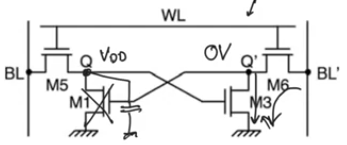

## Three transistor DRAM
- This is a practical dram cell, because the four transistor model had redundant transistor
    - half the area of the sram cells
- Separate controls for reading and writing
    - WE: write enable, RE: read enable
    - writing through M5 and reading through M6.
- Bit line and bit line bar won't be complements of each other, they aren't working differentially
    - one of them is the write line and the other is the read line
- To Write one to the cell
    - Drive the write line to Vdd
    - Then enable the write enable line (word line)
    - This causes the capacitance at the storage node to charge up to Vdd
    - Then we lower write enable
    - Then this storage node becomes high impedance node because it observes a cutoff transistor M5 and a mosfet gate of M3 so it'll keep the value of Vdd
    - This value of Vdd at the storage node is gonna guarantee that M3 is always on
- To read 
    - precharge the read line to Vdd
    - raise the read enable to one
    - The Vdd on this read line is gonna discharge through M6 and M3
    - M6 is on because read enable is one, and M3 is one because there is Vdd at the storage node
    - so we are gonna read a zero volt (write Vdd read 0 inversion)
    - if you stored zero, then transistor M3 is gonna be off,
        - when you precharge the bit line and enable read enable
        - the bit line won't be able to discharge and it'll remain at Vdd
- This is solidly a dram because storage takes place at the capacitance of a high impedance node
- The storage capacitance is a parastic capacitance of the drain of M5 and the gate of M3
    - This is different then the one transistor dram cell which requires a specialized storage capacitor

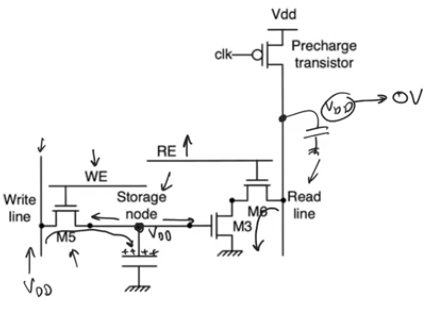

- The advantage of this to the smaller one transistor dram cell 
    - three transistor dram cell doesn't need an explicit capacitor for storage, it just uses the parasitic capcitance 

### Layout
- We aren't using any wierd processing steps
- we aren't using any layers that doesn't exist in standard cmos
- you can create three transistors dram cells using standard cmos, can be used as embedded memories on chip
- When you have embedded memories they usually happen to be srams
    - This allows you to not think too much about the issues of leakage or charge sharing and -other dynamic circuits problems
- When dram cells is used it usually off chip as main memory in this case it's better to use a one transistor dram cell

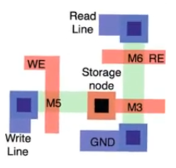

## One transistor DRAM
- Dram is probably the most complicated memory to read from and to maintain
- The cell consists of a single access transistor
- storage takes place on the storage capacitor Cs
- single bit line and  a signle word line
- To store a zero,
    - set bit line to zero
    - raise word line to Vdd so that the  access transistor turns on
    - the storage capacitro discharge and zero is stored
    - When the word line is disabled, the zero volt is maintained on the storage capacitance Cs in a high impedance state
- To store Vdd
    - Drive Vdd on the bit line, then enable the word line
    - because the access transistor is nmos to promote density, the maximum storage value at the storage capacitor is `Vdd-Vth`, to store Vdd, drive the word line to `Vdd+Vth`

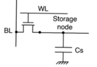

- One transistor Drams uses dynamic read operation meaning that we precharge the bit line, and then enable the word line
- To read
    - precharge the bit line, then enable the word line
    - if Vdd is stored, then `Vout=Vdd` is read on the bit line
- if zero is stored, then we have two capacitors at high impedance
    - CBL contans Vdd obtained at precharge
    - Cs contains zero volt obtained by previously being written two 
    - These two are connected together using the access transistor
    - Charge sharing happens because the two transistors are in parallel with each other

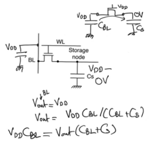

- if we are precharging the bit line to Vdd/2 then
    - if the storage capacitor is storing Vd, the bit line shares with the storage capacitor and VBL is gonna increase a little bit
    - if Cs is storing zero, the VBL is gonna decrease a little bit
    - this has the advantage the we observe a change in both cases which helps in the design of the sense amplifier

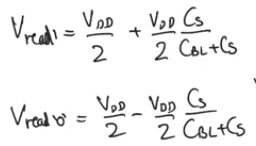

### Issues
- one transistor dram cells has destructive read
    - When you read the value stored in a cell, you also destroy it, because you are taking away or giving to the charge on the storage capacitor Cs
    - at the end of the charge sharing operation both Cs and CBL have the same value on them which is neither 0 or Vdd
    - To have a meaningful memory, when you read you have to go back and rewrite the value again
- The DeltaV observed on bit line is really small
    - the difference between reading a one and reading a zero is `Vdd*Cs/(Cs+CBL)`
    - CBL is the capacitance of the eniter bit line and it's also loaded by all the drains of all the access transistorsa
    - Cs is a small capacitance
    - We can't relay on the parasitic capacitance of the access transistor to provide Cs cause in this case the DeltaV is imperceptible
    - We have to use a physically created capacitor to provide enough storage to provide enough charge so that it has an impact on the bit line when reading
    - For capacitance to increase we have to increase area of the capacitor plates this contradicts with DRAM density

### Layout
- Layout that uses normal cmos layers
- diffusion bit line and metal word line (different from the others)
    - the problem here is that we will use the polysilicon to create one plate of the capacitor
    - this polysilicon is gonna run the entire length of the array (connected to ground)
    - the other plate is diffusion layer shorted to the drain of the access transistor
- the problem here is that this is a non linear capacitor
    - the capacitance because of the use of diffusion layer is non linear
    - it's really hard to manage

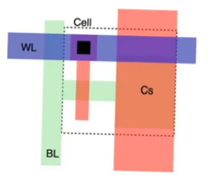

- To create a linear capacitor we use another polysilicon layer for the second plate
- one of them creates the bottom plate of the capacitor
- the other one is the normal poly layer which runs the length of the entire cell and connected to ground
- the bottom plate polylayer is gonna be shorted to the diffusion layer of the transistor drain by creating as many contacts as possible

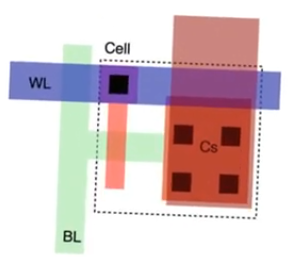

- this storage capacitor needs to be as large as possible so when we do charge sharing it has as large an impact on the bit line voltage as possible
- this is done by increasing the cell area, which has a bad impact on the cell area and therefore density
- most practical drams comes in an independant chips, they aren't integrated in the same chip as the system which allows them to do some nifty tricks
    - Like creating the capacitor through a 3D strucutre to increase the area without increasing the foot print

## DRAM read, write  and refresh cycles

### Dram array
- You have to use sense amplifiers 
    - While [sense amplifiers](13-sense-amplifier.md) help speedup other kinds of memories like srams
    - For drams sense amplifiers are indispensable to reading
    - because the dram cell itself isn't capable of creating  any kind of perceptible DeltaVBL
- sense amplifiers by definition are differential while drams are single ended
    - The way to deal with this is to have two bit lines connected to each sense amplifier
    - in each bit line we will have a dummy cell at the end of it
    - if we are reading from the cell at the upper bit line we activate the dummy cell on the other side and viceversa
    - the dummy cell might not contain anything it's an empty cell, so when reading it's not gonna change and remain at VDD/2 allowing us to read DeltaV 

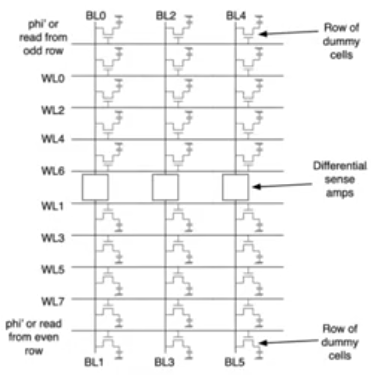

- In terms of layout the array is usually folded like this
- so that it's exists on one side of the sense amplifier

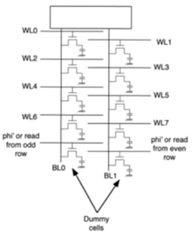

### Write cycle
- Drive the value to be written on the bit line
- enable the word line
- wait for the cell to store the value driven
- `Twrite = Tdrive + Twordline + Tcell`
- Drive delay means that we are driving the bit line using drive buffer
    - Delay of an inverter chain
- Word line delay can be calculated exactly the same way for rom array
    - with one exception which is word lines in drams are made using metal layers
    - which means that they can be modeled as a lumped capacitor, which makes calculation easier
- Cell delay the time it takes for the transistor to move the correct value to the storage capacitor
    - single time constant RC circuit
    - `T=RnCs` resistance of the access transistor times the capacitance of the storage capacitor

### Read cycle
- precharge the bit line, single time constant circuit with the capacitance of the bit line and the resistance of the precharge transistor
    - Bit line now is in the diffusion layer, has a resistive component
- Enable the word line, word line delay same as write
- cell delay (charge sharing delay)
    - charge sharing between the storage capacitor and the bit line capacitor
    - Charge sharing time is pretty small because the amount of charge is small
- [sense amplifier](13-sense-amplifier.md) delay
    - takes care of taking the charging sharing swing and maximizing it to full swing
- Once you read you have destroyed the value stored in the cell
    - take the full swing values produced from the sense amplifiers
    - route them to drive buffers (same used for writing)
    - drive them on the bit line
    - same delay of write operation

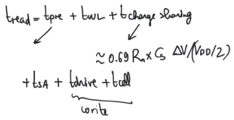

### Refresh cycle
- Drams have severe signal integrety issues
    - The stored value is stored in a capacitor
    - it's capacitance is relatively small
- A lot of different phenomena can affect the stored charge on this capacitor (takes away or adds to the charge, chaning the stored value)
- cosmic radiation tends to cause the value stored in DRAM cell to evaporate
    - causing the dram cells to randomley lose their data
    - which is why dram arrays are always used in conjunction with forward error correction
- Leakage charge flowing through the cut-off transistor because it doesn't have infinite resistance
    - With time the stored value is gonna evaporate
    - it's more an issue for dram then any other dynamic cmos circuit
    - for other dynmaic cmos circuits like latches or registers their inputs are updated every cycle, they precharge and evaluate every cycle
        - which is why you only need to make sure that the clock cycle isn't too long to allow any impact
    - With memories there is a danger that you might write somthing and won't need it for a very long time depends on the program
- This is why DRAMs have to refresh all of their stored data regularly
- refresh means reading the values and writing them again
    - read cycles include rewrite at the end
    - all we have to do is to do a read operation then it's a refresh
- When you enable a specific word line, you will enable all the cells in the word line
    - so you do refresh on a row by row basis
- The amount of time it takes to refresh one row is `Tread` with `m` rows in the array,
- refresh rate depends on the amount of leakage 
    - `Ileak=Cs*DeltaV/DelatT`
    - `DeltaT=Cs*DeltaV/Ileak` the time it takes to leak DeltaV (toleratable leakage voltage amount)
    - This is the amount of time that can pass between two consecutive refreshs for each row
- The memory as a whole needs to do refesh so that each row observers DeltaT between two refreshes 
    - `Trefresh = DeltaT/m` where m is the number of rows
- during the whole time `Trefresh` every cell can do reading and writing normally
    - but it's wasting some time to do refresh, the time is a read time
    - The overhead of refreshing is `Tread/Trefresh = Tread*m/DeltaT`

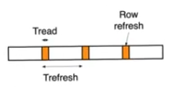

