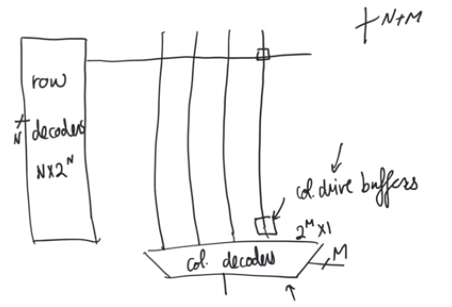
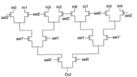
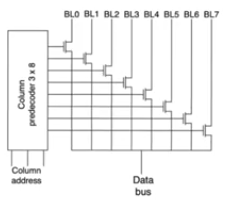
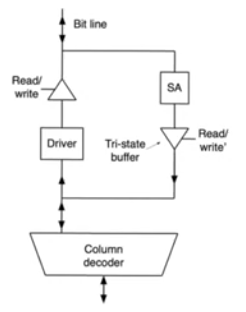
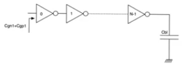

# Column decoder

## Memory array's auxiliary circuits
- The cell exists in the array somewhere, the word line is activated (using row decoders)
- The value of the bit line changes, which activates the [sense amplifier](13-sense-amplifier.md)
- and then we need to pick (using column decoders) which bit line we are reading from
- The auxiliary circuits are
    - row decoders (true decoder),
    - column decoders (more multiplexers then decoders), 
    - column drive buffers, only present in rams, might be in [flash](9-10-flash.md) or [nvm](7-non-volatile-memories.md)
- combine the inputs to the row and column decoders you get the address bus

## Column decoder
- The easist auxiliary circuit to understand
    - because it's not actually a decoder
    - it's a multiplexer
- Multiplexers generally created using pass transistors or transmission gates (for full value)
    - if we don't care about the threshold voltage drop over an nmos we can use nmos only
- there is a logarithmic growth in the depth of the transistor
    - the number of pass transistors we have to go through from the input to the output
    - `depth = ceil ( log2(#columns) )`
- number of stages we have to go through increases with the number of inputs which leads to delay
- The delay is concerning because the more transistors in series we have, the longer the RC network we are gonig through
    - The R is the resistance of the pass transistor or the transmission gate
    - The C is the parasitic capacitance at each node
    - This RC ladder has a delay that increases quadratically with the number of stages (depth)
    - fortunately the number of stages increases proportional to log2(#columns)

### Predecode and multiplex architecture
- Alternative way to create column multiplexers
- using a true decoder first,
- feeding it the M input lines and it produces 2^M lines
    - only one of the is active at a time based on the address at the input
- only one of the transistors is going to be on
- and the data bus will have a single value

- This might look good because we have a signle transistor in the path from input to output
    - we seem to have lost any depedance on the number of inputs, this is misleading
    - We are ignoring the depth of the column predecoder itself
        - it increases lograithmically with the number of the input bits
        - we have to go through the same number of transistors as with the straight mux arch
- there is not much improvement in speed, in fact it might be slower
- but it has an advantage in layout because it separates the multiplexer into two components
    - a predecoder compoenet
    - a single transistor in every path
- The transistors are gonna be in the same column as the bit lines
    - which allows to lay them out so that they have a tight pitch
    - that fits with the pitch of cells in the memory array 
    - so we can throw much of the complexity to an area outside the array

## Column drive buffers
- Column decoders need to work as multiplexers and demultiplexers
    - because sometimes in ram arrays we want to write to a specific cell
- We have separate buses for reading (dout) and writing (din)
    - but within the array we have a single bit line through which we have to read and write
    - so we have to multiplex these two buses and internally it has to be a single bus
- When reading the sense amplifier drives the bit line to the column decoder the value
- When writing we have to feed data the other way around, data is coming from the outside and it has to be driven to the bit line,
    - it has to be routed to a specific bit line
    - this can be done by using the multiplexer exactly the same way the only difference is that data is being fed from the outside
- There are couple of issues here
    - The bit line could be written to or read from, so there could be contention
    - While we are writing to the memory array, we have to drive them the values, the demultiplexer is a passive circuit that doesn't have any drive (RC circuit)
        - It doesn't have the ability to drive the large capacitance of the bit line

### tri-state-buffers
- The contention problem isn't a huge issue
- because when we are writing to the array we should be driving the value of the bit line
- when reading the bit line would be passive
- To guarantee that the two paths won't fihgt each other we have to have tri-state buffers 
    - at the output of the sense amplifier
    - at the output of the driver
- When writing we go through the driver, the buffer of the sense amplifier path will be open circuit, and vice versa
    - The bit would be under control of either one of these path but not the both at the same time

# Column drive buffers
 
### Driver
- The driver recieves the value from the column decoder which isn't capabable of driving the value
    - so we need the driver to provide low impedance drive for the bit line
    - to charge up the large capacitance of the drive real fast
- This can be done using a chain of inverters that optimize the delay of the path through which they are going

