# Row decoders

## Introduction
- The row decoder is the hardest subcircuit to design
- it represents a good chunk of total delay while reading and writing
    - because tehy have to drive word lines which are very resistive, which makes the delay very significant
- although word line delay is large, there are things we can do about it
    - because the row decoder is an active element,
    - so we can do things about designing and sizing them so that we minimize the word line delay
- it's a true decoder (N inputs, 2^N outputs)
    - can be active high (srams, drams),
    - or active low (NAND roms, nand flash memory)
    - there is only one active element at a time
    - we can disable the entire output of the row decoder so that every line is disabled in precharging for example

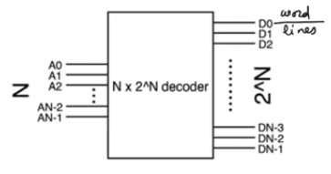

## row decoder basic circuit
- It's a set of `and` gates, each of them is enabled only for a unique combination of the inputs of the row decoder
- `N` inputs requries `2^N and` gates

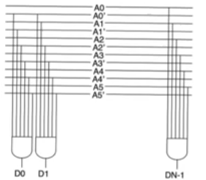

### Issues with large and gates
- The logical effort of the `and` gate increases substantially as we increase the number of inputs
    - means reduction in the ability to drive the output capacitance
    - more logical effort means less of the total effort being expanded to drive the electrical effort which means more word line delay
- As you increase the size of the decoders, the sizes of the gates in the layout increases
    - the distance between each output line and the other is gonna increase as the gates' sizes increase
    - this forces us to use word lines which are more spaced apart, reducing the pitch of the array, reducing the density of the array
- In the stadard cell library usually there isn't arbitrary large `nand` gates available, only small gates avaialable,
    - so to build larger `nand` gates the synthesizer will use smaller ones

## pre and final deocder architecture
- Divide the row decoder into a row predecoder and a row final decoder
    - The predecoder produces a number of lines that run vertically
    - There a small final decoder at the output of it
- The main reason we do this is for pitch (area density)
    - This allows to use very small gates at the outputs (final decoder)
    - reduces the pitch between them
    - allows us to return to row decoder drivers that are more inline with the size of memory cells 

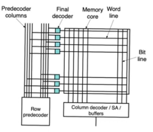

### Circuit
- row predecoders and final decoders are `and` gates
- Instead of creating `N` inputs `and` gates in one step, we create it using two steps
- The predecoders combining each pair of address lines to produces predecoder address lines
- you can trade off the complexity of the predecoder and the final decoder

 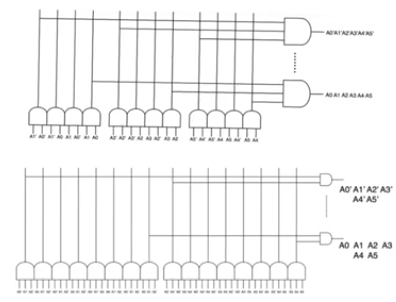

### Predecoder, final decoder tradeoffs
- We should push more complexity to the predecoder
    - We will always assume that the final decoder is always a two input `and` gate
    - most of the decoding is happening in the predecoder

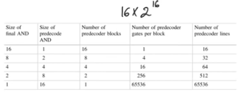

- For large `and` gates implement them as a sequence of smaller `and` gates instead of a large `N` input `and` gate
    - it might look that we are passing through more stages, which means more delay
    - in fact what matter is when we have more stages, that means a longer chain,
    - using logical effort method we can do more optimization in a longer chain to reduce the total delay of the chain while driving the output capacitance and this is our objective
- `AND` gate is implemented using `NAND`gate and inverter preferably two input ones

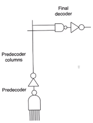

## Row decoder design using logical effort
- For the predecoder the large fan-in `nand` gate is created using smaller two input `nand` gates
    - each one is followed by an inverter to make it `and` gate
- Then the final decoder a two input `nand` gate and an inverter
- All driving the word line capacitance
- The path (chain) of interest is the path from either input bit to the word line
    - All of the paths are symmetric so optimization for one leads to all paths to be optimized
- A chain of `NAND` gates and inverters driving a final large capacitor
- we know the size of the first gate
    - and wanna find out the sizes of the intermidiate gates
    - to optimize total delay (Twl: word line delay)

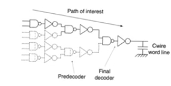

- Logical effort problem
- apply it to 16 input `nand` gate (16x2^16 row decoder)
    - 8 input predecoder `and` gates and a final 2 input `and` gate
    - The predecoder 8 input `and` gate is formed of 3 two input `and` gates in series
        - composed of 3 two input `nand` gates and 3 inverters
    - overall we have 4 two input `nand` gates and 4 inverters in the chain driving word line capacitance CWL
    - logical effort of the input `nand` gate is 4/3, logical effort of the inverter is unity
    - The total chain logical effort `G=(4/3)^4` ,
    - Total electrical effort of the chain `H=Cwl/Cin` (Cin input capacitance of the 1st nand gate)
    - This allows us to find the total effort of the chain `F=G*H` and get the optimal stage total effort, then we can find the electrical effort of the `nand` gates and the inveters
    - Then we can generalize these results in terms of `N` number of inputs
    - knowing the parasitic delay of each of the stages we can find an expression for total delay in the decoder, which is the word line delay

### Issues with logical effort
- Looking at the result there are two major incorrect assumption made
- The first one is assuming that the word line is purely capacitive (have Cwl only)
    - This is not true, the word line is always resistive in the majority of arrays because it's formed from polysilicon
    - even in drams where the word line can be metalic, due to the skin effect we will observe a significant resistance
    - so the wire should be represented as a resistive wire, a single pi section
    - When we have a resistive wire instead of a purely capacitive wire this doesn't change any thing about sizing for optimal delay
    - It just change the optimal delay by adding constant delay offset = `Cwire*Rwire/2`
        - it's the self delay of the wire
    - so this doesn't change anything about the sizes obtained

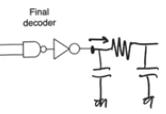

- The second one is a big assumption with major ramifications, it's that we have ignored the capacitance of the column running between the predecoder and the final decoder
    - The predecoder provide predecoded lines that run the entire length of the memory
        - They have a very large capacitance `Ccol` predecoder line capacitance

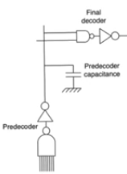

- It doesn't allow us to the final `and` gate with the initial `and` gates in a single chain because it separates the two
    - for the majority of terms we are still using the same expression the we have
        - because for most of the stages of the predecoder nothing has changed
        - starting with the penultimate stage in the entire decoder or the ultimate stage in the predecoder things have to change cause it doesn't drive the input capacitance of the final decoder `nand` gate only
        - now it's driving the input capacitance of the final decoder plus the capacitance of the column

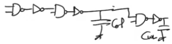

- The ultimate stage in the predecoder is driving the self capacitance and the input capacitance of the next stage and it's driving the capacitance of the column
    - Then we get a similar expression for the delay and it adds `Ccol` to the electrical effort
- The problem with `Ccol` is that it's unchangable, can't be controled like the capacitances of gates, 
    - if you increase the size of the gate we can increase it's input capacitance
        - this is the assumption upon everything in the sizing problem is based is that we can control the terms of any electrical effort within the chain 
        - except for the very final electrical effort where we have the load capacitance and we can't control it and that forms one of our boundry conditions
    - In this case we have an intermediate boundry condition imposed by `Ccol`
    - So we don't have enough equations to solve, we have one more unkown
- so for the final stage we have to do special minimization, our own differentiation and equating to zero
    - when we do this it gives us another condition on the logical and the total efforts of stage and the total efforts of stages N-1 and N-2 in which `Ccol` is making an appearance
    - then solve the the two equations

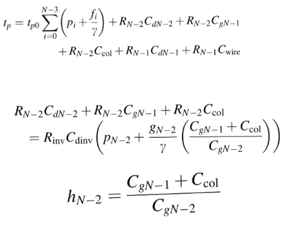

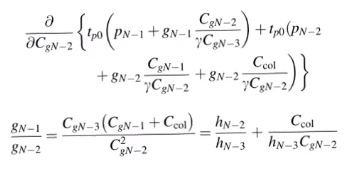

- There is also a very approximate way to solve this problem that works specially when column capacitance is large
    - To consider the predecoder as a chain on its own
    - and consider the final decoder as a separate chain
    - optimize the predecoder assuming the column capacitance is the entire load and ignore the input capacitance of the final decoder
        - this is valid only when the final decoder capacitance is small relative to the predecoder column capacitance, which is true for large arrays
    - once we have finished this we obtain the value of output capacitance of the predecoder final inverter plus the column decoder and these are the input capacitance of the final inverter
        - then perform optimization with it driving the entire wire
    - we don't have enough stages to do optimization 
        - so the final inverter is expanded into an inverter chain of its own allowing us to optimize the final delay of the final decoder 

