# Nor Roms
- Source [this](https://www.youtube.com/playlist?list=PLyWAP9QBe16oYW_JFv1lptjfArS4eI4GC) playlist on memories.

## Nor Roms
- Simplicit kind of memory that can be designed
- Rom array consists of 3 word lines, and 4 bit lines, at each intersections there is a cell
- Two different types of cells
    - Cells that contain an Nmos transistor storing logic 0
    - Cells that don't contain an Nmos transistor storing logic 1
- Nmos transistors connect the drain to the bit line and the gate to the word line

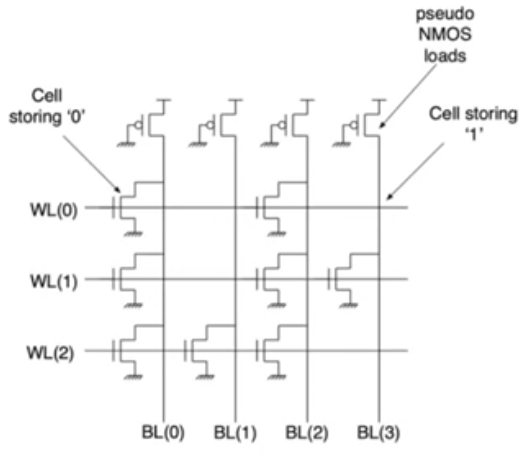

- This is called a NOR rom because if you look at any column you'll find that they perform a pseudo nmos nor gate

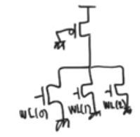

## Read process
- Activate a single word line using the row decoder, then observing the values that appear in the bit lines
- This gonna activate a signle nmos in each column and the output will close to zero as per pseudo nmos charactaristics

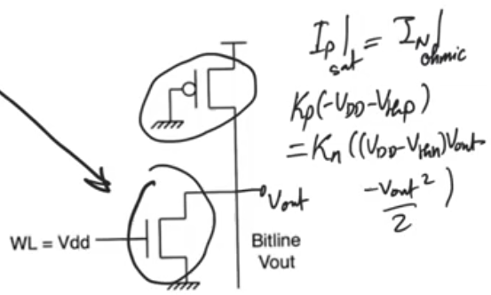

- For cells that don't contain a transistor, the pmos is always active, and there is no connection from the output to the ground as there is no nmos active in the column

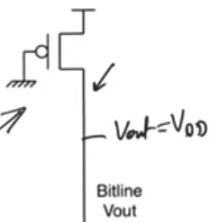

## pseudo nmos is unfavourable
- vout for reading zero from the memory is not gonna be exactly zero
- There is a static steady state current flowing in the circuit while reading a zero.
- we cannot allow a situation where there is a steady current flowing anywhere in the memory

## dynamic cmos Nor Rom
- The main difference is that the row of the grounded pmos loads on the top have been replaced with a pmos transistors with a clock signal phi applied to their gates
- Transformed every column into a dynamic cmos nor gate instead of a pseudo nmos.
    - it doesn't have an nmos tail clocked transistor cause it's generally not needed in most dynamic cmos implementations
- We should ensure that while the phi signal is zero all word lines are zero.
    - all the bit lines capacitances are gonna precharge up to Vdd
- same operation as pseudo nmos

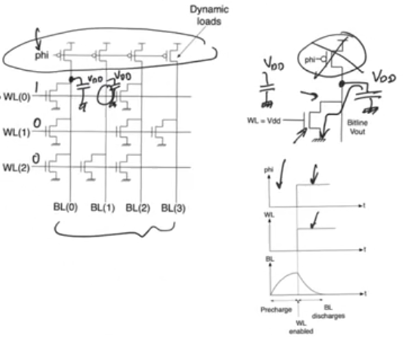

## Layout
- The layout is the only way we can have a good understanding of the area or the density of the memory
- at the top the precharge pmos transistor in an nmos well (single well process)
- Bit lines running vertically, bit lines are all metal
    - Metal layer has a really good advantage which is good conductivity, this will allow us to make some delay estimates.
    - allowing us to ignore the resistance of bit lines in general and just consider them capacitors
    - In general you want long wires to be metal as much as possible
- Word lines are in the polysilicon layer
    - Word lines always contact the gates of the nmos transistors, and gates are made using polysilicon
    - If the word lines were made using metal there will be two issues with this
        - We will need to use a higher metal layer cause the bit line is already made using metal one
        - This higher metal layer will need to go down and make contact with the gates of all the nmos transistors along the row 
        - This will need a via to go down to metal one and a contact to connect to the poly silicon for the 2^k bits
        - contacts and vias in general have a very large area requirements because they have a fixed area, and they have to be enclosed in all directions by both contacted layers
        - most of area will be lost on them, there will be alot of distance between cells reducing the pitch and density of the memory.
    - The price that we pay for this is that polysilicon itself has a large resistivity which doesn't allow us to ignore the resistance of the polysilicon wire while calculating delay
        - word line delay is gonna be significant when calculating delay
- In cells that doesn't contain a transistor you just run the bit line metal layer and the word line polysilicon across each other and they just create a crossover
- In cells that contains a transistor you have to have a diffusion layer below the metal making a contact with the metal at the drain, creating a transistor and another strip of diffusion under the transistor (connected to the source of the nmos) connected to the ground
- The cells under this is the next row flipped over so that (the source connected to the ground) is on top and the metal connection in below allowing us to share a ground.
    - Allowing to run a single ground strip for each two rows of the array
    - cause the ground strips that runs across the array are extremly area intensive, and they are the main reason nor roms are known for not being dense (fast but not small)
- grounds are implemented in diffusion for the sake of density cause the grounds are gonna be contacted exclusively by nmos sources which are in the diffusion layer so we are best off implementing the grounds in the diffusion layer to reduce the need for contacts and vias.
    - we are expected to pay a price in resistance as the diffusion layer has a really bad resistance
    - but fortunatly grounds don't carry signals, so we don't worry much about delay in grounds 
    - we do worry about drops or resistive bounces on ground but that's another issue

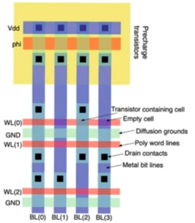+ 

- Another practical consideration for the nor roms, which will also be important for nand roms
- Nor roms arenot implemented with a distinction of whether or not there will be a transistor at every cell
- Instead the layout is implemented with the assumption that there is a transistor
- Instead when we want to create a cell that doesn't contain a transistor we insert threshold raising implants
- Threshold raising implant is a doping with P-substrate increasing the body potential of the substrate cause the Vthreshold potential to rise
- So there still be a transistor but with a high Vth that for all purposes it doesn't exist as it exceeds the supply voltage so it doesn't turn on
- It's important cause it allows us to preserve the programming to a single mask at the end of operation (threshold raising implant mask)

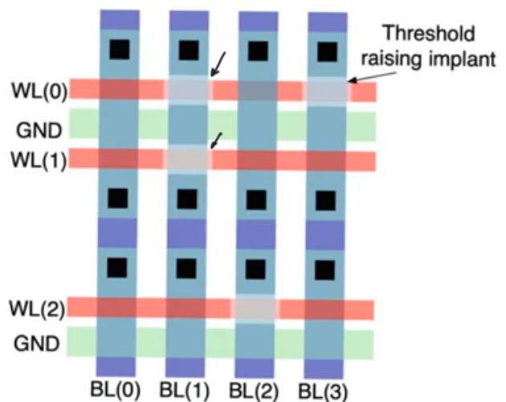

## Delay in Nor roms
- Easiest memory to calculate delay for
- Reading operation consists of three steps, each of them is gonna have its delay, and the read delay is the summation of all events
- Tread = Tprecharge + Twordline + Tcell
    - precharge delay: we activate the pmos transistors and they take sometime to precharge the bit line capacitances CBL
    - word line delay: from the point of time that row decoder activate the word line till the activation signal reaches the end of the word line this is called word line delay
    - Cell delay: The time the cell takes to discharge the bit line capacitance is Tcell

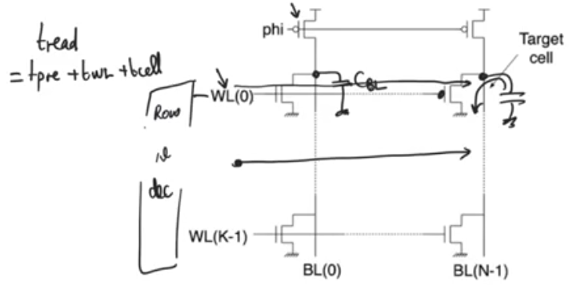

### Precharge delay
- The equivalent resistance of the pmos transistor is precharging the bit line capacitance
- single time constant RC circuit `Tprechage = 0.69 Rp CBL`
- Bit line is made using metal layer, assuming zero resistance, and the capacitance of the metal per cell is given 
- Another capacitance loading the cell, the drain capacitance from each transistor 
- `CBL = Cm * K + Cdrian * K`
- To reduce the precharge delay increasing the size of the pmos transistor (W/L)p is a viable option as there is only one pmos transistor per bit line so we can afford to reduce its size within reasonable bounds

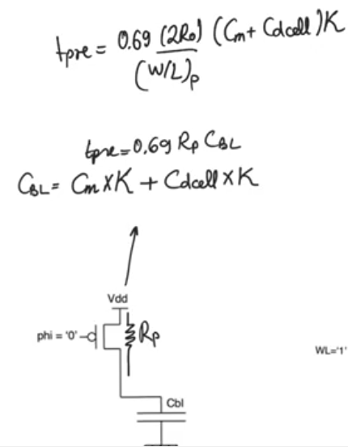

### Word line delay
- The total delay it takes for the signal to reach the last cell in a row
- To do this we need to use this equivalent circuit which is complicated
- The word line starts with a row decoder driving the word line, it has some kind of resistance, idealy should be zero
    - Rdrive is the output resistance of the last buffer that's driving the word line
- The word line itself is polysilicon wire which is highley resistive, consists of resistance and capacitance
- At every cell there is also loading by the gate of the nmos transistor of the cell assuming the worst case (there is a transistor at every cell)
- Assuming that each section (section between two cells) has a capacitance of Cw and a resistance of Rw
- We are going to represent each section of the poly silicon line using a pi section (capacitance Cw/2, resistance Rw, capacitance Cw/2)
    - Why this is a reasonable model? module 13

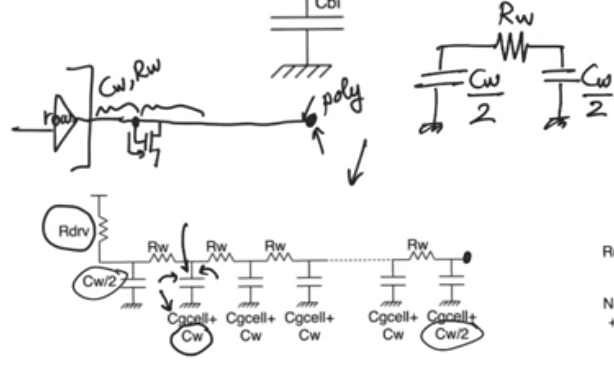

- we have a multiple time constant circuit so we have to calculate the Elmore time constant (module 13)
    - At every capacitive node multiply the value of the capacitance by the value of the resistance it sees coming up from the input 
- First and second terms represent the delay that results from the row decoder driving the line
- The last term has a really large impact in arrays with a large number of columns, and it represents self delay of the wire itself
 
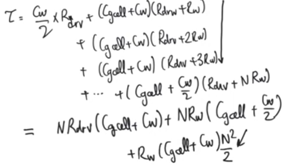

- Another equivalent circuit
    - Calculate the total capacitance of everything on the word line including word line capacitance and gates from cells, then form a single pi section representing the entire poly silicon wire
    - works best when the gate capacitance is small relative to the polysilicon capacitance, this is usually true
 
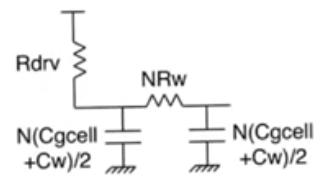

### Cell delay
- Once a certain cell in the array has been activated how much time does it take to discharge the precharge the was obtained in the precharge phase

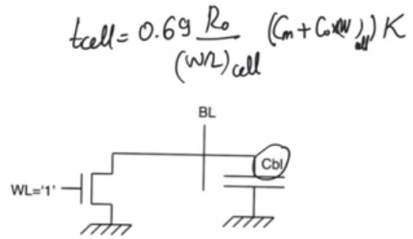  

### The most critical delay
- most critical delay is the word line delay 
- cause the precharge delay can be minimized by increasing the size of the precharge pmos transistor, and it's usually not big of delay
- and cell delay is also not important cause if we have to depened on a cell for discharging we gonna have a huge delay so we don't count on the cell to begin with and instead we relay on sense amplifiers
- Tcell is not important cause we don't wait for the entirty of Tcell we wait for a fraction of it, then we depend on sense amplifiers to take care of the rest
- On the other hand with word line delay, you have to observe it all, you have to wait for the signal to reach the end of the row
- and also you have alot of control over the word line delay using Rdrive, so you can reduce it, by simply design good row decoders

