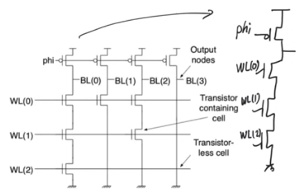
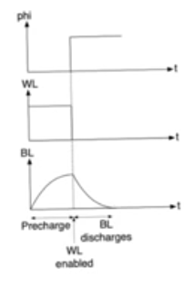
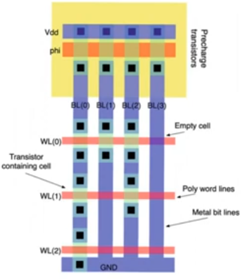
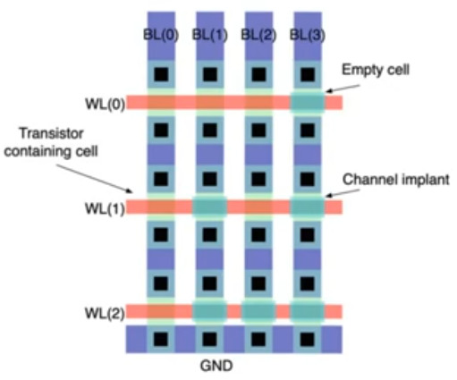
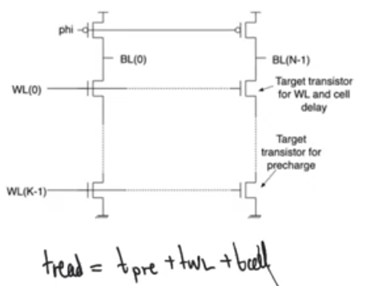
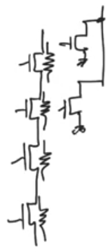
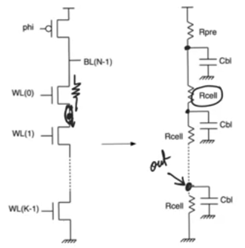
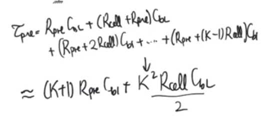
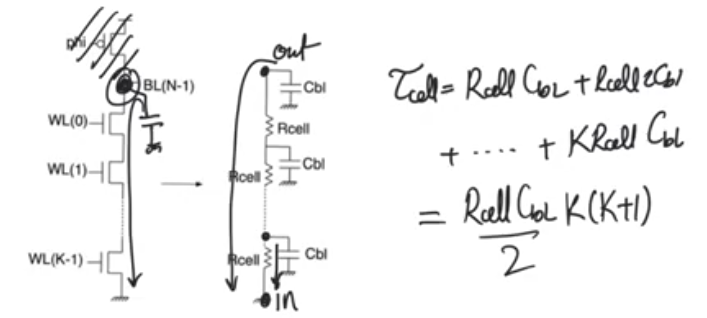

# NAND Roms
- Source [this](https://www.youtube.com/playlist?list=PLyWAP9QBe16oYW_JFv1lptjfArS4eI4GC) playlist on memories.

## NAND rom array
- Called NAND rom because each column forms a nand gate
- Every column is a dynamic NAND gate lacking a tail transistor because it doesn't need it
    - While precharing the pull down network is guaranteed to be inactive
    - The reading mechanisim is using dynamic logic, but this is not dynamic memory, because dynamic memories relay on capacitance to store data
- NAND roms is worse than NOR roms because there is a long resistive chain of transistors in each of the column
    - This doesn't exist in nor roms because in nor roms the transistors are in parallel with each other
    - NAND roms in general are slower than nor roms
- NAND roms are the densest memories, they store the most amount of data in the least area

## Reading operation
- The row decoder is active low, so all the word lines are set to one and the active word line is set to zero
- If there is no transistor in the cell, the pmos transistor will have a path to ground, so the node capacitance is gonna discharge to ground reading 0 in the cell
- If there is a transistor in the active cell, it'll be off (decoder active low, 0v at gate, transistor is deactivated), so this transistor will create an open circuit for the nand gate and the charge on the capacitor will be trapped and the cell will read Vdd
- This is the opposite of the sense in the [nor roms](3-4-nor-roms.md)

## Layout
- Row of precharge pmos transistors running at the top
- Bit lines running in metal vertically
- word lines running in polysilicon horizontally same as [nor roms](3-4-nor-roms.md)
- Bit lines running in metal in general because they need to contact with the drains which is the diffusion layer, and there is no way of running long wire in the diffusion layer
    - Because diffusion layer has a huge resistance
    - We are running the word line in polysilicon horizontally, if we run a diffusion layer vertically we are gonna create alot of unwanted transistors
- Unlike the [nor rom](3-4-nor-roms.md), the metal line isn't running over the active, it's being interrupted by the active (transistor intersection between diffusion and polysilicon)
    - The metal line has to stop, then we create the active for the channel then we go back to metal
    - This doesn't really waste alot of area because the width of active and metal in most design rules are pretty much the same
- We don't need grounds to run between rows as needed in [nor rom](3-4-nor-roms.md).
    - We need a single ground at the bottom of the array.
    - Grounds are implemented in metal
- This is why NAND roms are very dense, there is only a single transistor with nothing else in each cell, there is no additional grounds, or anything
    - The desnest solide state memory, every more dense than DRAM cause drams need large storage capacitance
    - NAND roms are very populare in solidstate drives, they form the mass storage of most mobile media

- As with the nor roms, a practical nand rom array is gonna create a transistor at every intersection
- In cells where there is no transistor, we have a short circuit instead of an open circuit
- The way to do this is to introduce threshold lowering implant
    - which ensures that the transistor is on for all voltage range used
- This reduces the programming of roms to a single step or a single mask

# Delay in NAND rom
- Read operation in NAND rom have the exact three step in NOR roms
    - precharge the bit line
    - activate the word line
    - read from the cell by potentially discharging the bit line
- Read delay in NAND rom is exactly the same in NOR roms in terms of its components
    - The way they are calculated are different

- Prechage delay
    - When precharing you are gonna precharge every internal node in the NAND gate except for the bottom most node
    - if you don't do this there is a possibility of charge sharing effecting the value of the data read at the output node
- Word line delay
    - It's exactly the same as in nor roms because we have exactly the same equivalent circuit
- Cell delay
    - cell delay is gonna be different than nor roms
        - Because in NAND roms we have a bunch of in series transistors, and the channel of these nmos transistors are resistive giving us an equivalent circuit that is formed of series resistances
        - We don't have this in the nor rom because the transistors lay outside the bit line, therefore the only impact on the bit line is to add more drain capacitance to CBL

## Precharge delay
- precharge delay is considered concluded once the bottom node has been fully charged up to Vdd
- Rcell is the resistance of each mosfet's channel
- CBL is  the capacitance of a single cell (drain from one transistor+source from another transistor+metal line connecting the two)
    - unlike the nor roms where CBL was the total bit line capacitance

## Cell delay
- Time required for the transistor to discharge bit line to zero
- Here we are intersted in the transistor at the output node, that is gonna discharge down to ground through the series connection of all next transistors
- This is gonna happen when there is one cell missing in the column and we are reading from it.
    - but we are gonna assume that there is a transistor at every cell to get a more regular expression for the cell delay

## NAND vs NOR roms Delay
- The delay of NAND roms is higher than NOR roms because the cell delay, the precharge delay are much longer
- Precharge delay higher in NAND roms because we need to precharge all the internal node
- Cell delay higher in NAND roms because we need to discharge through a long series of connections
