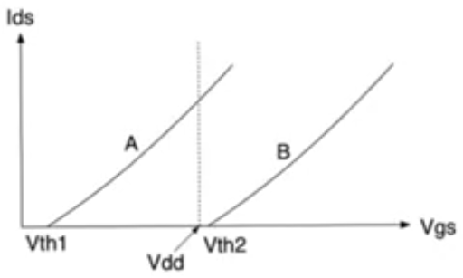
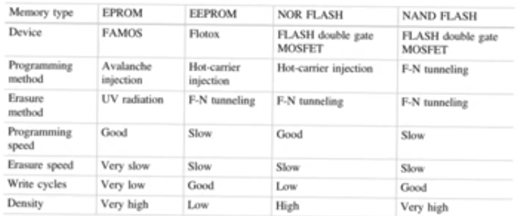
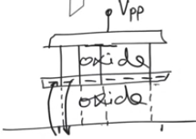
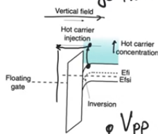
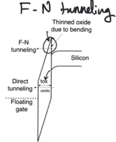

# Non-volatile memories
- Source [this](https://www.youtube.com/playlist?list=PLyWAP9QBe16oYW_JFv1lptjfArS4eI4GC) playlist on memories.

## Introduction
- Memories whose content remains the same if you disconnect the power supply
- They form the mass storage device of choice in most mobile medium
- NVMs are build on the same array structure as roms
    - NOR and NAND NVMs
    - same way of calculating delays in read operations
- The main difference is that the only way to decide there is a stored one or zero in roms is wether the cell has a transistor or not
    - The whole idea in NVMs is how to make the fact that there is a transistor or not reprogrammable
    - How can you have a transistor in the cell, and this transistor can be made to disappear or appear based on the what we want to write
    - In Roms we had threshold raising and lowering implants to program the rom, so doing this on the fly while operating the memory makes it sort of writable

## programming NVMs
-  The idea in NVMs is if you have a transistor whose characteristics can be changed on the fly, its Vthreshold changes between two points, then you have succeeded
- if Vthreshold 2 is higher than supply voltage, then for all purposes this transistor doesn't exist, so we can program the transistor to not exist
- if the trasistor can move back and forth between two characteristics then we have a non-volatile memory
- Terminology
    - When we move the transistor to the Vth2 so that it doesn't exist we call this erasure
    - When we push it back to Vth1 so that it exists we call it programming
    - These processes aren't called writing.
    

### double gate mosfet
- The idea for almost all non volatile memories is that we have a double gate mosfet which is called a control gate
- If you put alot of negative charge at the floating gate this is gonna raise the threshold voltage
    - because they form an implanted channel that requires the control gate to put on a higher Vgs in order to turn on the transistor
    - When you put a +ve voltage at the gate (control) the negative charges are gonna create a counter field going up, so you'll need a much higher field coming from the control gate inorder to invert the true channel
- If the electrons at the floating gate are pushed out of it, then we can return the transistor to its original Vthreshold

## NVM types
- There are three programming and erasure mechanisms 
    - Avalanche break down
    - Fowler nordheim tunneling
    - Hot-carrier effect (injection)

### Avalanche break down
- you have a floating gate and a control gate and you have silicon dioxide between the floating gate and the substrate
- If you can get the electrons from the substrate to the floating gate, they will be trapped there, and your job will be done
- Apply a really high positive voltage to the control gate, a much higher voltage then the normal supply voltage used during operation
    - This high electric field is gonna attarct electrons from the substrate into the oxide
    - These electrons are usually stopped within the oxide, can't get through it
    - They are gonna hit some of the atoms of the silicon dioxide releasing electrons
    - These electroncs are energatic in the field, so they hit more atoms releasing more electroncs in a chain reaction
    - The oxide basically becomes a conductor temporarily.
    - electrons flow upward against the direction of the electric field, as soon as they meet the floating gate, they settle there
    - This process is self limiting, because the more electrons gather within the floating gate, the weaker the electric field below the floating gate will be
        - most programming operations are self limiting 

#### Specs
- Avalanche break down can't be used to erase the gate becasue you can't apply voltate in the reverse direction
- It's a pretty slow process
- It's a harsh process, you are basically breaking down the insulator
    - The programming cycle of memories that use avalnche breakdown are low, only a limited number of time because the insulator becomes too porous, almost conducting all the time

### Hot-carrier effect
- It's a classical effect can be understood fully using the band model, no quantum effect happening here
- some electrons are gonna be very energetic in the conduction band of the substrate
- They gain enough energy to overcome the barrier imposed to them on the oxide
- This barrier is 3.5 eV, they overcome it and flow through the oxide to the floating gate and settle there
- We have high energy electrons near the drain usually because they are flowing very fast.
    - the electrons have so much kinetic energy we call them hot electrons
- inorder for them to flow through the oxide, there has to be an electric field, a vertical field applied through the control gate
- The electric field promotes the motion of electroncs into the floating gate

#### Specs
- It's a self limiting process
- It's the fastest method used for programming
- It can't be used for erasure because the electrons in the floating gate are immobile, there is no way to get them moving and hot
- It has a medium effect on the oxide, it's alot gentler then the avalanche break down, but it's not ideal, it's programming cycles is kind of intermediate.

### Fowler nordheim tunneling
- It's a quantum effect, it doesn't require the physical motion of electrons within the oxide, it's more related to uncertainty and the wave particle duality in electrons
- The main determining factor of probabilty of tunneling is the thickness of the insulator (oxide) through which we are trying to tunnel
    - The smaller the thickness, the more likely to tunnel
- In an NVM we don't want the tunneling to happen all the time, so we don't keep it too thin, we should keep it reasonable so we don't have tunneling during normal operation
    - because most of time we are reading from the array
- We apply a very large vertical field by putting a very large control voltage on the control gate 
- With a very large vertical field the oxide is gonna tilt, and the tilt is goning to be very sharp because there is a huge drop on the oxide (between the floating gate andd the substrate)
- With the oxide tilting so much there is a portion of the oxide which is triangular instead of rectangler, and its thickness is much smaller then the normal thickness
- So it's easy for the electrons on this side to tunnel to the other side with the application of this large electric field
- When you remove the electric field, this large bending (tilting) on the oxide is gonna resolve and the thickness observed by the electrons is gonna be large again and they can't tunnel

#### Specs
- It's very gentle and has great programming cycles
- It can be used for programming or erasure
- The only disadvantage is that it's pretty slow relative to the hot carrier injection

