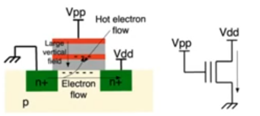
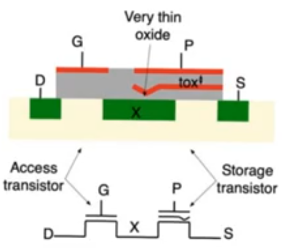
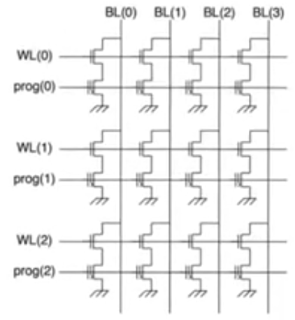
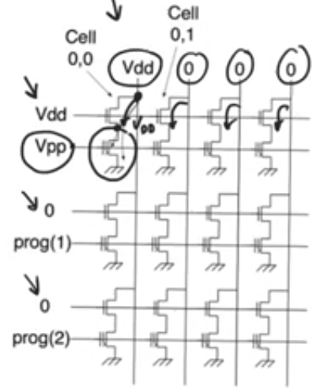
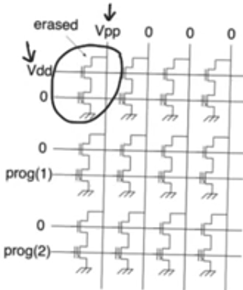
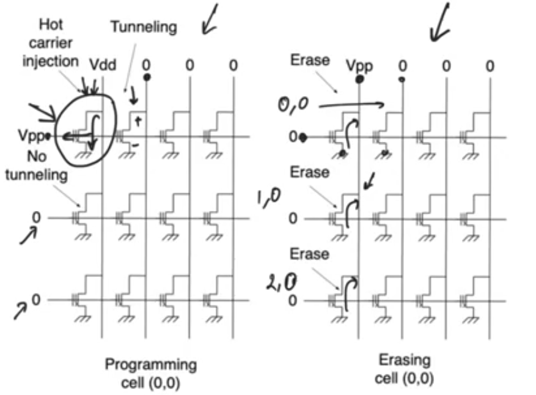

# EPROM and EEPROM

## EPROM
- Electrically programmable rom
- Specifically only electrically programmable not erasable
- We can program a zero into a cell by causing the transistor to not exist by raising the threshold voltage, but we can't deprogram it or erase it while the chip is being used
- The memory array is basically a [NOR rom](3-4-nor-roms.md) and it's read from exactly the same way we read from any NOR rom
### Programming EPROM
- Apply a normal supply voltage on the drain and a very high positive voltage on the gate
- This high positive voltage called the programming voltage does two things
    - Creates a channel, the electrons in this channel are kind of energetic
    - Creates a vertical field that attracts the oxide
- This causes the electrons to flow through the oxide causing it to breakdown through [avalance breakdown](7-non-volatile-memories.md)
    - The avalance break down leads to a large flow into the floating gate
- This device is called a FAMOS device (floating gate avalanche injection mos)
- All the cells by default are carrying a one, to program a cell to carry a zero you do this

### EPROM disadvantages
- The problem with EPROM is that you can program them using specific electrical values on the gate and drain but you can't erase them same way
    - The problem here is that the oxide below the floating gate and between the floating gate and the control gate are thick 
        - this device is historical device nolonger practically used, which is why the oxides were kind of thick
    - so we don't have any mechanism by which we can push back the electrons from the floating gate down to the substrate
- To erase an EPROM chip you take it out and put it in a special machine that exposes it to ultra violate light
    - EPROM chips usually have a transparent window on top that allows the chip to be exposed to UV light when you want to erase it
    - When you erase it, you erase everything on it, you reset it so that every cell is carrying a logic one 
    - The UV ligh freezes some of the electrons in the oxide making it conductive allowing the electrons to drop down from the floating gate to the sustrate
- The avalanche injection operation is very harsh on the oxide so this reduces the number of times you can program the chip and also it's very slow
    - programming is very slow
    - Erasure is slower, UV light process is very slow
 
## EEPROM
- Electrically erasable programmable rom
- You program it by putting electrons on its floating gate causing it to store a zero and you can erase it by removing the electrons from the floating gate causing it to store a one
    - you can do both things by applying specific electrical values to the cell
- storage device used in the cell called flotox device (floating gate tunneling oxide)
- Two mosfets
    - access transistor (run-of-the-mill mosfet) on the left
    - storage transistor on the right
- The storage transistor has a double gates and the gate takes a bend down towards the substrate near the drain and it extends alot over the drain
    - it has a terminal called P (programming)
   

### EEPROM cell array
- Nor rom structure, the disadvantage is that there are two transistors per cell (worse density)
- We have word line connected to the gate (access transistor), bit lines connected to the drain, programming lines connected to the storage transistor

### Programming
- To program select the cell by applying supply voltage Vdd to the word and bit lines
- Apply high voltage Vpp to the programming line
- The access transistor will be on, and its drain has Vdd transfered to the source (drain of storage transistor)
- so the storage transistor has Vdd on the drain, ground on the source, very high Vpp in the gate
- This very large Vdd creates an extremly healthy channel in the storage transistor
- The Vdd applied to the drain causes electrons to move through the transistor
- These electrons will be very energetic when they reach the drain, which allows them to go through the oxide using [hot carrier effect](7-non-volatile-memories.md)
- There is a large vertical field created by Vpp that promotes this process attracting alot of electrons to the floating gate using hot carrier effect
- This process programmed only one cell, non of the cells in the row will be programmed cause there is no current flow cause there is no drain voltage (bit line) applied
- Now the cell is storing a zero (the cell doesn't have a transistor (Vth of the transistor is larger than the supply voltage) )

### Erasing
- Enable the word line that contains the cell (apply Vdd)
- Apply Vpp (large +ve voltage) to the bit line that contains the cell
- Apply 0 voltage to the P gate of the storage transistor
- The high voltage Vpp is gonna pass to the drain of the storage transistor 
- This is gonna cause tunneling to happen on the drain side from the drain down to the substrate cause the field is in the opposite direction
    - Which is why the floating gate is bent down on the drain side allowing the oxide to be very thin near the drain which promotes tunneling near the drain side
    - Keeping the oxide thick along the channel allows us to have control over how much tunneling happen accross the channel so we can localize the tunneling to the drain side only 
- other transistors on the row and the column won't be affected.
- Now the cell is storing a one (the cell have a transistor)

### Disadvantages
- It has two transistors per cell and this is required because of erasure

### single transistor EEPROM
- If we have a single transistor per cell in eeprom 
- programming will be by applying a Vdd to the bit line and Vpp to the word line
    - we are gonna have a current through the cell's storage transistor and a large electric field.
    - there will be a hot carrier effect and the cell will be programed
    - All other cells in the column won't be programmed as they have 0v applied to their gates
    - All other cells in the row don't have a current within their channels as they have 0 applied to their bit line, there is no Vds, so there is no hot carrier effect
        - But there is a large Vpp applied to the gate of these transistors causing tunneling in them
        - maybe attracting some electrons into the floating gate and accidently programming some of these cells
        - This is an issue but a secondary one, not a huge deal because hot carrier effect is much faster than tunneling
    - So there is no problem programming using this method
- Erasure will be by applying Vpp to the bit line (drain) and 0 applied to the gate
    - This creates a negative electric field that promotes the motion from the gate into the substrate
    - Non of the cells in the row (other than the wanted cell) is gonna be erased because they have zeros on all their terminals (drains and gates)
    - The problem is with the cells on the column, they observe the same terminal voltage as the cell we want to erase (Vpp on the drain, 0 on the gate, 0 on the source)
        - Tunneling (the process in which we erase the cell) is also gonna happen in the other column's cells
    - So there is no way we can erase a single cell if we don't have an access transistor
- if we insist on having a single transistor per cell, then we have no way of erasing a single cell, we have to accept that when we erase a cell, we will erase all the other cells in the column that share the same bit line
    - This is the foundation of flash memory (most practical category of NVM)

