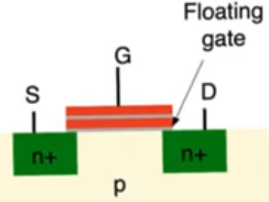
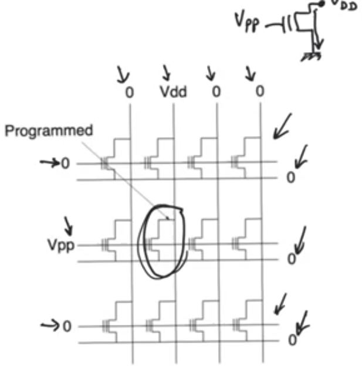
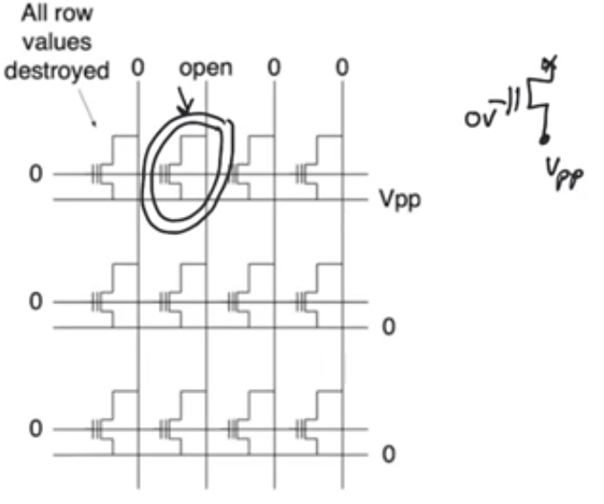
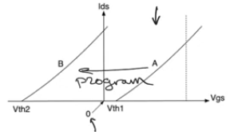
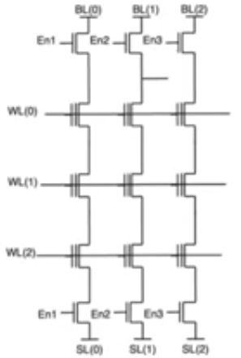
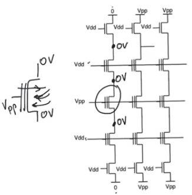
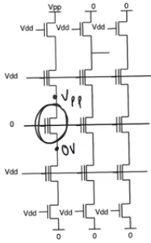

# FLash memories
- Source [this](https://www.youtube.com/playlist?list=PLyWAP9QBe16oYW_JFv1lptjfArS4eI4GC) playlist on memories.

## Introduction
- Most practical [NVM](7-non-volatile-memories.md) memories, used to implement all mass storage devices on modern electronics
- Device used in flash memories is a simple double gate device
    - The oxide thickness is small
    - This allows to do tunneling with the application of favourable voltage
    - Which allows it to use tunneling through the entire length of the channel for programming or erasure
    - This is different from the [flotox](8-eprom-eeprom.md) device where tunneling took place in a specific localized location near the drain, at the oxide was relatively thick everywhere else
    - This is because the thickness of the oxide used in modern technologies is already thin enough that tunneling under [Fowler nordheim](7-non-volatile-memories.md) is tenable for erasure and programming
- The whole point about flash memories is that it uses a single transistor per cell.
    - this allows it to be the smallest and most dense memories that can be rewritten ever.

- The trade off in flash memories is that they can't have a cell by cell erasure
    - There is no way for you to pick a specific bit and erase it
    - instead you have to erase a whole bunch of cells at once usually the entire row or column of a certain array cause there is no access transistor like [eeproms](8-eprom-eeprom.md)
- Flash memories require alot of monitoring and control,
    - there is alot of control circuits surrounding them that keep track of what's going on because there is alot of values that can deviate through usage
    - specifically the values of threshold voltage
- If you can't program on a bit by bit basis then this array doesn't work
    - If you erase and find that you are erasing whole sections of the memory that's fine

## Nor Flash array
- Looks like regualer old [nor rom](3-4-nor-roms.md) 
    - except that there is a transistor at every cell,
    - and these transistors are double gate transistors,
    - and there are ground lines that aren't connected to ground,
        - because when programming or erasing we might connect different terminal voltages to these grounds
- In normal operation this would operate exactly the same as a nor rom with the ground lines being connected to ground, and word lines being dervied from the row decoder, and the bit lines feeding the column decoder and the sense amplifiers
- Reading from a nor flash is exactly the same as reading from a nor rom, and the delay calculations is the same as [nor roms](3-4-nor-roms.md#delay-in-nor-roms)

### Programming Nor flash cell
- Apply Vpp (high voltage) to the word line that contains the cell to be programmed
- Apply Vdd on the bit line that contains the cell
- Grounds are applied normally
- Zeros on all other word lines and bit lines
- A healthy channel is created by Vpp, this channel will have electrons that are flowing at a very high speed (close to velocity staturation or velocity overshoot levels)
- The [hot carrier effect](7-non-volatile-memories.md#hot-carrier-effect) will take place,
- A lot of electroncs will be attracted into the floating gate of the storage transistor allowing it to program into not existing.

- All the cells in other rows are safe from being programmed or erased (All terminals' voltages are very safe (not Vpp))
- All the other cells in the row are observing Vpp on their gates (they have a zero volt on the drain and source, and Vpp on the gate) 
    - this will cause tunneling from the substrate into the floating gate,
    - some of these cells might program but it's safe enough 
    - the amount of time required for hot carrier effect is so short that the deviation of Vthreshold of other cells by tunneling is gonna be unnoticalbe
    - but we have to keep track of it, there has to be a circuit that keeps monitoring how far Vthreshold of all the cell have deviated from normal levels

### Erasing Nor flash cell
- Apply zero voltage to the word line that contains the cell
- Apply Vpp to the source (ground row) of the cell
- The drain (bit line) is kept open
- Zeros on all other word lines and bit lines
- For the cell we have Vpp on the source, ground on the gate, and an open circuit on the drain
- There will be a large vertical field in a direction that promotes the flow of electrons from the floating gate back to the substrate, erasing the cell by tunneling

- The problem is that all other cells in the row are also gonna observe tunneling from the floating gate down to the substrate
- Every thing in the row is gonna be destroyed
- If you really insist on destroying or erasing a specific cell you have to have a register sitting on the side, 
    - read the contents of the entire row, erase the row, then write everything except the cell that you wanted to erase
- It's impossible to erase a value of a specific cell in a flash memory

## NAND flash
- The absolute majority of flash memories are NAND flash memories because of their density
    - Nor flash memories have specialty applications when we need really fast memories
- For nand arrays we have cells that contain transistors and cells that don't contain transistors
    - the cells that don't contain transistor, contain short circuit instead of a transistor so it's a transistor always on
        - This is the opposite of nor flash, in which there is an open circuit instead of a transistor
- In NAND roms the characteristics that we switch between are the normal one and a depletion mode transistor which is always on even at Vgs=0
    - So erasing means moving to the second characteristic (transistor becomes like a short circuit)
    - and programming means going back to normal operation of a transistor
    - Unlike the nor flash where the second characteristic was higher than the supply voltage

### NAND Flash array
- In a NAND flash array we have units (each column is called a unit)
- The units are usually really short because NAND roms suffer from high delay because the resistance on the series connection of mosfets (on the column) grows really quickly
    - one way to deal with this is to keep these units of series transistors short (16-32-64 transistors at most)
- In erasure we can't erase a certain cell, we have to erase an entire column 
    - One smart thing to do is to keep the column be same as the word size of the processor implemented.
- a group of bits is characterized by the two pass transistors at top and bottom, with a common enable signal fed to them

### Programming NAND flash cell
- Apply Vpp to the word line that contains the cell to program and Vdd to all other word lines
- Apply zero (grounds) to the bit line (drain) and source of the cell
- Apply Vdd to all enable signals of all transistors and Vpp to the sources and drains of all other columns transistors
- So the cell will have grounds on the source and drain and Vpp on the gate
- This is gonna cause tunneling and the field direction is into the substrate causing electrons to be attracted into the floating gate accumulating in it causing the transistor to go the the first characteristic (normal operation)
- The default case here is that the transistor acts as a short circuit where it's conducting all the time
    - and we want to get it to the normal operation by attracting electrons from the substrate into the floating gate
- This won't affect the other cells of the column cause their terminals voltages are (S:0v, D:0v, G:Vdd) which are don't cause tunneling and used normally for reading
- For the other columns we are apply Vpp to their sources and drains causing Vpp to appear on all their terminals saving them from tunneling

### Erasing NAND flash cell
- Apply zero to the word line (gate) that contains the cell to program and Vdd to all other word lines
- Apply Vdd to the bit line (drain) and zero to the source of the cell and zero to all other bit lines
- Apply Vdd to all enable signals of all transistors
- The cell will end up with (D:Vpp, S:0v, G:0v), 
    - these terminal voltages are gonna create a large vertical electric field that favors the flow of electrons from the floating gate into the substrate 
    - causing the formation of an implanted channel,
    - causing the transistor to appear as an effective short circuit
- All the other transistors at the same column are also gonna erase at the same time because the observe voltages that expose them to tunneling
    - The threshold voltages of the other transistors are gonna switch
    - The amount of deviation of the threshold voltage of them will be different from the amount of deviation of the threshold voltage of the target transistor
        - This is even worse than nor flash rom where the values stored all erased
- When erasing we are gonna reset the entire column,
    - Write ones on all the columns cell first
    - Then erase them all next
    - This takes alot of time

   
