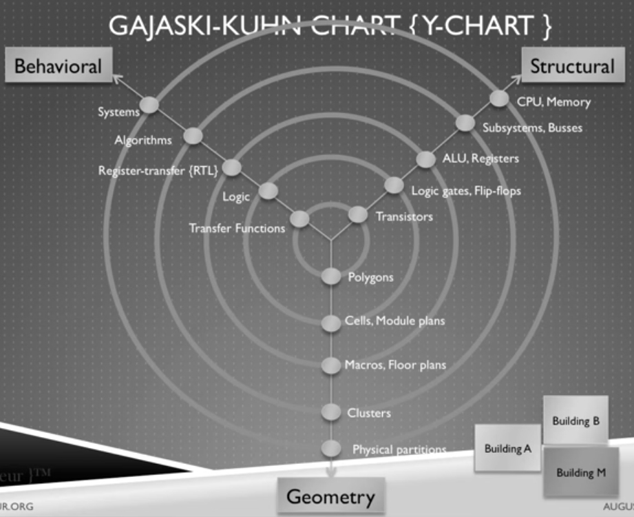
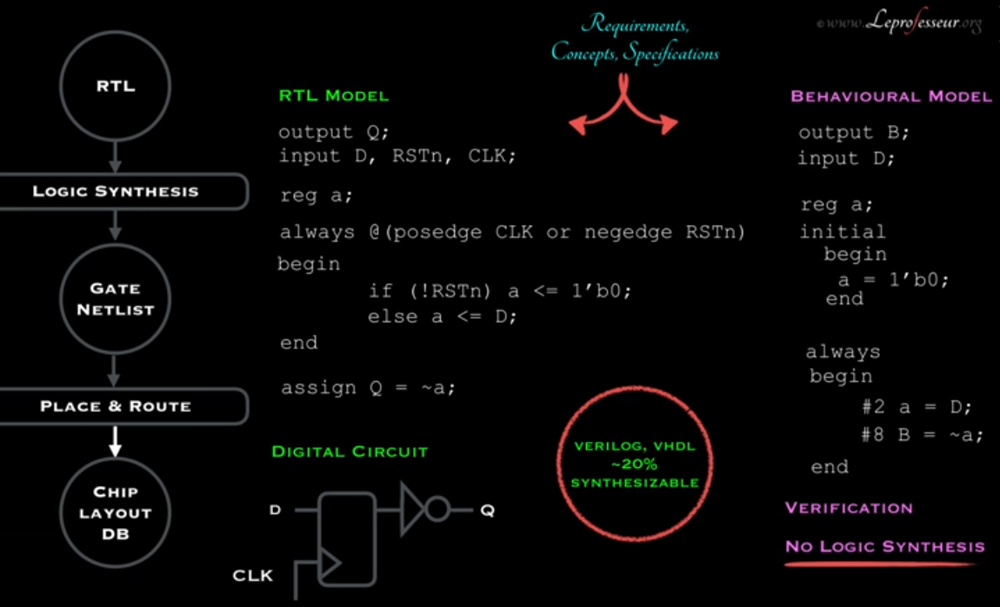
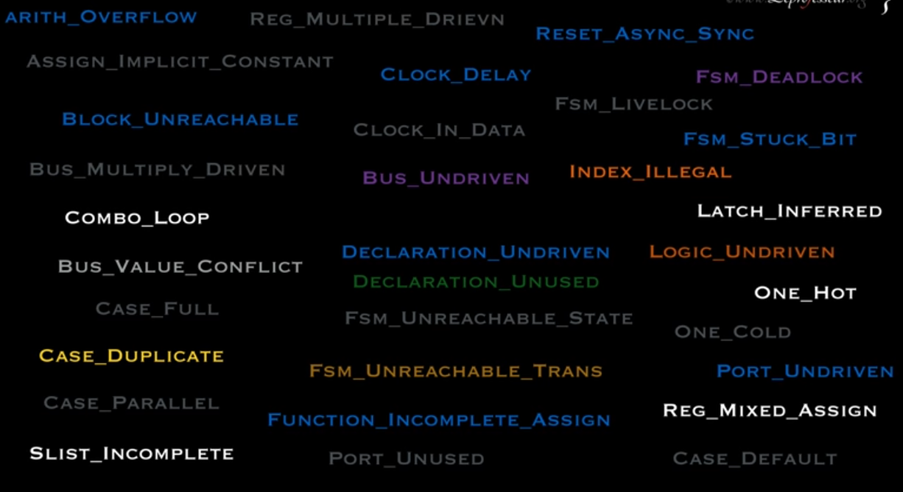
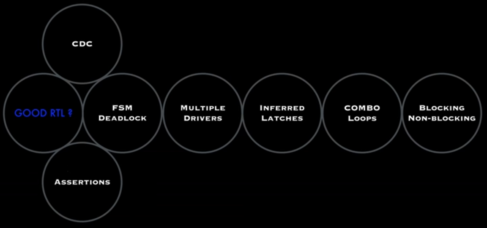
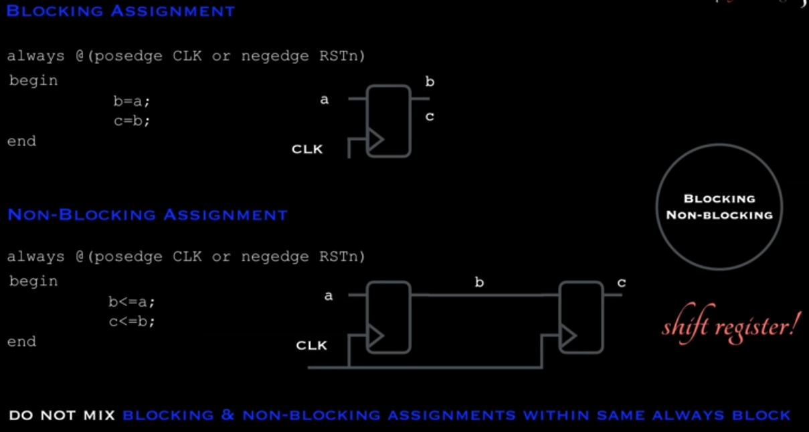
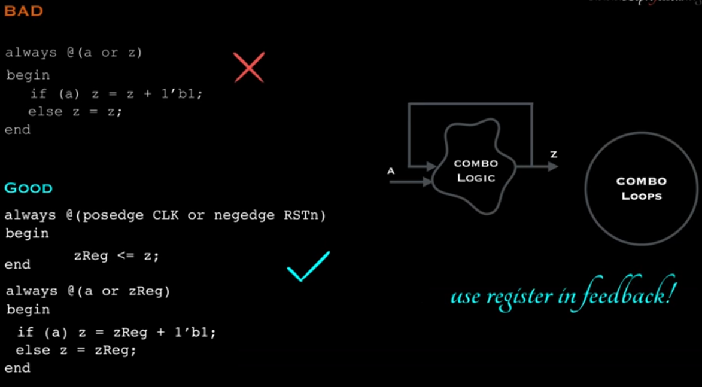
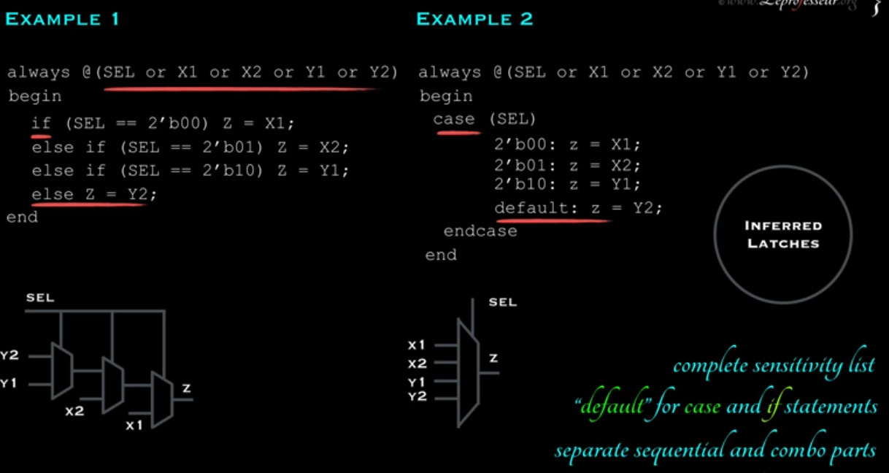
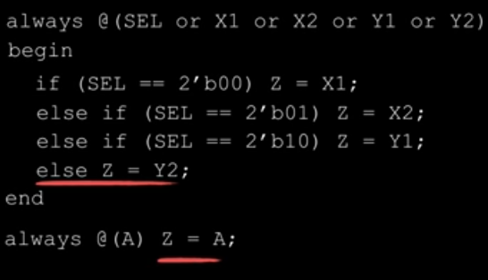
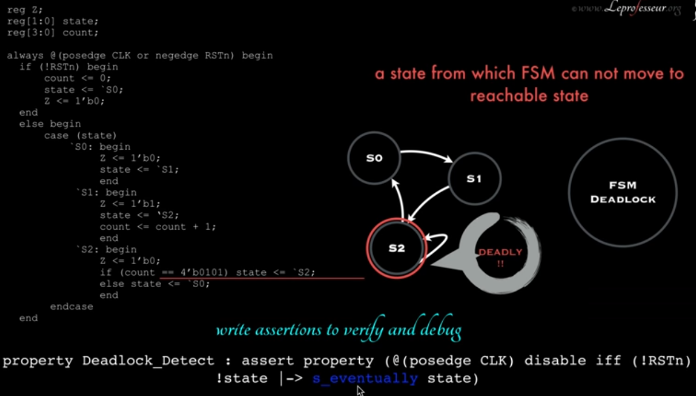

# Y-chart and RTL tips
source: [this](https://www.youtube.com/watch?v=voi0oZI5Tug&list=PLFhizsGPFKt8gz-bYlKMDCgBKwxMc33H2&index=20&t=0s) video
 
## Gajski-Kuhn chart

## Linting
- After writing RTL code, run a linting tool on the code to check for RTL style checks
- Synopsys spyGlass, Mentor Autocheck, questasim

## Points to check in RTL code

## Blocking and non blocking assignments
- DONOT MIX BLOCKING AND NON BLOCKING WITHIN SAME ALWAYS BLOCK

## COMB_LOOP 
- feedback in combinational logic

## INFERRED LATCHES (implicit)
- Latches makes problems in timing constraints

## Multiple Drivers

## FSM DEADLOCK
- Fsm is stuck in one state

