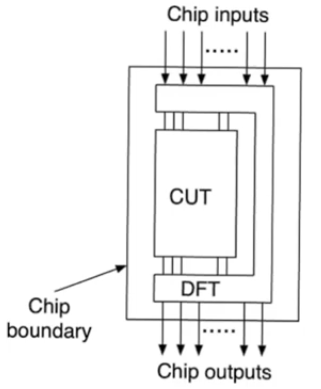
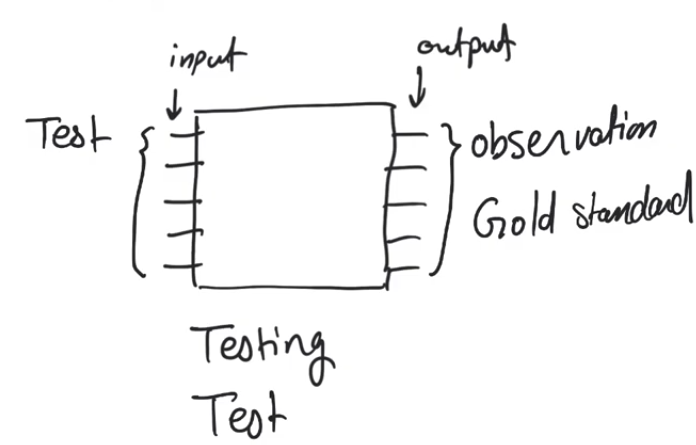
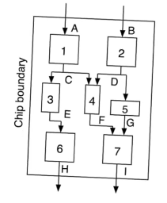
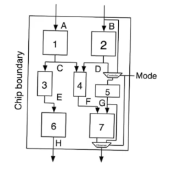

# Design For Testability
- Source [this](https://www.youtube.com/playlist?list=PLyWAP9QBe16qiSMkBcAnUMxFagLIJzmv1) playlist on Testing.

## Introduction
- Testing is basically making sure that your product works
    - The product is the chip, and you have to make sure that it works proberly
- When we start talking about testing, we will find that we need to add alot of additional hardware to the finished chip just to make sure that we can test it
    - It's a significant amount of hardware around 30% or 40$ additional hardware
- CUT: circuit under test
    - like the UUT (unit under test) in software testbench
- Additional hardware for DFT that goes through the same [design cycle](../design-flow) that the main chip goes through
- The DFT hardware stands in the middle between the input, outputs and the core of the chip
    - The DFT hardware is usually intertwined with the core of the chip and there is no way to separate the two into neat modules

   

## DFT
- The whole area of DFT is focused on finding efficient tests for chips and figuring out the additional hardware required to enable these tests and how this hardware is efficiently designed
- This is not a preferable subject, it's integral to ensure that the design works, and to ensure the finish products are also functional

## Testing
- The main problem of a finished chips or even an HDL design that has gone through synthesis is that you nolonger have access to internal hardware
- you only have access to the inputs and outputs of the chips
    - you can control the input pins and observes the output pins
- The process of making sure that the chip is functional is called testing
- A **test** means a pattern applied to the input,
    - and then you expect to see something at the output
- An **observation** is what is seen at the output when applying the test
    - The observation could be correct or incorrect so it needs to be compared to something
- A **gold standard** is a correct output expected to be seen if the chip is functioning proberly
- if the observation matches the gold standard then the chip is functioning proberly,
    - but you don't apply a single test, you apply multiple tests to make sure the chip is functional for all of your inputs
- The test tells you if the chip is working or not,
    - To find why it doesn't work or which part isn't working proberly that's called diagnosis
- *Diagnosis* defines the part of the chip (submodule) where there is a problem and perhaps tell you what the problem is
    - A higher level of testing than functional test

## Issue with Testing
- In the example assume there is a problem that is detceted by applying a certian test to the inputs
    - you need to isolate the problem    
    - you have a suspesion that there might be a problem with submodule 5
- The problem with submodule 5 is that it's not reachable, and can't be tested
    - because the inputs to it is an internal signal (D)
    - and its output too (G)
- You can't control the inputs of submodule 5 (controlability problem) and you can't oberserve the outputs (obervability problem)
    - we don't have access to these nodes through input and output pins
    - modules 1 and 2 are directly controlable
    - modules 6 and 7 outputs are directly observable
- In a scale of a realistic chip, you have hunderds of thousands of gates inside the core and perhaps a few hundred pins
    - the overwhelming majority of nodes are neither directly controlable or observable

- The only way to reach these internal nodes is to bring them out to input and output pins
- This can be done but with a couple of problems
    - pin count
    - you don't want internal nodes to be controlled from external inputs in most normal operation, you just want it in certain circumstances while testing to come from an external pin
- To deal with this you can have a multiplexer at the input of internal submodules
- The inputs and outputs to internal modules can be multiplexed between a testcase and a normal operation case with a `mode` select signal
- The good thing about this is that in test mode previous and next modules are irrelevant
    - the same input and output pins that is feeding other submodules in normal operation can be used to feed the test inputs and obeserve the outputs

- There is a systematic way to do this for large circuit so that we can have access to multiple nodes without increasing the number of pins
- The field of study that is concerned with this is called **Design For Testability**
