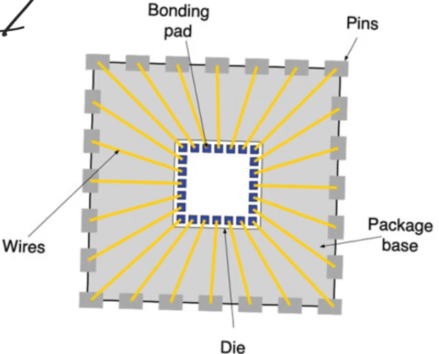
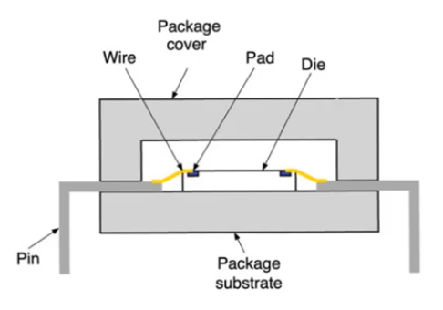
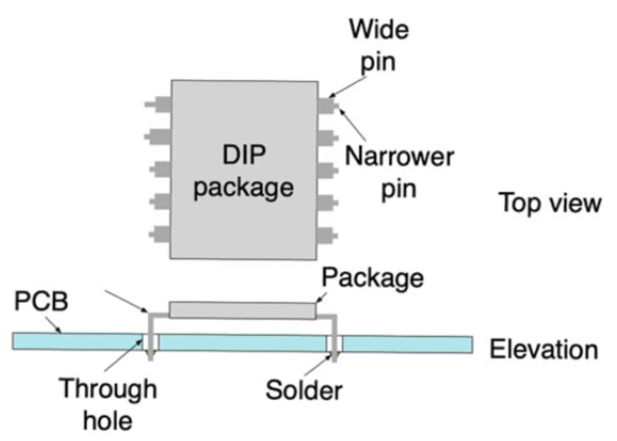
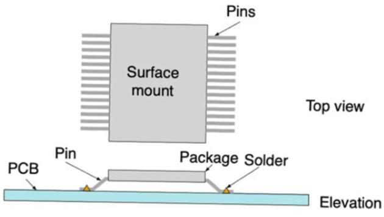
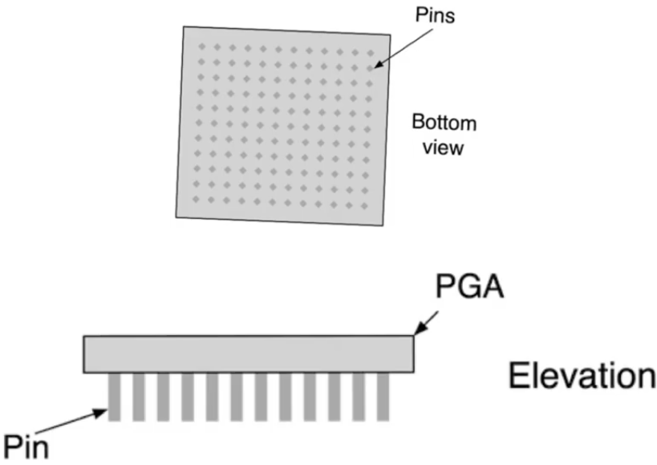
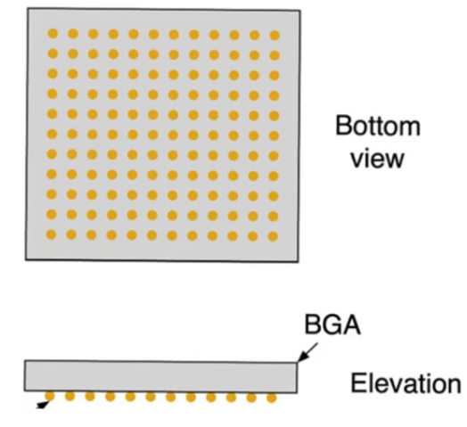
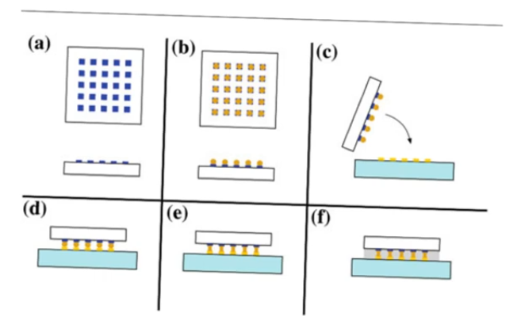

# IC packaging
- Source [this](https://www.youtube.com/playlist?list=PLyWAP9QBe16qiSMkBcAnUMxFagLIJzmv1) playlist on Testing.

## Introduction
- Once a die has been fabricated, it's then time to package it before it's sent to customers
- The package is usually made from plastic or sometimes ceramic, and it's supposed to provide really important functions to the die

## Package functions
- Mechanical support
- Communication with the outside world by pins
- cooling
    - package provide a large surface area in contact with air allowing heat to be removed by radiation or conduction
    - If the chip dissipates alot of power that the package area isn't enough to radiate the heat away, then we could have fins usually made of metal to increase the surface area for efficient cooling
    - with larger chips, cooling fans might be needed
- protection from scratches and mechanical damage

## Packaging
- In one of the metal layers we create something called bonding pads
    - very large square areas of metal layer
    - provide areas where we can contact the pins (contact between die core and the pins)
- Cotact between the pads and pins is provided by wires usually made of gold
- The bonding operation is mechanical with very high precis ion
- package body is usually made of plastic
    - plastic is good because they provide good thermal conduction allowing heat to escape the chip
    - and they are electrical insulator, allowing the chip to be grounded and insulated properly from the surrounding
- Pins are made of conducting material sometimes metal, and they provide communication the core of the chip and the outside world 

- Top of the package is made of the same kind of plastic
    - The top is glued to the bottom so that they form a nearly hermetic seal that contains the chip within
- The chip itself is also bonded to the plastic so that it sticks to the bottom, this is usually done using exposy glue of some sort

- Packaging process has to be done in a relatively clean environment
    - not as tightly classified and controled as an environment where photolithography takes place, but it's still a clean environment

## Economy of pins
- In alot of modern designs the design is actually pin limited rather than core limited
    - we are limited by the need for more pins
- if we have a chip where the pins are only on the periphery, the pins have to be separated from each other by a certain pitch,
- The size of the package limits the number of pins available
- The die is usually mounted on a very small area of the package
- The majority of the area is not dedicated to housing the die, it's dedicated to cooling the chip and to providing pins
- package choice is based on the number of pins needed rather than the area of the die 
- In some cases you can have unused pins in small non-commercial designs
- Also you can have unused chip pads, you insert pads and not use them or connect them to pins
    - this has to do with design rules for specific vendor through which you are fabricating
    - sometimes vendors specify a certain size for pads and these pads have to be inserted with a certain density

## IC packages types
- Dual in-line pin (DIP)
- surface mount 
- pin grid array (PGA)
- Ball grid array (BGA)

### Dual in-line pin (DIP) packages
- pins arranged in two lines on either side of the package
- PCB installation is really easy
    - you dig holes in the pcb
    - plug in the chip by pushing its pins into these holes
- Pins make a very sharp normal angle when they comeout
    - so they need to be wider
    - pitch between pins is larger
    - less pins desnsity
- you need to create electrical connections and mechanical bond between the chip and the PCB
    - this is done by soldering

### Surface mount packages
- pins come out from the periphery (perimeter) of the package
    - come out from one or two or even from the four sides
- They don't make a sharp angle and go down, instead they make a gentle angel, then straight out towards the bottom
    - pins can be much narrower
    - pitch between pins can be made smaller, larger density, more pins
- This can be installed by soldering on PCB and doesn't need holes

### Pin grid array
- In very large chips specially those that contain microprocessors, the perimeter of the die isn't large enough to accomodate all the pins needed
    - so we have to use the bottom of the package to contain the pins (2D array)
- PGA a square array of pins at the bottom of the package
- this chip is usually installed on top of a pcb but it usually need a special mount into which it plugs in and that mount will route the pins to the correct copper tracks

### Ball grid array
- Pins aren't actually pins, they are solder balls
    - soldering material used to attach to the pcb
- This requires a special installation techniques so that the chip can be proberly mounted on the PCB

#### Mouting technique
- The mounting technique is called flip chip
- The bonding pads (blue rectangles) are protruding out of the package
- you cover these ponding pads with solder balls
- flip the chip so that it's on top of the PCB and the solder balls have to be aligned perfectly with the copper tracks of the pcb which is why machines is needed to control this alignment
- then use heating so the solder balls melt creating a contact between the bonding pads on the chip and the copper tracks on the pcb
    - the amount of heating (temprature and time) has to be controlled to create a solid enough contact without creating shorts between pins
- A protective layer of insulator is created to cover the exposed contact material

