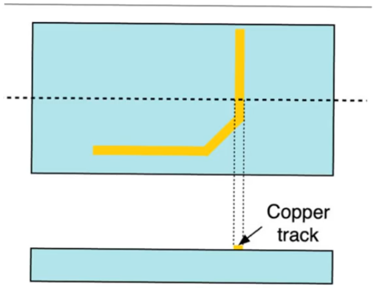
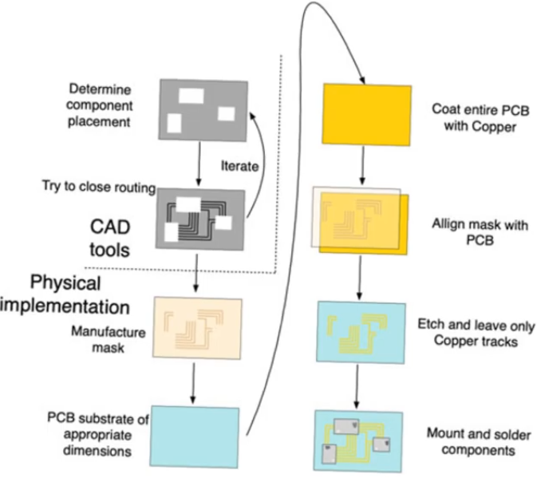
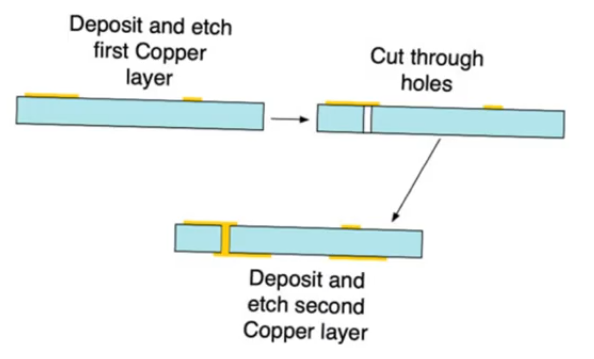
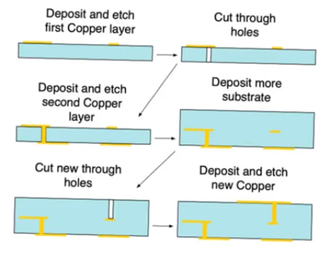

# PCB design and fabrication
- Source [this](https://www.youtube.com/playlist?list=PLyWAP9QBe16qiSMkBcAnUMxFagLIJzmv1) playlist on Testing.

## PCB
- Printed circuit board
- It's the most likely platform upon which independent microchips are combined to form an overall system
- consists of an insulator substrate (plastic/epoxy)
    - provides thermal radiation
    - provides mechanical support
- On top of the pcb there are tracks of conductive material (usually copper)
    - provides wires that can communicate and connect the components of the system together

- On top of the pcb there are footprints that indicate locations where you expect that your chips will be installed
- copper tracks communicating between these footprints
- In the next step you perform installation of these chips in their locations
    - manually if the chips are DIP or surface mount packages
    - or using equipment in the case of BGAs

## PCB Design
- There is an analogy between PCB design and microchip design
- The design tells where the copper tracks are gonna be
    - The PCB itself is an insulator substrate 
    - All you create on top of it is the conductive copper tracks
- You have a certain amount of real estate which is the substrate
- Witin this substrate you have to distribute a number of resources your chips and passive components
- you also need to connect the input and output pins of these microchips in a specific way
    - To communicate with each other or with jacks that come off the pcb
- you have to determine ways inwhich these constraints (connections between chips) are satisfied
- These copper tracks provide an additional capacitive load increasing delay
- so you may find closure (a solution that functionaly connects the chips together but it creates a situation where the delay is too much)
    - In that case you try to place the chips in other locations and then do rerouting
- This reminds of [placement and routing](../design-flow/8-place-and-route.md)
    - The design flow and optimization process is very similar
    - with one difference, the pcb design is less computaionally intensive because the constrains alot more permissive

## fabrication flow
- Once you have determined the routing tracks required, then go the fabrication stage
- the fabrication stage is very similar to photolithography
- we begin by placing the components and then routing between them
- then proceed to fabrication
- First step is to manufacture a mask created similary to the mask created for microchips
    - except in this case the mask is usually formed of solid material
    - the copper tracks are itched on the mask as openings
    - The mask and the substrate are gonna be roughly the same size
- Then you coat the entire pcb with copper
- align the mask with the pcb and use an itchent to each throguh the exposed parts and leave the unexposed parts  
- then mount and solder the components

## Multi layer
- when you fail to find a colsure for routing on a pcb, you will need another layer of metal wire to create crossovers
    - this is similar to the need for multiple metal layer in asics
- This is difficult in dip chips because they go through holes in pcb occupying both sides
- These two layer are gonna need to communicate
- this is created similar to vias in mircochips, you cut holes through the pcb, then when you deposite your copper these holes are filled simultaneously

- some pcbs require more than two layers
- you create the first layer of metal wires and cut the holes,
- then the second layer, and then you deposite insulator on top of the second layer, then you create via 2, then the third metal layer
- this is agian similar to the mircochip fabrication process

