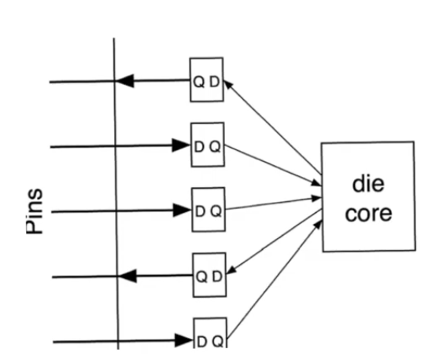
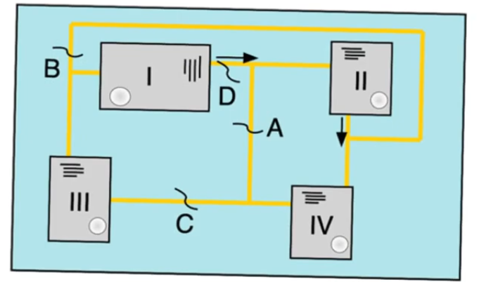
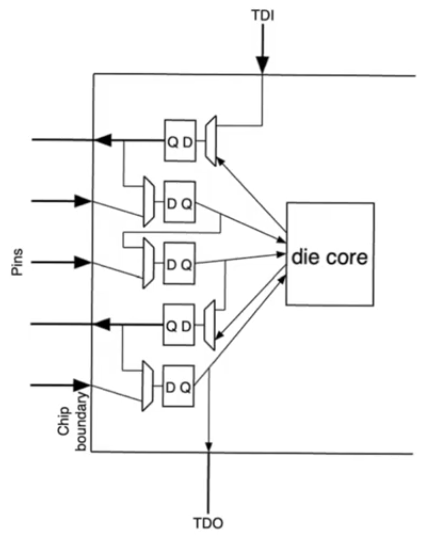

# Boundry scan and JTAG
- Source [this](https://www.youtube.com/playlist?list=PLyWAP9QBe16qiSMkBcAnUMxFagLIJzmv1) playlist on Testing.

## Introduction
- JTAG (Joint Test Action Group) is an IEEE standard used to allow designers to use the BST (Boundry scan technique)
- BST is a technique that allows us to probe pin values of chips installed on pcbs without having to use physical probes
    - This is analogous to a topic within [DFT](1-design-for-testability.md) in microchips

## Chip boundry
- Within the IC package there are the chip's inputs and outputs connected to registers contained within the die
    - used to register the values of the pins before they are presented to die or pcb
    - These registers would allow communication in parallel

## BST
- The boundry scan technique requires us to modify every input and output register in the chip into boundry scan register
    - This is similar to the [scan technique](7-8-scan-technique.md)
- The BST is a scaling up of the scan technique from the chip level to the pcb level
    - While most embedded systems designers wouldn't have to deal with scan technique, they would have to understand the BST
- The two aren't mutually exclusive,
    - you can have the scan technique enabled on the chip
    - and BST enable on the PCB and the two aid each other
- The first step is to modify every register into a BST register
- All registers will have an additional multiplexer
    - The Mux will feed the `D` input of the register either a normal input, or a test input
- The test data input `TDI` is different from the `TDI` in the [scan technique](7-8-scan-technique.md)
    - same for the select `Test` input pin that sets the multiplexers in test mode or normal operation mode
- In test mode operation is similar to [scan technique](7-8-scan-technique.md),
    - the first register will accept the `TDI` input
    - the second register will accept the registered value (output) from the first register
    - and so on till the final register that accepts the output of the previous one, and it provide it's output to a pin called `TDO`
- Test data output `TDO` pin is also independent from the `TDO` in the [scan technique](7-8-scan-technique.md)

## PCB setup with multiple chips
- In a pcb with multiple chips connected with (multibit) copper tracks
- All chips in the PCB are boundry scan compatible (each one have BST modifications)
    - each one have `Test`, `TDI`, `TDO` pins
- There is also `Test`, `TDI`, `TDO` jacks on the PCB itself
- There are two sets of tracks on the PCB
    - The tracks that connect the chips to each other so that they function properly and form a system with each other
    - There is an indenpendant set of tracks that form a boundry around all these chips
- The other tracks starts from the `TDI` jack goes to the `TDI` pin of the first chip
    - Then exit through `TDO` of the first chip
    - Then the `TDI` of the next one
    - till it reaches the last on
    - The final chip's `TDO` is connected by track to the `TDO` jack of the PCB
    - The PCB `Test` input is also distributed to the `Test` pin of all chips

## BST Usage
- BST is useful when you create a PCB with multiple chips you don't have mechanical access to the pins (you can't probe them)
    - specially in case of [BGA](13-14-ic-packaging.md) packages
- This allows you to probe the values of the pins because they are all part of a shift register
- You can also force the values of a chip inputs to a specific value
    - similar to the [scan technique](7-8-scan-technique.md)
- This can be combined with the scan technique to have nested levels of scanning
- BST also can be used to probe and ensure the integrity of the assembly
    - you can ensure that the pins are actually connected to the copper tracks
    - it's also a way to test the pcb itself and the connection of the chips within it
        - you can force the output pin of a certain chip to a certain value and then you can check that you received this value properly at the other chips
- The specific way in which you perform a test (how the test vectors are shifted from `TDI` to `TDO`) is specified by the JTAG standard.
