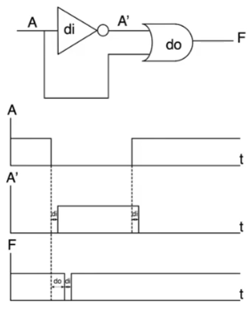
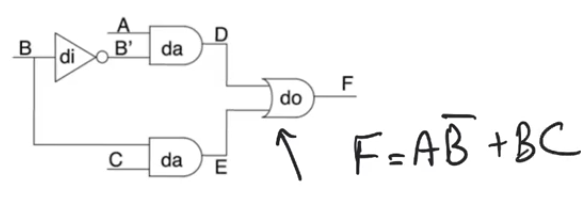

# Glitches and logical hazards
- Source [this](https://www.youtube.com/playlist?list=PLyWAP9QBe16qiSMkBcAnUMxFagLIJzmv1) playlist on Testing.

## Introduction
- At the output of combinational logic, we sometimes see glitches appearing

## Glitching example
- simple combinational circuit `F=AB'+BC`
    - assume `C=1` and `A=1`, outputs `D,E` will be dependant on the value of `B` only
- In a situation where the logic input `B` makes a transition from `1` to `0`
    - output `F` is expected to remain at logic `1`
- Logic `F` will remain at logic value of `1` however for a limited time there will glitching and the output will go back to zero for a limited amount of time
- `B'` is the opposite of `B` however there is a delay because the inverter has a delay of `di`, this is where glitching comes from

## Glitching
- Glitching comes from the propagation delay of the combinational logic gates
- when you have multiple paths in a combinational circuit that recoverge on a single gate, and these paths have differential delay, you might have to contend with the fact the you have glitches
- This is called a logical hazard
    - it's inevitable
    - it's something that you'll see consistently in all logic gates

## Mitigation factors
### Sync pipelines
- In a synchronous pipeline you have registers at the outputs of logic gates
- so even the combinational logic block contains multiple stages of cmos combinational logic
- and even if the outputs or the internal nodes are glitching all the time
- the register will only gonna sample once the total propagation delay of the CLB has passed
- clock period is based on the worest propagation delay in the path

### Delay types
- We have to distinguish between two kinds of delays
- assume that you have an element represented by a block box that has an input signal and output signals
- There are two kinds of delays that this box could have
    - Inertial delay 
    - Transport delay
- so even if we say that it has a delay value of `dg` this delay has to be qualified as either inertial or transport
- The difference is what kind of pulse at the input would this block allow to transport or to go through to the output
    - Transport delay: any kind of impules with any width at the input gets transported at the output
    - Inertial delay: only impulses at the input that are wider than the value of delay of the block manage to appear at the output

- Transport delay is generally a good model for wires and interconnects
- Inertial delay is good for combinational logic

> So most glitches are really narrow and they don't actually manage to propagate to subsequent gates

> Even if you don't have intervening registers alot of the logic gates within your CLB will manage to block the glitches just because they have inertial delay within them

## Logical hazards
- Logic hazards are particularly  important because they impact latch loops
    - [latches](../vhdl/13-14-15-latches.md) are used to design very high performance pipelines by allowing slack borrowing
- latches are level senstive so the kind of protection that we get from sampling at the edge of the clock in a register pipeline is lost at the latch loop
- the latch will allow most glitches to pass through because it has a very small delay itself (much smaller than the CLBs)
- so glitches will manage to go down the latch loop and destroy the output values

- Logical hazards are classified into two types
    - static hazards
    - dynamic hazards
- Static hazards have two kinds
    - static 0: the stable value of the output is `0` and the glitch has a logic value of `1`
    - static 1: the stable value of the output is `1` and the glitch has a logic value of `0`
- Dynamic hazards happen when you make a transition
    - Dynamic 0-1: means you are in a stable `0` and going to stable `1` but you see a glitch happening while you make the transition
    - Dynamic 1-0: means you are in a stable `1` and going to stable `0` but you see a glitch happening while you make the transition
- each of these kinds of hazards are reducable to a single form
    - this means when we look at static 0 hazard for example any static zero hazard in any circuit comes from a very basic structure that you have to be able to identify within the circuit
- This will allow us to formulate solutions for these hazards to remove them by adding some additional circuitry

#

## Static 1 hazards
- Identify static one hazards and solve them using K-map approach
- Static 1 hazards always reduce to the simple form of
    - two paths that reconvene at an `OR` gate
    - and these two paths have to have differential delay
    - and they have to present the `OR` gate with some form of true and inverted form of a certain variable
- When that happens you'll possibly see a static 1 hazard
    - depending on the delays of the circuits and the inertial modle delay used

### Example
- The previous form doesn't have to be explicitly exist in a circuit to have a static 1 hazard
    - it could be implicitly present
- The circuit in the example has a static 1 hazard
- Variable `A` has two path to the final `OR` gate
    - This isn't enough for a static hazard to occur
    - There also has to be an inversion between these two variables
- The inversion of `A` happens using the `NAND` gates in the upper branch
- The third condition is that the two branches has differential delay so that you can have a time through which the glitch appears
    - this is obvious in this circuit because the upper branch is much longer than the lower branch
- The values for other inputs to the circuit are the values that will cause the glitch to appear
    - The glitch doesn't appear in all conditions under all circumstances
    - It only appears under certain conditions

## Solution
### Combinational delay
- Static hazard occurs because we see a true and a complement form of a variable having differential delays
- The glitch occurs when the variable makes a transition and there is a period of time in the middle where neither of `A` or `A'` are `1`, thus we see a glitch with a value of `0`
- If we compensate the differential delay by adding a delay to the lower path so that both paths' delays are equal
    - Then `A` and `A'` are gonna match exactly
    - If that happens, there is no space for the glitch to occur
- This delay has to be combinational delay
    - Absolute time measured in terms on nano seconds
- It's extermly difficult to match combinational delays, so it'll be extermly difficult to match the delays of the branches exactly
- This approach isn't very practical

### K-map approach
- The correct approach is to add extra combinational logic which masks the offending transition
- Going back to the original circuit `F=AB'+BC` 

- The K-map has 8 squares each one represent the min terms
- The function has active min terms `3,4,5,7`
- Static 1 hazard happens when `A=1` and `C=1`
    - If be makes a transition between squares `5` and `7` the glitch happens
    - for min terms `m5<->m7` we have a glitch where the only variable changes is `B`
    - these min terms are adjacent and not covered by a group

- The solution is to cover these min terms by a group 
- This additional term is `AC`
- This is a redudant covering that doesn't change the logic function
- It's additional hardware that will solve the static 1 hazard and completely mask it

- In the original problem when we make a transition between min terms `m5<->m7` the function is supposed to keep `F=1`
    - in `m5` we are relying on the term `AB'` to maintain the value of `1`
    - in `m7` we are relying on the term `AC` to maintain the value of `1`
    - But `C` and `A` aren't the variables that give us the `1` at the nodes `D` and `E`, `B` and `B'` are
    - because there is a differential delay between `B` and `B'` then there will be a period of time where neither `B` nor `B'` are ones and therefor you'll see a glitch
- When adding the term `AC` we now have a term where when both `A` and `C` equal to `1` this term is also `1` 
