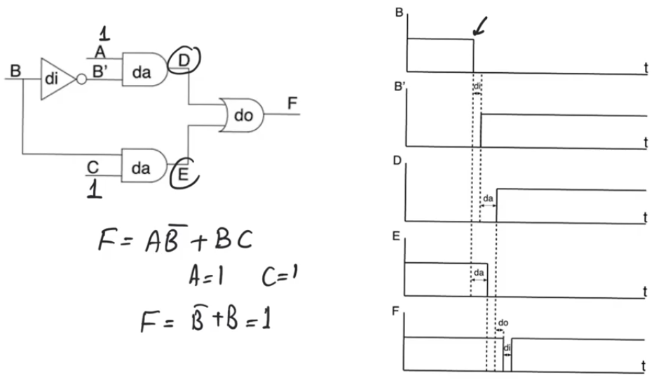
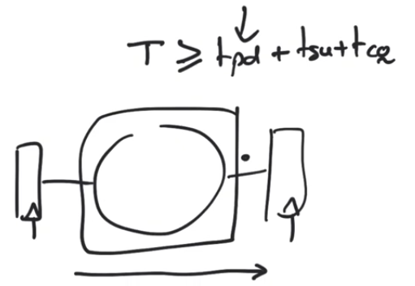
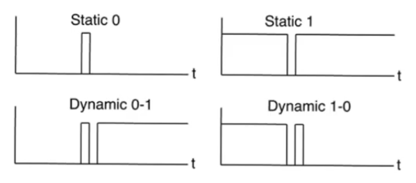

# Glitches and logical hazards
- Source [this](https://www.youtube.com/playlist?list=PLyWAP9QBe16qiSMkBcAnUMxFagLIJzmv1) playlist on Testing.

## Introduction
- At the output of combinational logic, we sometimes see glitches appearing

## Glitching example
- simple combinational circuit `F=AB'+BC`
    - assume `C=1` and `A=1`, outputs `D,E` will be dependant on the value of `B` only
- In a situation where the logic input `B` makes a transition from `1` to `0`
    - output `F` is expected to remain at logic `1`
- Logic `F` will remain at logic value of `1` however for a limited time there will glitching and the output will go back to zero for a limited amount of time
- `B'` is the opposite of `B` however there is a delay because the inverter has a delay of `di`, this is where glitching comes from

## Glitching
- Glitching comes from the propagation delay of the combinational logic gates
- when you have multiple paths in a combinational circuit that recoverge on a single gate, and these paths have differential delay, you might have to contend with the fact the you have glitches
- This is called a logical hazard
    - it's inevitable
    - it's something that you'll see consistently in all logic gates

## Mitigation factors
### Sync pipelines
- In a synchronous pipeline you have registers at the outputs of logic gates
- so even the combinational logic block contains multiple stages of cmos combinational logic
- and even if the outputs or the internal nodes are glitching all the time
- the register will only gonna sample once the total propagation delay of the CLB has passed
- clock period is based on the worest propagation delay in the path

### Delay types
- We have to distinguish between two kinds of delays
- assume that you have an element represented by a block box that has an input signal and output signals
- There are two kinds of delays that this box could have
    - Inertial delay 
    - Transport delay
- so even if we say that it has a delay value of `dg` this delay has to be qualified as either inertial or transport
- The difference is what kind of pulse at the input would this block allow to transport or to go through to the output
    - Transport delay: any kind of impules with any width at the input gets transported at the output
    - Inertial delay: only impulses at the input that are wider than the value of delay of the block manage to appear at the output

- Transport delay is generally a good model for wires and interconnects
- Inertial delay is good for combinational logic

> So most glitches are really narrow and they don't actually manage to propagate to subsequent gates

> Even if you don't have intervening registers alot of the logic gates within your CLB will manage to block the glitches just because they have inertial delay within them

## Logical hazards
- Logic hazards are particularly  important because they impact latch loops
    - [latches](../vhdl/13-14-15-latches.md) are used to design very high performance pipelines by allowing slack borrowing
- latches are level senstive so the kind of protection that we get from sampling at the edge of the clock in a register pipeline is lost at the latch loop
- the latch will allow most glitches to pass through because it has a very small delay itself (much smaller than the CLBs)
- so glitches will manage to go down the latch loop and destroy the output values

- Logical hazards are classified into two types
    - static hazards
    - dynamic hazards
- Static hazards have two kinds
    - static 0: the stable value of the output is `0` and the glitch has a logic value of `1`
    - static 1: the stable value of the output is `1` and the glitch has a logic value of `0`
- Dynamic hazards happen when you make a transition
    - Dynamic 0-1: means you are in a stable `0` and going to stable `1` but you see a glitch happening while you make the transition
    - Dynamic 1-0: means you are in a stable `1` and going to stable `0` but you see a glitch happening while you make the transition
- each of these kinds of hazards are reducable to a single form
    - this means when we look at static 0 hazard for example any static zero hazard in any circuit comes from a very basic structure that you have to be able to identify within the circuit
- This will allow us to formulate solutions for these hazards to remove them by adding some additional circuitry

