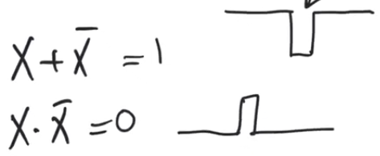
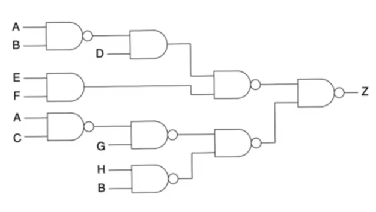
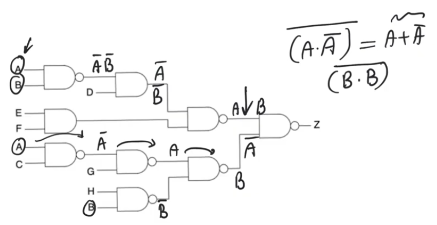
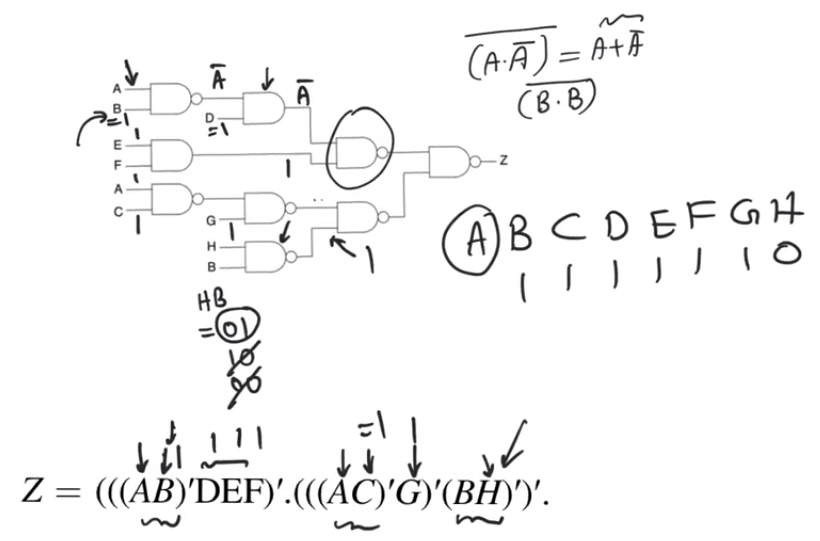

# Static hazards
- Source [this](https://www.youtube.com/playlist?list=PLyWAP9QBe16qiSMkBcAnUMxFagLIJzmv1) playlist on Testing.

## Static 1 hazards
- Identify static one hazards and solve them using K-map approach
- Static 1 hazards always reduce to the simple form of
    - two paths that reconvene at an `OR` gate
    - and these two paths have to have differential delay
    - and they have to present the `OR` gate with some form of true and inverted form of a certain variable
- When that happens you'll possibly see a static 1 hazard
    - depending on the delays of the circuits and the inertial modle delay used

### Example
- The previous form doesn't have to be explicitly exist in a circuit to have a static 1 hazard
    - it could be implicitly present
- The circuit in the example has a static 1 hazard
- Variable `A` has two path to the final `OR` gate
    - This isn't enough for a static hazard to occur
    - There also has to be an inversion between these two variables
- The inversion of `A` happens using the `NAND` gates in the upper branch
- The third condition is that the two branches has differential delay so that you can have a time through which the glitch appears
    - this is obvious in this circuit because the upper branch is much longer than the lower branch
- The values for other inputs to the circuit are the values that will cause the glitch to appear
    - The glitch doesn't appear in all conditions under all circumstances
    - It only appears under certain conditions

### Solution
#### Combinational delay
- Static hazard occurs because we see a true and a complement form of a variable having differential delays
- The glitch occurs when the variable makes a transition and there is a period of time in the middle where neither of `A` or `A'` are `1`, thus we see a glitch with a value of `0`
- If we compensate the differential delay by adding a delay to the lower path so that both paths' delays are equal
    - Then `A` and `A'` are gonna match exactly
    - If that happens, there is no space for the glitch to occur
- This delay has to be combinational delay
    - Absolute time measured in terms on nano seconds
- It's extermly difficult to match combinational delays, so it'll be extermly difficult to match the delays of the branches exactly
- This approach isn't very practical

#### K-map approach
- The correct approach is to add extra combinational logic which masks the offending transition
- Going back to the [original circuit](17-glitches-logical-hazards.md) `F=AB'+BC` 

- The K-map has 8 squares each one represent the min terms
- The function has active min terms `3,4,5,7`
- Static 1 hazard happens when `A=1` and `C=1`
    - If be makes a transition between squares `5` and `7` the glitch happens
    - for min terms `m5<->m7` we have a glitch where the only variable changes is `B`
    - these min terms are adjacent and not covered by a group

- The solution is to cover these min terms by a group 
- This additional term is `AC`
- This is a redudant covering that doesn't change the logic function
- It's additional hardware that will solve the static 1 hazard and completely mask it

- In the original problem when we make a transition between min terms `m5<->m7` the function is supposed to keep `F=1`
    - in `m5` we are relying on the term `AB'` to maintain the value of `1`
    - in `m7` we are relying on the term `AC` to maintain the value of `1`
    - But `C` and `A` aren't the variables that give us the `1` at the nodes `D` and `E`, `B` and `B'` are
    - because there is a differential delay between `B` and `B'` then there will be a period of time where neither `B` nor `B'` are ones and therefor you'll see a glitch
- When adding the term `AC` we now have a term where when both `A` and `C` equal to `1` this term is also `1` 

## Static 0 hazards
- similar to static 1 hazards in terms of structure and solution 
- Static 0 hazards reduce to the simple form of
    - two paths that reconvene at an `AND` gate
    - and these two paths have to have differential delay
    - and they have to present the `AND` gate with some form of true and inverted form of a certain variable
- Variable `A` made two transisitions `1->0` and `0->1`, the glitch only appeared when it made a transition from `0->1`

### Example
- The previous form doesn't have to be explicitly exist in a circuit to have a static 1 hazard
- Variable `A` has two path to the final `AND` gate
- The inversion of `A` happens using the `NAND` gates in the upper branch
- There is a differential delay between the bottom and the top branches because the upper branch is much longer than the lower branch
- The values for other inputs to the circuit are the values that will cause the glitch to appear
    - The glitch doesn't appear in all conditions under all circumstances
    - It only appears under certain conditions

### Kmap approach
- This is a POS (product of sums) circuit, the variable which will cause the static hazard is variable `B`
- The output is `F=(A+B)(C+B')` which allows us to observe a glitch if `B` makes a transition `0->1`
- For POS circuits when you suspect there is a static 0 hazard, it's better to represent the circuit on the Kmap using zeros rather than one
    - circuit represented using max terms
- The active max terms are `m0,m1,m2,m6`
- The glitch happens at two adjacent `0` squares which are not covered by a group
    - The kmap has adjacency on the edges
- Sqaure `m2` and `m0` are adjacent
    - any transition between them represent a glitch
    - The only variable that makes a transition between them is `B`

- This problem is solved by covering the uncovered transition with a redundant term `C+A`

## Static hazards in logic equations
- The kmap approach towards detecting and solving static hazards is very limiting
    - it doesn't give any way to deal with dynamic hazards
    - it only allows you to deal with functions with up to four variables
- The best way to detect and solve hazards static or dynamic is to look at logic expressions and try to work from them
- When you are looking at an equation you are looking for an expression in the form `X+X'` or `X.X'`
    - These are terms that indicates the possibility of a hazard
    - `X+X'` is always equal to 1 and because there could be a differential delay between the `X` and `X'` there is a possibility that there will be a glitch (static 1 hazard)
    - `X.X'` is always equal to 0 and because there could be a differential delay between the `X` and `X'` there is a possibility that there will be a glitch (static 0 hazard)

### Example
- Function `Z=AB(C+DE')+F(GH+EK)`
- In this expression the only variable that has the potential to have a hazard is variable `E`
    - as it's the only variable that makes an appearance in its true and complement form
- We need to know what other variables' values brings up the glitch to know whether it's a static 0 or 1 hazard
    - We have to think what they have to be at inorder to allow `E` and `E'` to meet together
- All variables that are multiplied (ANDed) `E` or `E'` have to be 1 inorder to make it propagate `A=B=F=K=D=1`
- All variables that are added (ORed) `E` or `E'` have to be 0 inorder to make it propagate `C=0`
    - `G` and `H` we need only on of them to be equal to `0`
    - They can be `GH=0X` or `GH=X0`
- In that case `Z=E'+E` so we have a static 1 hazard
- To solve this glitch we add another product them that keeps the value of `Z` at one in this condition
    - `Z=AB(C+DE')+F(GH+EK)+ABFKDC'GH'`
    - This additional term solves the static hazard
- there could be multiple sources of hazards in which case you will deal with each variable independently

## Static hazards in complex circuits
- for a static hazard to occur we have two at least two appearances for a variable
    - All the input variables that have a single appearance don't have a potential to cause a glitch
- In the example the only variables that could cause a glitch are `A` and `B` cause they both appear twice

- For `A` the gate in which both occurences appear is the final `NAND` gate, we have to check the other static hazard conditions
    - The upper branch `A` appearance passes through the first `NAND` gate to be `A'`, then `A'` for the next `AND` gate, then it'll make an appearance as `A` after the second `NAND` gate
    - The bottom branch `A` it'll make an inversion through the `NAND` gate then another inversion through the second `NAND` gate, then a third inversion so it'll be `A'`
    - So both meet at the final nand gate as `A` and `A'`
    - so they have a potential to cause a hazardif they have differential delay
        - which is a possibility here cause the top path goes through two `NAND` gates and `AND` gate
        - The bottom one goes through three `NAND` gates
    - `A` will cause a static 1 hazard
        - at the final `NAND` gate we have `Z=(A.A')'` which is by demorgan's theorem equals `Z=A+A'`
- For `B` the both appearances meet at the final `NAND` gate
    - The upper branch will be `B'` then `B'` Then `B` after the two `NANDs` and the `AND` gate
    - The bottom branch will be `B'` then `B` after passing through the two `NAND` gates
    - so it makes a transition and meets at the final gate as `(B.B)'` this isn't gonna cause a static hazard
- so just because a variable has a couple transition through the circuit doesn't mean you'll have a hazard because of it
    - you also need a true an a complement form meeting at a certain gate 

- The circuit expression is `Z=(((AB)'DEF)'.(((AC)'G)'(BH)')'`, we need to get the input variables other than `A` that will bring us the glitching structure `Z=A+A'` 
- First `NAND` gate has to have `B=1` to allow `A` to propagate
- Then `D=1` to allow `A'` to propagate through the `AND` gate
- `E=1` and `F=1` to allow `A'` to propagate through the `NAND` gate to prevent them from masking the output to zero
- `C=1` to allow `A` to pass through the `NAND` gate and `G=1`
- Finally either of `H` or `B` has to be equal to `0` to output a `1` from the `NAND` gate to allow the `A` to propagate, `BH=00,01,10`
    - But in the top branch we force `B=1`, which doesn't allow us to use any combination except for `BH=10`
- so the final combination that show the glitch is `ABCDEFGH=X1111110`
    - The gltich appears because for this combination regardless of the value of `A` we should have an output equal to `Z=1`
    - however for this transition we are relying on `A` to keep the function equal to `1`
- The glitch is removed by adding a product term that's gonna be `1` for this input variables combination `BCDEFGH'` 
- `Z=(((AB)'DEF)'.(((AC)'G)'(BH)')'+BCDEFGH'`

 

