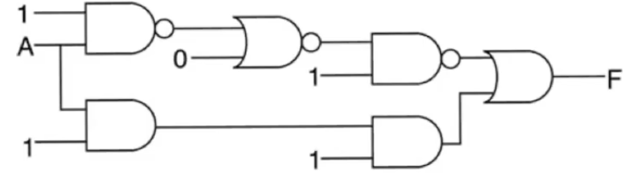
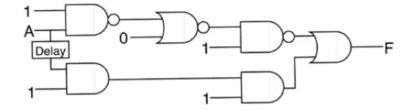
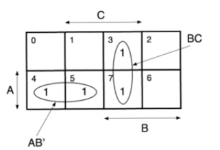
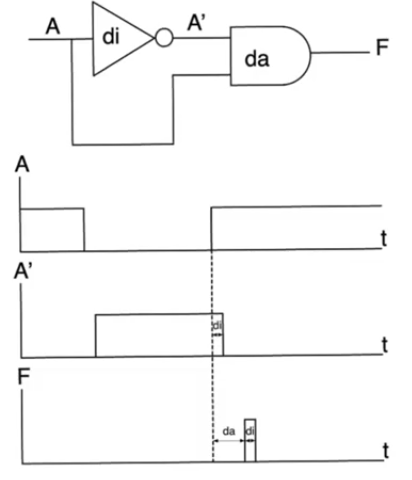
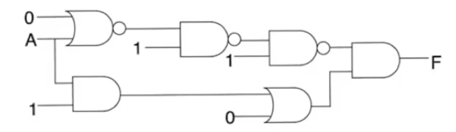
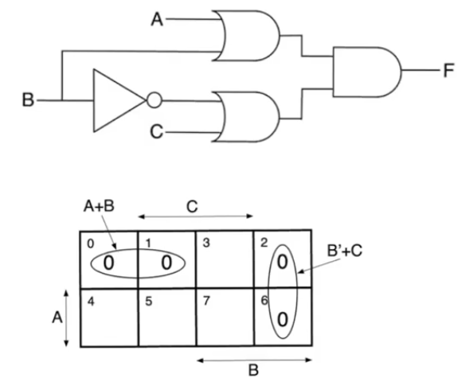
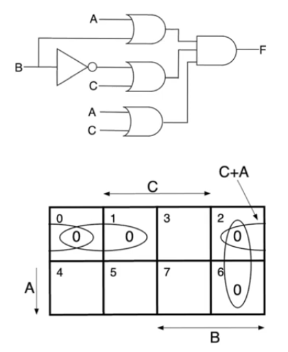

# Static hazards
- Source [this](https://www.youtube.com/playlist?list=PLyWAP9QBe16qiSMkBcAnUMxFagLIJzmv1) playlist on Testing.

## Static 1 hazards
- Identify static one hazards and solve them using K-map approach
- Static 1 hazards always reduce to the simple form of
    - two paths that reconvene at an `OR` gate
    - and these two paths have to have differential delay
    - and they have to present the `OR` gate with some form of true and inverted form of a certain variable
- When that happens you'll possibly see a static 1 hazard
    - depending on the delays of the circuits and the inertial modle delay used

### Example
- The previous form doesn't have to be explicitly exist in a circuit to have a static 1 hazard
    - it could be implicitly present
- The circuit in the example has a static 1 hazard
- Variable `A` has two path to the final `OR` gate
    - This isn't enough for a static hazard to occur
    - There also has to be an inversion between these two variables
- The inversion of `A` happens using the `NAND` gates in the upper branch
- The third condition is that the two branches has differential delay so that you can have a time through which the glitch appears
    - this is obvious in this circuit because the upper branch is much longer than the lower branch
- The values for other inputs to the circuit are the values that will cause the glitch to appear
    - The glitch doesn't appear in all conditions under all circumstances
    - It only appears under certain conditions

### Solution
#### Combinational delay
- Static hazard occurs because we see a true and a complement form of a variable having differential delays
- The glitch occurs when the variable makes a transition and there is a period of time in the middle where neither of `A` or `A'` are `1`, thus we see a glitch with a value of `0`
- If we compensate the differential delay by adding a delay to the lower path so that both paths' delays are equal
    - Then `A` and `A'` are gonna match exactly
    - If that happens, there is no space for the glitch to occur
- This delay has to be combinational delay
    - Absolute time measured in terms on nano seconds
- It's extermly difficult to match combinational delays, so it'll be extermly difficult to match the delays of the branches exactly
- This approach isn't very practical

#### K-map approach
- The correct approach is to add extra combinational logic which masks the offending transition
- Going back to the [original circuit](17-glitches-logical-hazards.md) `F=AB'+BC` 

- The K-map has 8 squares each one represent the min terms
- The function has active min terms `3,4,5,7`
- Static 1 hazard happens when `A=1` and `C=1`
    - If be makes a transition between squares `5` and `7` the glitch happens
    - for min terms `m5<->m7` we have a glitch where the only variable changes is `B`
    - these min terms are adjacent and not covered by a group

- The solution is to cover these min terms by a group 
- This additional term is `AC`
- This is a redudant covering that doesn't change the logic function
- It's additional hardware that will solve the static 1 hazard and completely mask it

- In the original problem when we make a transition between min terms `m5<->m7` the function is supposed to keep `F=1`
    - in `m5` we are relying on the term `AB'` to maintain the value of `1`
    - in `m7` we are relying on the term `AC` to maintain the value of `1`
    - But `C` and `A` aren't the variables that give us the `1` at the nodes `D` and `E`, `B` and `B'` are
    - because there is a differential delay between `B` and `B'` then there will be a period of time where neither `B` nor `B'` are ones and therefor you'll see a glitch
- When adding the term `AC` we now have a term where when both `A` and `C` equal to `1` this term is also `1` 

## Static 0 hazards
- similar to static 1 hazards in terms of structure and solution 
- Static 0 hazards reduce to the simple form of
    - two paths that reconvene at an `AND` gate
    - and these two paths have to have differential delay
    - and they have to present the `AND` gate with some form of true and inverted form of a certain variable
- Variable `A` made two transisitions `1->0` and `0->1`, the glitch only appeared when it made a transition from `0->1`

### Example
- The previous form doesn't have to be explicitly exist in a circuit to have a static 1 hazard
- Variable `A` has two path to the final `AND` gate
- The inversion of `A` happens using the `NAND` gates in the upper branch
- There is a differential delay between the bottom and the top branches because the upper branch is much longer than the lower branch
- The values for other inputs to the circuit are the values that will cause the glitch to appear
    - The glitch doesn't appear in all conditions under all circumstances
    - It only appears under certain conditions

### Kmap approach
- This is a POS (product of sums) circuit, the variable which will cause the static hazard is variable `B`
- The output is `F=(A+B)(C+B')` which allows us to observe a glitch if `B` makes a transition `0->1`
- For POS circuits when you suspect there is a static 0 hazard, it's better to represent the circuit on the Kmap using zeros rather than one
    - circuit represented using max terms
- The active max terms are `m0,m1,m2,m6`
- The glitch happens at two adjacent `0` squares which are not covered by a group
    - The kmap has adjacency on the edges
- Sqaure `m2` and `m0` are adjacent
    - any transition between them represent a glitch
    - The only variable that makes a transition between them is `B`

- This problem is solved by covering the uncovered transition with a redundant term `C+A`

