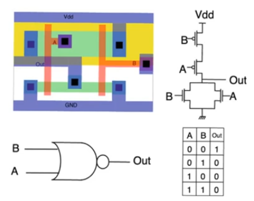
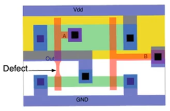

# Defects, faults and errors
- Source [this](https://www.youtube.com/playlist?list=PLyWAP9QBe16qiSMkBcAnUMxFagLIJzmv1) playlist on Testing.

## Terminology
- [DFT](1-design-for-testability.md) uses alot of terminology,
    - some of the words have colloquial uses that are very similar
    - but they mean different things in DFT
### Testing and Verification
- **Testing** refers to making sure that a finished chip is working
    - Testing usually applied to finished products (fabricated chips)
    - this could apply to a prototype, FPGA, research chip
    - it's usually refers to a chip that is shipped for commercial use
    - It's testing the design in a hardware platform,
    - if the product is destined for an FPGA, testing the design when it's actually burnt on the FPGA
- **Verification** is about the design, you verify the design not the finished product
    - Any kind of testing before fabricating the chip is considered fabrication
    - All the simulation at whatever level are considered fabication
- Testing usually applied on a per chip basis, evrey chip has to be tested before it's shipped
- Verification has to be done for the design and it's done once, but the test is done for every finished product
- If your ultimate platform is an ASIC and you use an FPGA first to test the functionality for example, then using the FPGA to check first is part of verification
- It's much cheaper to do verification than to do testing
    - So you need to expand as much effort as you can into making sure that your design will work once it's fabricated

### Defect, fault, and error
- They describe pretty much the same thing at different levels of abstraction
- A **defect** is an actual physical problem that happens when we fabricate a chip
- A **fault** is one way in which we can model this defect at a certain level of abstraction
- An **error** is an observation that you make when you perform a test that exposes the uderlying fault and defect

#### Example
- standard cell entry for a two input nor gate
    - layout
    - circuit level model (delay, power information)
    - logical model
    - truth table model
- each of these entries represents a different level of abstraction

- *Defects* are physical problems, they are the root cause of everything has to be done in DFT
    - CMOS fabrication is a very long process and alot of things that can go wrong when applying photolithography
    - All of these issues can lead to physically realised problems and deviations on the chip

- Assume we have a problem in the layout that leads to a short circuit
    - due to misalignment or wrong etching, or overdiposition of metal, or other reason
    - this pyhsical manifestation of the problem is called a *defect*
- A *fault* model is one way in which we can model this defect at a certain level of abstraction
    - There can be different faults that results from the defect
- At the circuit level this over metal deposition can be modeled as a short circuit between the drain and the gate of a transistor (output and input A)
    - A schematic fault model of this defect
- It can be modeled at the logic level as the short circuit of between input A and output of the gate
    - This is a different fault model for the same defect
- Which model is used for the fault depends on the kind of fault that happened
- An *error* is a deviation from the gold standard that you see as an observation of a defect
    - In the example when the input is (0,0) a 1 should be observed, seeing 0 at the output is an error
    - this error indicates that there is a defect underlying this and that this defect can be modeled in one of different ways using the fault models

- Certain defects can manifest themselves in certain fault modeling levels but not in others
- consider the example's defect that is due to under deposition or over itching of polysilicon that leads to thinner polysilicon line at a certain location
- If the logic level is used to model this fault then it's impossible to model it (you'll have the same logic gate as the correct one)
    - because there is no tools at this abstraction level to model what's happened here
    - no errors won't be observed
- On the other hand if the circuit level is used to model this fault then you'll observe certain errors
    - because the narrowed polysilicon line will have a higher resistance than expected
    - so perhaps you'll see a delay performance that is worse than expected
    - so the circuit model can expose this defect into a fault that can reflect into performance

