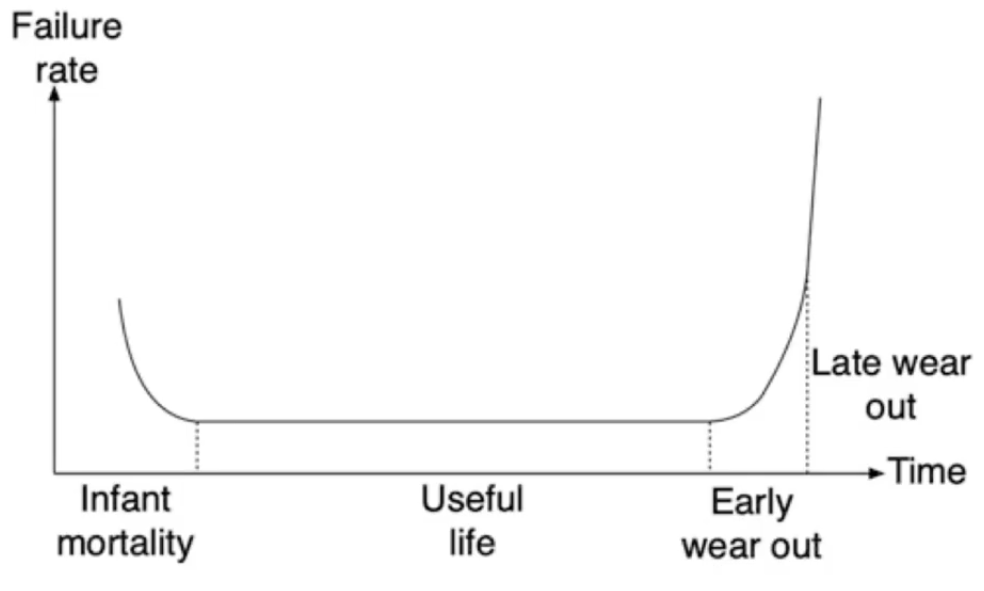
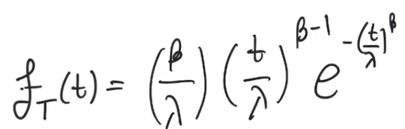
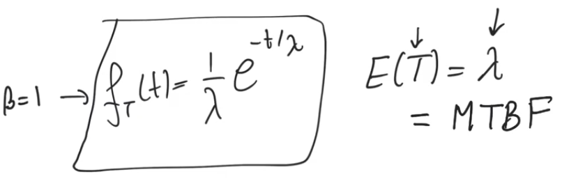

# Reliability of VLSI systems
- Source [this](https://www.youtube.com/playlist?list=PLyWAP9QBe16qiSMkBcAnUMxFagLIJzmv1) playlist on Testing.

## Introduction
- Reliability is a huge field of study that extends to all branches of engineering and other branches of science
- Reliability considers the question of once a system has been introduced (a microchip) would it continue to work properly or will it fail over time?
    - if the microchip fails over time we call this a reliability issue
- It's something related to testing
    - but also distinct from it as it becomes apparent over a long period of time when the system is used under certain circumstances
- Reliability is related to testing because the issues that cause failure of the system can sometimes be uncovered by testing
- Alot of failures happen when the systems is stressed but you can also do stress testing
    - where you expose the chip to working conditions that are more streneous than normal working conditions inorder to accelerate the kinds of issues that will cause systems to fail in the market

## Reliability characteristics
- The way we charactarize reliability is through failure rate
- failure rate (lambda) is the number of failures that occur over a period of time
- for a practical vlsi system to be commercially viable we have to have failure rates that are small
    - few failures per year
    - few failures per decade for high reliability systems

- The graph is a very well known graph in terms of reliability
- it shows the phases of a system when it's introduced to market
- it suggests that the failure rate isn't a constant, it varies over time
- We have at least three phases of the life time of the product
    - Infant mortality phase
    - Useful life phase
    - wearout phase
        - it's sometimes divided into early and late

### Infant mortality stage
- Once a system is first introduced it has a high failure rate
- as it keeps getting used in the market, the failure rate starts to decrease
- We have introduced a very large number of chips to the market, and a relatively large number of chips starts to fail initially but them the rate in which they fail starts to decrease with time
    - because early on, bad chips (with missed faults or faults uncovered with use) will start to die in large numbers 
    - as these are weeded out, the rate at which chips starts to fail continues to decrease
- eventually we will reach a certain failure rate and it'll start to saturate at this certain rate
    - this indicate the useful life period of the product

### Useful life stage   
- Constant failure rate
- The manufacture kind of have an idea of how often their systems fail and they can develop a commercial model that allows them to replace these components and every thing is stable
- At the end of useful life, the products that are in the market starts to fail because they are ageing
    - This indicates the start to of wear out phase

### Wear out stage
- In the early wear out phase we start to notice that the failure rate starts to increase indicating that perhaps this product is now starting to die out
- In the late wear out phase, the failure rate of the product is kind of sky rockets and almost all of the product dies out in the market

## Reliable systems
- This kind of behaviour is expected and normal
- What matters is that you manage the failure rate
- and the goals of a good product are 
    - to bring the start of useful life earlier
    - to push  the start of wear out later
    - to bring down the stable value of failure rate for useful life
- There is really no need to try to manage failure rate during wear out because products are gonna fail anyway during this phase
- It's also not very useful to try to manage failures in infant mortality phase because even is the product is very good, there are issues that will always be there and will always be uncovered only when the product is introduced
- In [testing](3-test-design-fault-coverage.md) even with a very high coverage and high yield process there will still be a defect level in chips that get shipped to market and we depend on infant mortality stage to just weed out these products
    - what matters is that it weeds them out quickly

## Lifetime of a chip
- There is a single mathimatical function that represents all three phases in the life of the product
- The Weibull distribution `FT(t)`: is a probability density function (PDF) represents the probability that we have a failure in terms of time `t`
- `Beta` and `Lambda` are both parameter of this PDF
- `Lambda` represents the failure rate of the system (encompases the quality of the product)

- `Beta` encompases information about the phase in which we are
    - `Beta < 1` infant mortality
    - `Beta > 1` the function reduces to gaussian distribution (`Beta =~ 3` signifies the start of the wearout stage)
    - `Beta >> 3` the probability of failure starts to increase really high
    - `Beta ~= 10` it almost becomes certain that all products will fail which indicates late wear out

### Mean time between failure
- `Beta ~= 1` is where useful life is
    - the PDF reduces into an exponential distribution
    - The expected value of this PDF equal to `lambda` and has a unit of time
- `lambda` is the average amount of time between failures
    - MTBF : Mean Time Between Failure
    - It means that if you have a product that fails, what is the average amount of time that passes before another product fails
    - In a reversable system, it also means if a system fails and you reset it, how much time would go before another failure occurs
    - represents how good the product is, the larger the MTBF, the better the product
- The reciprocal of lambda (MTBF) represents the failure rate

## Reliablility of systems in series and in parallel
- It doesn't have to do with the connection of the subsystems, it doesn't mean they are connected in series or parallel
- In terms of reliablility the connection of the subsystems basically talks about which subsystems are necessary for functionality and which are redundant
- for example in a case where you have a chip or a pcb which has four subsystems, the question is what is the reliability of this pcb in terms of its individual chips
- will this pcb function proberly in case any of these chips fail?
- if the answer is no, then these microchips are connected in series (they all have to function inorder for the entire system to function proberly) (it doesn't matter how they are connected in circuits)
    - assuming each of them have an MTBFi the MTBF of the entire system is one over the summation of one over the MTBF of each individual compontent
    - `MTBF=1/sum(1/MTBFi)` 
    - like a resistance of a bunch of resistors in parallel
    - the system's MTBF is lower than all subsystems MTBFs
    - the system as a whole is less reliable than the least reliable of its components
- If we have a parallel connection of components
    - The MTBF is the summation of each of the subsystems' MTBF
    - `MTBF=sum(MTBFi)`
- The kind of connection of parallel (redundant) systems is more common in mechanical systems rather than VLSI
    - In VLSI we normally don't add redundant systems unless you have a very sensitive application like space applications

