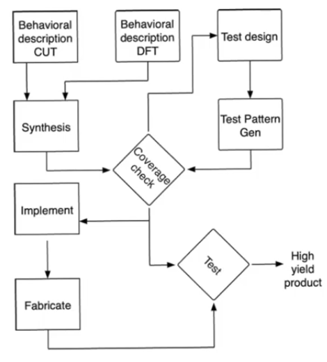
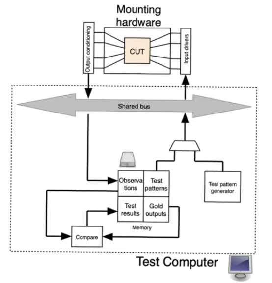
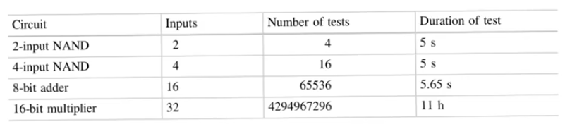
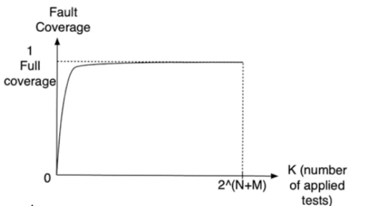

# Test design and fault coverage
- Source [this](https://www.youtube.com/playlist?list=PLyWAP9QBe16qiSMkBcAnUMxFagLIJzmv1) playlist on Testing.

## Design flow
- The design flow with DFT is modified a little than the normal [design flow](../design-flow) because of the presence of additional hardware for DFT
- You'll have a behavioral description for the core chip and a behavioral description for the additional hardware of DFT
    - These two are usually intertwined and it's really difficult to separate them so they both may exist in the same design file
- After *synthesis*, you go through a *test design phase*
- In the test design phase you determine the test patterns to apply in the finished the inputs and the gold standard to compare with
    - The gold model is usually obtained from one of the level in which the simulation is cycle accurate and bit accurate
- Then a *coverage check* that ensures that the test you are doing covers the majority of the faults that can occur
- Once you ensure that the tests are of good quality you go through *implementation* of the design that includes the DFT
- Then *layout fabrication* and then apply the tests to the chip if it works you can ship it out
- The ultimate aim is that the majority of the chips pass through the tests and also that the tests are practical (can be applied in a practical manner)

## Testing flow
- To test hardware (finished chips) you have
    - A platform to mount the chip and it has connectors to connect the pins of the chip automatically using a robotic arm 
    - Conditioning circuits allowing the chip to communicate with the test computer
    - Test computer a specialized computer which uses a real time operating system (bare bones for efficiency)
        - generates the test patterns 
        - apply them to the inputs of the CUT (circuit under test)
        - The ouputs are then fed to the memory of the computer storing them as observations
        - Carry out the comparisons with the gold standards
        - produce test result saying the chip is functioning or not
- If the chip is good it goes to the "Good bin" and if it fails it goes to the "Bad bin"     

- The main aim is to have chips that are mostly good
- The percentage of chips that work is called the **yield**

### Test duration
- The time it takes to test the chip has two main components
- Time expended to do mechanical operation (moving the chip onto and out of the platform)
    - assume in an efficient process it takes 5 seconds
    - This is actually not an important figure
    - because it's an overhead, it's calculated once per chip
- Time it takes to apply the test
    - assume it takes 5 micro second per test includes
        - generate the test pattern
        - apply it to the CUT
        - the CUT takes its time to produce an output
        - All the conditioning circuits taking thier time to condition the signals
        - the test computer comparing the observation to the gold standard and making a decision
- Assume testing a NAND gate
    - we have to cover its entire truth table,
    - for `n` inputs we have `2^n` test cases
- for a simple 16-bit multiplier, we have 32 inputs so `2^32` test cases, it'll take roughly 11 hours
- The delay for tests is dominated not by the mechanical overhead but the actual time of the test and comparison

- Most circuits are not combinational circuit, they are pipelines containing combinational and sequential elements so calculating the test time becomes challenging

- Assume a circuit with `M` inputs and `N` flip flops so it contains `2^N` states corresponding the the `N` registers
    - We need to apply all the test vectors for all of the states
    - the number of tests = `2^(N+M)`
    - this can be huge and leads to severe problems
    - assuming a simple data path circuit with 40 inputs and 40 states, this will require 383 billion years to be fully tested
- This means that we can't do testing naively as described 

## Fault coverage
- Fault coverage (F) is the ratio between the number of faults that can be uncovered and the number of faults that could exist
- for example assuming (2^80) possible combinations of inputs and states
    - how many faults that can occur inside this circuit (can be caculated using stuck-at fault)
        - assuming 3000 different faults can occur
    - if you apply a small number of tests you are gonna uncover some of them
        - if you apply 2^10 test you gonna uncover for example 500 faults
        - this doesn't mean that 500 faults exist, it means the if one of the 500 faults exists one of the tests will uncover it
        - so the fault coverage `F=500/3000`
- Fault coverage is a number that ranges between 0 and 1
    - Applying `2^(N+M)` tests (all possible tests), `F = 1`
    - Applying 0 tests, `F = 0`
- Fault coverage increases rapidly for a small number of tests, and then it starts to saturate slowly
    - The majority of faults can be uncovered by applying a small number of tests
- Perhaps we can tolerate the remaining small number of faults
    - tolerate shipping chips that have these faults
- So we only apply a small number of tests that uncover the huge percentage of faults
    - if the chip passes, it's shipped out
    - it has a possibilty that it contains a fault that wasn't covered in the tests
    - in that case the consumer has a faulty product and the vendor will replace it
- This can be quantified by calculating [defect level](4-yield-defect-level-fault-coverage.md)

