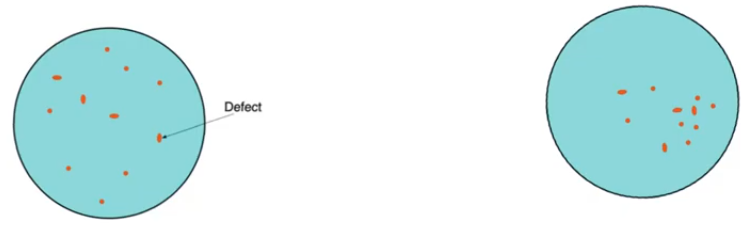
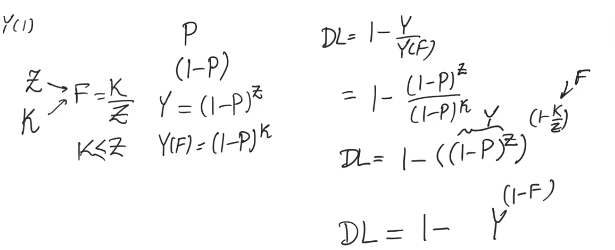
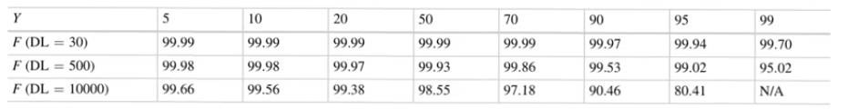

# Yield, defect level, and fault coverage
- Source [this](https://www.youtube.com/playlist?list=PLyWAP9QBe16qiSMkBcAnUMxFagLIJzmv1) playlist on Testing.

## Yield
- The percentage of the good chips to the total chips produces
    - `Y = GoodChips/TotalChips`
    - `Y=1` means that every chips is made is defect free
- Yield is the most important metric in a process because it tells us the economic viability of the process
- If the cost of fabricating one wafer is `$W` 
    - then the cost of fabricating a die is `$D=$W/d`, `d=NumberOfDieOnChip`
    - The cost of fabricating a good die is `$GD=$W/d*Y`
    - so it's really important to have a process with a good yield
## Defects
- Defects can be divided into two kinds of defects
    - Randomly distributed defects
    - Cluster defects, happens in a certain area
- Random defects is related to manufacture equipment
- Cluster defects have to do with a certain step in the process
- Cluster defects usually result in a better yield cause it'll hit a smaller percentage of die than the randomly distributed defects

- Defects reason can be 
    - systematic, it'll be repeated everytime you repeat the same conditions
    - due to random reasons, happenns with random distribution, you can have them one time and repeat the same conditions without getting them
- The two things are different aspects of defects so you can have
    - cluster defects that are random or systematic 
    - randomly distributed defects that are random or systematic

## Defect Level `DL`
- it's the percentage of the faulty chips that is shipped to customers
- [Fault coverage](3-test-design-fault-coverage.md) doesn't cover all the faults of the chip so there are certain faults that are missed, so some defective chips are shipped
- It's measured in parts per million (ppm)
    - A defect level of 500ppm is acceptable for a commercial process
    - A defect level at 100ppm is associated with highley matured processes with very good yield
    - A defect level lower than 30ppm is considered zero DL in really sensitive applications like space or military

## Defect level,  Yield and fault coverage
- there is a relation ship between the three
- Defect level equals one minus yield at the fault coverage of 1 divided by yield at a certain fault coverage
    - `DL = 1 - Y(1) / Y(F)`
    - if we are doing full testing, we won't miss any defect so `DL=1- Y(1)/Y(1) = 0` we are shipping zero defected chips
    - A yield of one gives `DL=0` because that means that all the chips that are produced are functional which means there are no defective chips to ship in the first place
    - Either Y=1 or F=1 indenpedently the `DL=0` 
- Yield is now a function of fault coverage `Y(F)`
    - The true yield we talked about is yield at fualt coverage = 1 `Y(1)` but `Y(F)` is the perceptive yield at a certain fault coverage
    - `Y(F) >= Y(1)`, if you are doing fault coverage of less than 1, you gonna miss some of the faulty chips and count them as good chips increasing the yield

- Assume there are `Z` faults that could happen and you are testing to detect only `K` of these fault s, `K<=Z`
    - Fault coverage `F=K/Z`
- The probability that a certain fault occurs `P`,
    - if faults are independent the probability that the fault doesn't occur is `1-P`
- With `Z` possible faults per chip, the probability there are no defect on the chip = `(1-P)^Z`
    - The probability that no defect occurs on the chip is the yield
    - `Y=(1-P)^Z`,
    - Yield is the percentage of chips that don't have any fault, which is also the probability that one chip has no faults
- `Y(F)` is the yield observed if you are only testing for `K` out of the `Z` faults
    - `Y(F) = (1-P)^K`
    - With `K < Z`, `Y(F)` is larger than `Y(1)`
- Defect level `DL=1-Y(1)/Y(F) = 1-(1-P)^Z / (1-P)^K`
    - `DL = 1 - ((1-P)^Z)^(1-K/Z)`
- With a little algebra, substitute `Y=(1-P)^Z` and `F=K/Z` we get a relation between defect level, yield, and fault coverage
    - `DL = 1 - Y^(1-F)`

### Practical relation
- Both `Y` and `F` operate independently, if `Y=1` then `DL=0`, if `F=` then `DL=0` regarding of each other
    - The reasoning behind this is that if your process yield is 1 means that you are making all good chips it doesn't matter how much you test, it doesn't matter if you do testing at all because your process is perfect and you won't produce a defective chip
    - If your fault coverage is 1 it doesn't matter what your yield is because you are gonna detect all the faults that can occur and won't ship defected chips
- The reality is somewhere in the middle
- The table shows something intersting
    - Different yield levels
    - The rows shows different fault coverage to get the defect level within brackets
- for example if `Y=99%`, then you need a `F=99.7%` to get a defect level of `DL=30ppm`
    - if the yield decreases, the fault coverage has to increase to compensate for that
    - for a higher defect level, we can have a lower fault coverage
- The table shows that even if the process is extremly high yield `Y=99%` (only 1% of produced chips could have fautls)
    - we still need a very high fault coverage to have a good process with low defect level
- There is a relative insensitivity to yield as yield increases, meaning that the fault coverage has to be high anyway
    - we need an intelligent test design to achive high fautlt coverage,
    - we can't rely on the process to give good results

