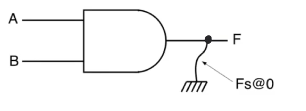
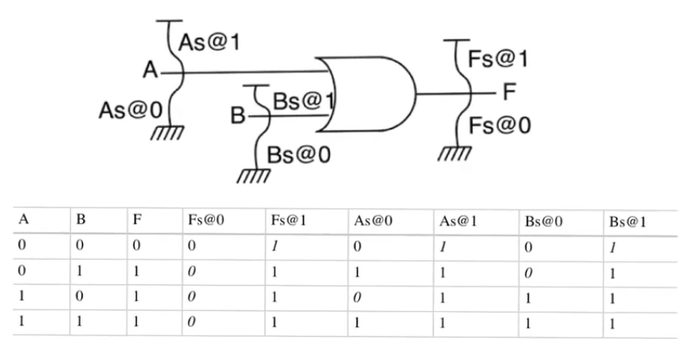

# Stuck at fault model
- Source [this](https://www.youtube.com/playlist?list=PLyWAP9QBe16qiSMkBcAnUMxFagLIJzmv1) playlist on Testing.

## Introduction
- Fault model applied at the logic level
- Allows us to design test vectors
- Allows us to determine wether the test pattern is sufficient to detect all the possible faults
- Allows us to project fault coverage statistics

## Model
- It looks at every single node of the circuit and says that said node could have three state
    - normal
    - stuck at logic zero
    - stuck at logic one
- In the example node `F` is stuck at logic zero

- When we say that a node in a logic circuit is stuck at zero or one we aren't actually implying anything about the underlying defect that caused the fault
    - node `F` stuck at zero doesn't mean that `F` is shorted to ground
- It's just a way to represent defects, and it could represent alot of defects, and it doesn't imply anything about actual connections that happen in the finished chips

## Example
- OR gate with 2 inputs and 1 output, It has `N=3` nodes
- Number of faults that can occur = `K*N` where `K` is the number of faults that can occur at every node
- In stuck at fault model we have 2 faults per node `K=2`
    - six possible faults that can occur for this circuit
- We will assume that there is only one stuck-at fault happening
    - depends on the fact that the probability of a single fault occuring is much higher than the probability of multiple faults happen
- The table contains the normal output, and the output when each of the faults occur
- This table allows us to see which inputs can be used to detect which faults
    - This can be done be comparing each of the columns of the table with the correct output of the circuit
- Applying inputs `A=0,B=0` isn't useful in trying to identify the presence of `F` stuck at zero because the correct output matches the output when stuck
    - on the other hand applying any of the other three inputs of the truth table is gonna expose `F` stuck at zero because the output deviates from the true output in all three cases
    - This is called an [error](2-defects-faults-errors.md) because it's an observation that deviates from the true output and it exposes an underlying fault
- `A` stuck at zero will only be exposed when applying the inputs `A=1,B=0`
- It's useful to look at the minimum set of test vectors which can expose all the possible faults that can occur in the circuit 
    - This is not necessarily the entirety of the truth table
- When we try to get the minimum set that exposes all the faults we start by faults that are uncovered by only a single test `F fault at one` then we start to move to faults that are uncovered by more
- In the example test vector `T={00,10,01}` we don't need to apply input `11` because the only fault exposed by applying input `11` is `F stuck at zero` which is also exposed by applying `{01,10}`
- Distinguishing which fault occured through the test vector is possible in some cases and isn't possible in others
    - If we applied test vector `01` and a fault occured this can be due to `F stuck at zero` or `B stuck at one`, this can be known by applying test `10` if a fault happens then it's `F stuck at zero`, if no fault happens then it's `B stuck at one`
    - Faults `F, A, B stuck at one` have the same observation so they can't be distinguished if a fault happens

