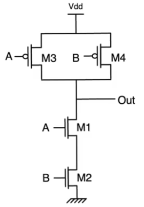
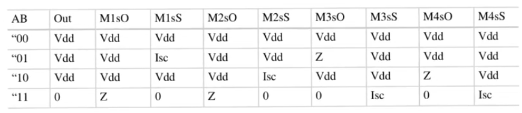
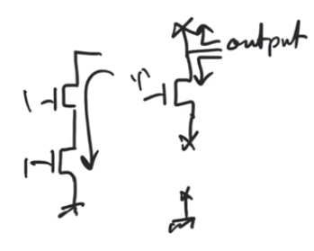
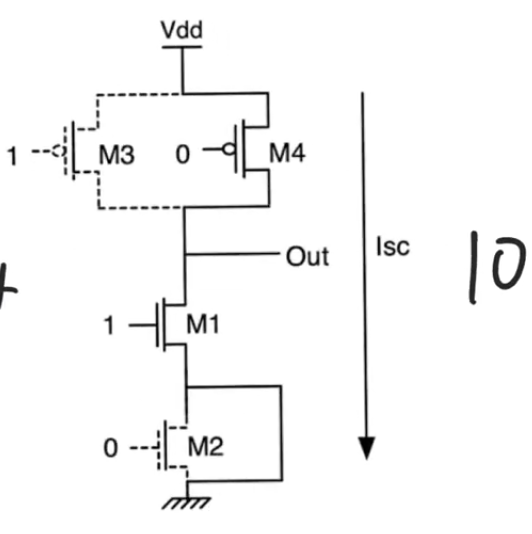

# Stuck open/short fault model
- Source [this](https://www.youtube.com/playlist?list=PLyWAP9QBe16qiSMkBcAnUMxFagLIJzmv1) playlist on Testing.

## Introduction
- used at the circuit level
- each transistor can have one of three states
    - working properly
    - stuck open (always cutoff)
    - stuck short (always on)
- When a transistor is stuck open this doesn't mean that there is an open circuit on the finished chip,
    - it can mean that some defect has caused the threshold voltage of the transistor to rise to an extent that the transistor never turns on
    - or it could be an open circuit
    - or a misalignment that failed to create a transistor  
- When a transistor is stuck short this doesn't mean that there is a short circuit created using metal lines,
    - it can mean that the gate is always connected to supply somehow,
    - it can mean that the threshold voltage of the transistor is pushed too low by some kind of accidental implant
- This is just a model used to model defects, and it shouldn't reflect any information about the specific defect that has happen

## Model
- The number of faulty states per transistor is 2 `K=2`
- In a circuit with `N` transistor we have `N*K` possible faults
    - assume a single fault model, single fault at a time, only a single transistor can be faulty

## Example
- Two input NAND gate
- first two columns represent the normal operation truth table 
    - when `A` and `B` are one, the output is zero otherwise it's `Vdd`

### fault M2sO
- transistor M2 is stuck open
    - rows of the truth table that uncovers this fault has to be rows where M2 supposed to be ON
    - inputs `00` and `10` are inputs where `M2` cutoff anyway so they will always produce outputs that match the correct output of the gate
    - even `01` will produce correct output, because even though M2 supposed to be ON, M1 is supposed to be off cutting the path for the output to the ground anyway
    - The only input combination that actually exposes this fault is `11` cause in this case there supposed to be a path to ground open by transistors M1 and M2, and M2 is stuck open so it won't turn on
        - In this case there is no path to supply or ground cause M3 and M4 are working properly cutoff so the output node is at the high impedance state

- for `M2sO` the wrong output (high impedance node) and the correct output is zero
    - The high impedance node could be at zero volt depending on the history of how this gate was used
    - This fault can't be uncovered by applying only this input, you have to apply atleast two inputs in sequence to uncover it
        - you have to apply any input to ensure the output goes to `Vdd` `00, 01, 10` then apply the faulty input `11`
        - if the output is still `Vdd` then we know that the fault has occured
- So discovering that a node is at high impedance requires applying two inputs in sequence

### fault M1sS
- transistor M1 stuck short, it's always on
    - transistor M1 will turn on if the inputs are `11` or `10` so these inputs won't expose the fault
    - input `00` also won't produce an error cause transistor M2 will cut the way to ground
    - input `01` will expose the error, because transistor M1 stuck short will provide a path to ground
- same applies to `M2sS`, the only input that exposes the problem is `10`

- `M2sS` will cause a short circuit from the supply to ground in the cmos circuit,
- this should never occur in the steady state for any static cmos circuit cause we should only observe either a path to ground or a path to supply
- this fault can be measured by measuring the current that's being drawn from the supply
    - if you managed to read a steady state current being drawn from the supply then that means this is an error that indicates a fault
    - because in the steady state you should only observe a leakage current in the steady state

