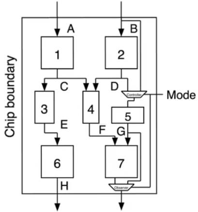
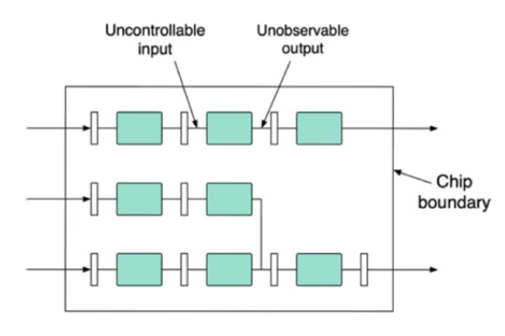
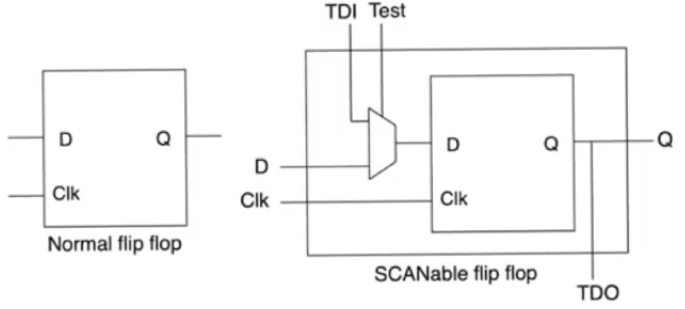
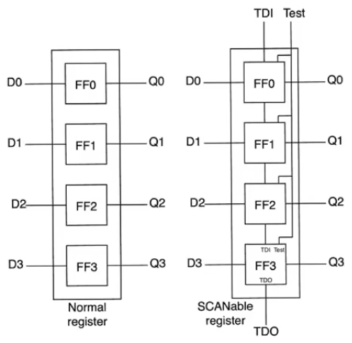
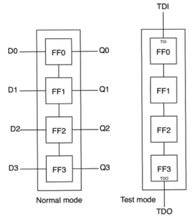
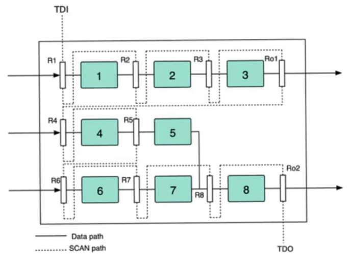
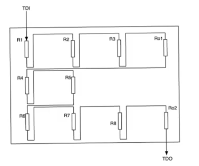
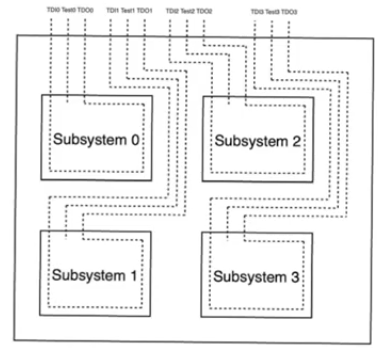

# Scan Technique
- Source [this](https://www.youtube.com/playlist?list=PLyWAP9QBe16qiSMkBcAnUMxFagLIJzmv1) playlist on Testing.

## Introduction
- One major problem that DFT has to deal with is observability and controllability of the internal nodes
    - Internal nodes within the chip aren't reachable for direct control or observation
    - If we need to test a specific module within the chip we will need to control its inputs and observe its outputs
- The most naive way to do this is to pull them out to additional pins
    - can't waste too many pins on putting out internal nodes because pins are the most valuable resource

## Multiplexing pins
- sharing pins to increase controllability and observability using multiplexers
- Mutliplex pins between test nodes and normal nodes
- A systematic way to do this is using scan technique

## Scan Technique
- The scan technique depends on thefact that the majority of our circuits are synchronous pipelines
    - They contain combinational logic blocks sandwitched between registers
- The level of granularity that we are dealing with is the level of the combinational logic blocks
    - we need to provide full controlability to the inputs of the CLB and full observability to the outputs of the CLB
    - regardless of where the CLB is, whether it's deep in the pipeline or it's in the periphery

- The way to deal with this is to design a scan register

### SCAN Flipflop
- Replace every single pipeline register on the design by a scan register
- This is usually handled by the CAD tool
- Additional pins to normal flipflop
    - `TDI`: Test data in
    - `TDO`: Test data out
    - `test`: A control pin which indicate whether or not we are in test mode
- It's a very minor difference and hardware cost, and gives incredible controllability and observability on your circuit

# SCAN path technique

## SCAN register
- The `test` input of each flipflop is connected to a single `test` input that is provided to the register as a whole
- There are always three additional pins for each register however its size was (`Test`,`TDI`,`TDO`)
- All of the flipflops in the register share the same `test` input
- The `TDI` input of the register is provided to the `TDI` input of the first flipflop in the register
    - `TDO` output of the first flipflop is provided to the `TDI` input of the next flipflop
    - and so on till the last flipflop of the register which will provide its own `TDO` to the external `TDO` of the register

## SCANable register modes
- It has two modes
- when `Test=0` normal mode,
    - each flipflop passes its `D` input to its `Q` output
- when `Test=1` Test mode,
    - the scannable register is functioning as a shift register
    - each of the flipflops is gonna accept the `TDI` input and passout the `TDO` output
    - There are as many shifts in the register as there are bits in the original register

 

## Chip example
- It consists of 8 CLB in a sync pipeline
- The placement and routing tool is gonna route the circuit normally (solid lines), this is the datapath
- There is also an additional path that is created called the SCAN path 
    - It accepts an input from the chip `TDI` external pin
    - It routes it so that it becomes the `TDI` input of the first register
    - Then it takes the `TDO` output of the first regiser, routes it so that it becomes the `TDI` input of the next register and so on
    - The dotted line forms a loop throughout the entire chip from the first register `R1` to the last register `Ro2` where its own output `TDO` is gonna be provided to the output pin `TDO`
- All the registers share a single `Test` mode signal, `TDI`, and `TDO`
- This setup for testing is only gonna add three pins to the chip

## How the test is done
- Set `Test=1` to indicate that we are in test mode
    - This causes all the registers to become shift registers
    - From `TDI` to `TDO` you observe a very long shift register that includes all the registers on the circuit
- Then we have our test vector prepared
    - The test vector is the contents we wish to have in each of the registers `R1` therough `R8`
- Then start feeding this vector through `TDI`, applying cycles
    - enough cycles so that the whole test vector shifts through the humongous shift register and settles in all of these registers
- Then switch to `Test=0` normal mode going to the normal operation of the circuit
    - All of the registers are operating in parallel feeding their inputs to their CLBs
- Then apply a single clock cycle
    - The CLBs will accept the inputs from the registers (the inputs that you put there manually)
    - The CLBs are gonna provide outputs to their output registers
    - These outputs will be registered at the output registers
- Then swich back to test mode again `Test=1`,
    - now we have the outputs that we need
    - we get the  outputs of the internal registers by applying clock cycles so that the contents of the registers shift out to `TDO`
    - mean while as we are shifting out the outputs from `TDO` we can apply a new inputs in `TDI`

## Problem with this method
- The main problem with this is the latency
- The deeper the pipeline the longer the shift registers that you have, and the more cycles that you have to apply to the shift register to shift out the observation vectors

### solution
- What we do sometime is that we divide the circuit into subsystems from the point of view of design for testability
- each of these subsystem could have its own `TDI`, `TDO`, `Test` inputs and its own scan path
- This will shorten the scan path but it comes at the cost of additional pins because you'll need three additional pins per each module
- we can also mutliplex the inputs of the subsystems to reduce the number of pins and have select lines to choose between the submodules
    - The cost here is that we can only test one submodule at at time

