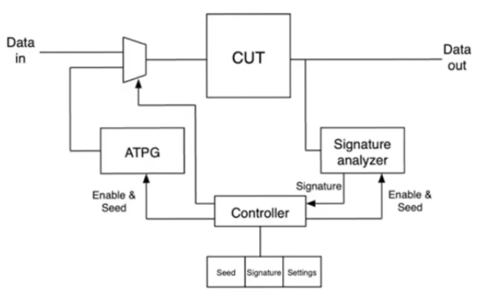
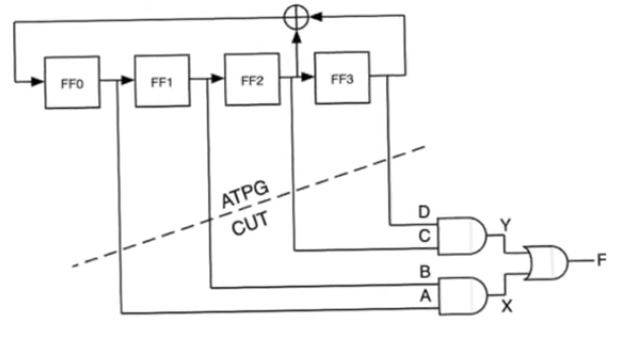
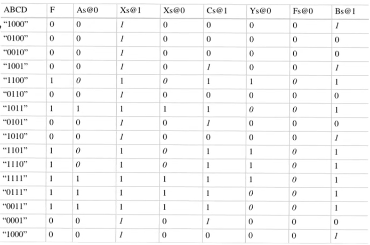
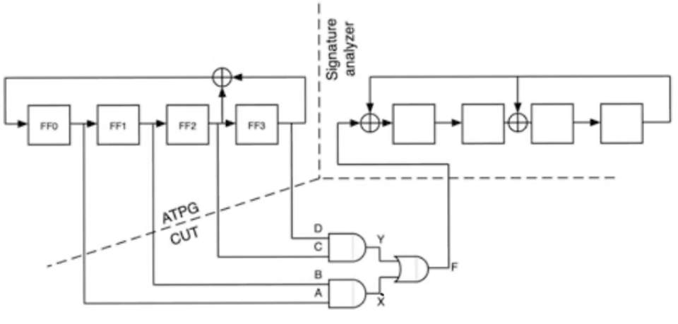
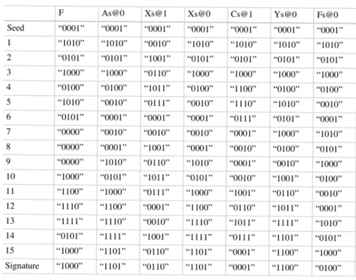

# Automatic test pattern generation
- Source [this](https://www.youtube.com/playlist?list=PLyWAP9QBe16qiSMkBcAnUMxFagLIJzmv1) playlist on Testing.

## Built-in self test
- We have considered a testing setup inwhich the chip is mounted on a testing platform, the test is applied and analysis is done offline
- Now we consider a setup where the test is performed within the chip itself this a concept called Built in self testing (BIST)
    - one of the most well known forms of BIST is Power on self test (POST)
    - Which happens when a chip upon powering on, runs a self test with itself and then generates reports of the results of the test
    - This most often appears on complicated chips such as SOC (system-on-chip) or large microprocessors
    - They are capable of running diagnostics on their own, detecting problems and identify and solve the problems sometimes

### BIST setup
- Everything happens within the chip
- CUT: circuit under test, the non-DFT part of the chip
- The inputs to the CUT is multiplexed between
    - data inputs (could be coming from ouside pins or another part of the chip)
    - test input comes from another component called ATPG
- ATPG: Automatic test pattern generation
    - it's a concept indenpended of BIST, meaning that BIST doesn't have to use ATPG but it often does
    - ATPG is a way of generating test vector on the fly so that they can be applied on a test
- When the test signal is active, the input to the CUT is from the ATPG, and its output is given to a signature analyzer
- Signature analyzer takes the outputs and automatically checks if the outputs fit with the correct outputs or not
    - Additionally when it detects a problem, there is a mismatch between the observed output and the correct output, it generates something called a signautre
- Signature: it's a compressed binary word that is a representation of the problem detected on the chip

## Automatic test pattern generation
- As discussed in [fault coverage](3-test-design-fault-coverage.md) it's hard to cover 100% of the possible inputs so we cover a percentage of them which leads to high fault coverage
- Testing inputs in order (000 to 111) will result in missing some intersting cases for the MSB
- so an orderly application of tests is not the kind of application that gives the faulte coverage needed
- we should apply tests that combine the input bits in a random fashion so that it exposes as many faults as possible
- on the other hand the pattern applied cannot be truly random because we need to know the pattern to generate the gold standard against to compare the output
- The sequence is pseudo-random noise (PN) sequence which is generated using linear feedback shift register (LSFR)

### Circuit example
- setup a seed in the shift register `1000`
- The outputs of the shift register are gonna be fed as inputs to the CLB (combinational block)
- After applying clock signal, the outputs of the register are gonna shift one bit to the right except the first one will be the XOR of the two last outputs

- After 15 cycles the pattern will be repeated
- the pattern of the LFSR is periodic and if it's a well designed LFSR then the period will be `2^m - 1` cycles
- the pattern itself is well known, it can be concluded by knowing the initial pattern and the number of applied clock signal
- on the other hand if you compare the contents of the shift register from on cycle to the other the kind of shifting happening is random
 

- The longer the shift register the more random it becomes, if you look at the truth table without knowing the seed the output will probably look like noise

# Built In Self Tests
- if we have `m` inputs, then we need to apply `2^m` input pattern to the circuit to test it
- so we need to observe a stream of `F` which is `2^m` bits long
    - With good fault coverage we don't need to observe the entire sequence `2^m` bits coming out of the CLB, instead we observe a set `T` which is `T <= 2^m`
    - In the example the last fault to be uncovered is the fault `Ys@0` which is uncovered after applying 8 test vectors
- This stream `F` 2^m bits long needs to be compared with the gold model which is the same length
    - usually comparison is made using subtractors, but for a `16` bit example we will need `2^16=64000` bit subtractor
    - This will result in a huge delay, because at best the adders delay is increased logarithmically with the input bits
    - This is not practical
    - So we need to find a way to observe the output sequence and compress it into a smaller word that tells us the circuit if functioning proberly or not, this is exactly what happens with signature analyser

## Signature analyzer
- Looks like LFSR but with some differences
    - The signature analyzer does have an external input (the output of the CUT)
    - We could have linear operations (XORs) between the registers of the shift register (so this can't be described as exactly a LFSR)

- We are gonna apply a number of cycles and at the end what remains in the shift register is called the signature
    - The end is the 16th cycle in this example
- the column `F` contains the content of the signature analyzer shift register
    - The contents begins with a seed inserted by the user
    - with the application of cycles, there is an output `F` sequence coming out of the `CUT`
    - This sequence is then fed into the analyzer with the initial seed and apply cycles
    - and you keep following with the output `F` applied at every cycle
    - and at the end what you have remaining in the register is called the signature
    - in the example it should be `1000` if the circuit is functioning properly

- You have taken a sequence of `2^m` and compressed it into the remainder in the signature analyzer `n` bits `n < 2^m`

- The fact that we have compressed the output means that we can't exactly distinguish all the faults that can occur
    - The signature resulted in the analyzer might be identical for some faults
- The design of signature analyzer isn't an easy task, you need to choose the size of the signature analyzer so that:
    - It gives you a brief number (signature) that indicates whether the circuit is functioning properly or not and what kind of fault has occurred
    - also because it's a compressed signature it'll give you false information sometimes so you don't want that to happen very often

