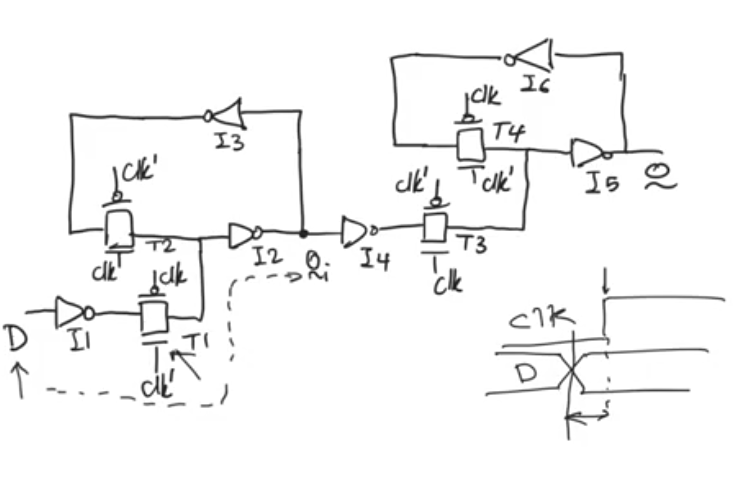
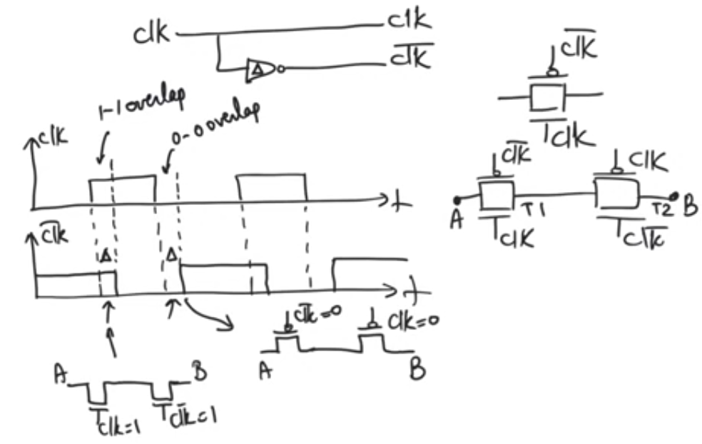
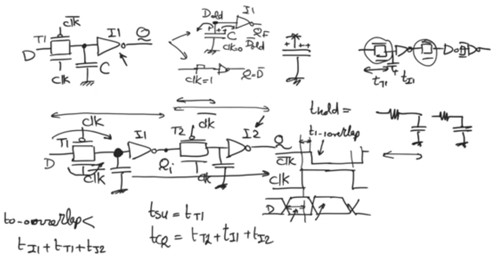
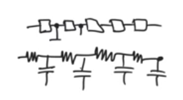
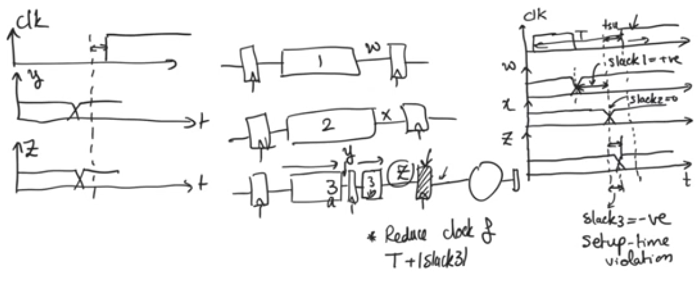
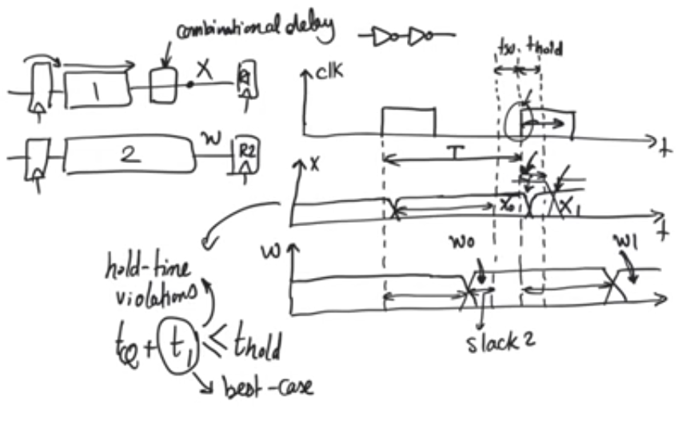

# CMOS Timing analysis 
- source [this](https://www.youtube.com/watch?v=8mgurDTr7UA&list=PLyWAP9QBe16oO31-pn-fl4qrLnSyY7Zr2) youtube playlist on CMOS sequential circuits

## Timing of static latches and registers (consists of static CMOS)
### Registers
- A register (edge triggered) is two latches in series with each other one as a master and the other as a slave with opposite activity

- Edge triggered flipflop consists of inverters and transmission gates controlled by the clock two latches master latch and slave latch with inverted clocks,
- Tsetup: setup time is the time required for D to reach Qi the input to the slave latch
    - allowing the data to be latched proberly in the master latch before it becomes obaque (active clock: transparent, inactive clock cycle: obaque)
    - the problem with setup time isn’t that we would latch the wrong value of Qi but the problem is it would take longer than expected to reach the right value.
    - Tsetup=Ti1+Tt1+Ti2+Ti3
    - it is required for the setup time to cover i3 inverter too for the data at Qi to stablize.

- Tcq is the time it takes for data to appear at Q from the clock start
    - Tcq = Tt4+Ti5
    - we didn’t take Ti4 in considration because we already allowed the data to transmit one inverter i3 in the setup time
    - we didn’t take Ti6 because Tcq is the time to get the data at the output we don’t need to wait for it to stablize in the feedback path before Q is correct.

- Hold time is the time after the active edge of the clock that the data has to be held stable.
    - it’s there because the clock is not stable.
    - the transmission gate takes clk and clkBAR as input so the clock signal passes through and inverter and inverters has delay,
    - so there is an overlap between clk and clkBAR signals(1-1 overlap, 0-0 overlap) missing with the transmission gates behaviour,
    - so there is a time where there is a path from D to Q, 
    - During the 1-1 overlap the nmos of T1 will remain ON and the T2 will be open.
    - so if D changes it’ll change Qi then Q,
    - Thus we need D to hold its previous value during the 1-1 overlap
    - Thold = 1-1 overlap duration if and only if (thold > Ti1+Tt1) because if it’s less it’ll not pass anyway.
    - During the 0-0 overlap the T3 will be active through the pmos and T1 will be active normally allowing D to pass to Q iff Ti1+Tt+Ti2+Ti4+Tt3 < T0-0overlap (Racing condition),
        - and it’s not likely to happen because T0-0 overlap is an inverter delay and the other quantity contains two inverter delays and two transmission gates. 

### Timing of dynamic latches and registers (dynamic cmos)
- Dynamic latches consists of one transmission gate and one inverter,
- it stores the previous state in the internal capacitance (transmission gate’s drain and inverter’s transistor’s gate)
- so it’s much smaller then it’s static cmos counterpart (which needs 6 inverters and 2 transmission gates) and faster

### Registers
- In dynamic registers (edge triggered, two latches in series)
    - setup time is the time needed for the input to pass through the transmission gate Tsetup=Tt1
    - Tcq is the time  for data to appear at Q from the clock start Tcq=Ti1+Tt2+Ti2,
    - Hold time is the 1-1 overlap time

#### Why do we need inverters? 
- Because when we put latches in series the inverters separate between each latch by open circuit so the delay will grow linearly with them, so we can calculate the delay of each of which and add them otherwise the it’ll be R-C ladder where the delay will grow quadratically 

## slacks
- A slack is a measure of by how much time input is ready before the setup time (how much ahead of time each reg i/p is ready)
- For critical path(path with max propagation. delay) slack=0

### slack minimization
- propagation delay in a circuit is proportional with the input voltage
- so to reduce slack in a certain cell we can reduce the input voltage
- To minimize slack in the whole path we can assign different Vdd to different cells based on their slack to reach a minimized slack time for each cell

### setup time violation - negative slack
- setup time violation happens when input at a register doesn't have enough time for its value to be latched properly.
    - whether it comes before or after the active clock edge is not important, but what's important is that it violates setup time
- sol1: reduce clock freq, increase clock period by the -ve slack T += |-ve slack|
- sol2: internally pipeline the offending path

## hold time violation  
- mostly has no relation with the frequency, it's calculated after the clock edge
- when the i/p value changes before the hold time, the time that the input value must be held after the clock edge so that data can be registered properly at the output 
    - cause for hold time 1-1/0-0 overlaps

### solution 
- Add combinational delay in the path where hold time violation happens (pairs of inverters) 
- it's so easy that cad tools do it most of the time

### Example to hold time violations
- series of shift registers, 
- the input to the next register changes immediatly after the active clock edge comes
- tools always add buffers between them

## NOTE 
- more pipelining = more latency and if we increase the frequency = more throughput
