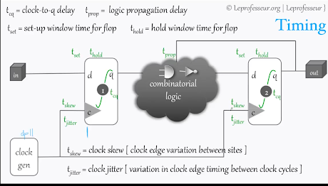
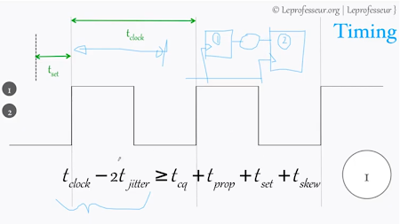
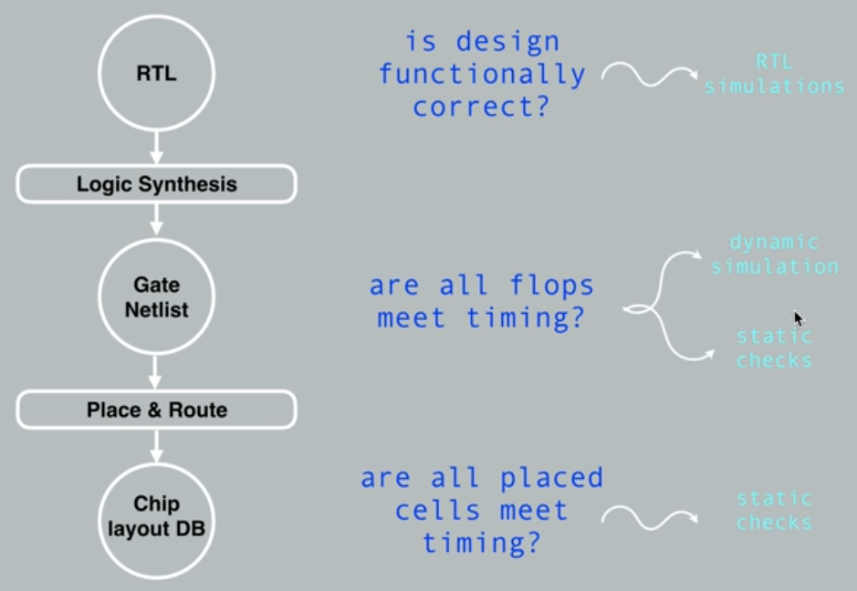
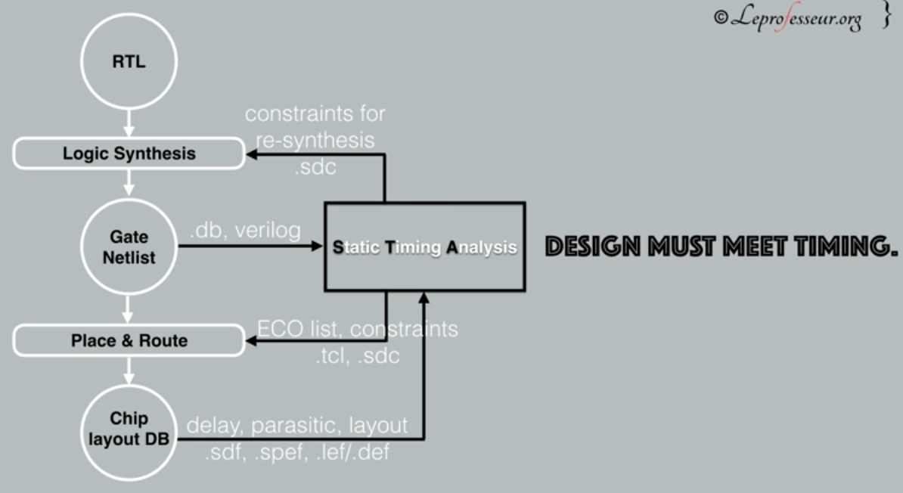
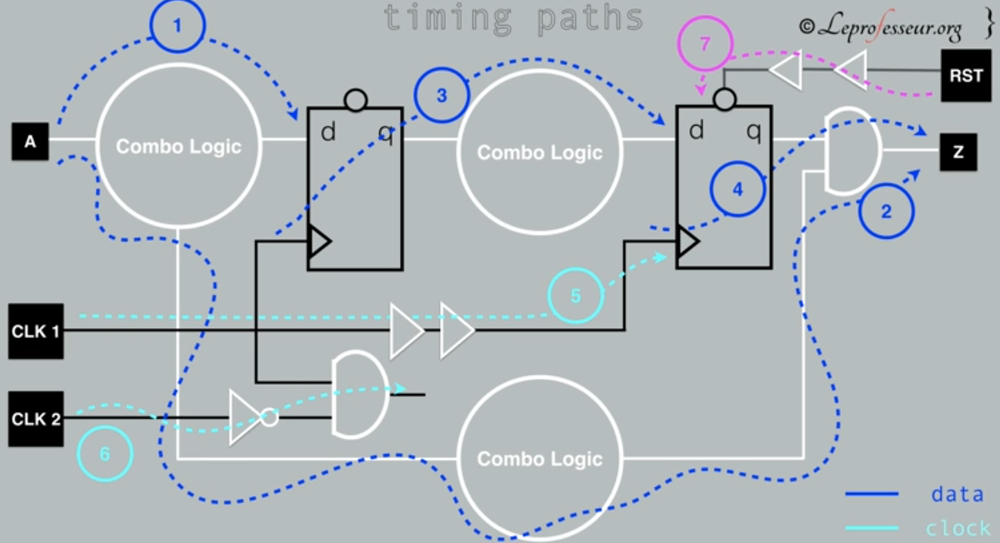
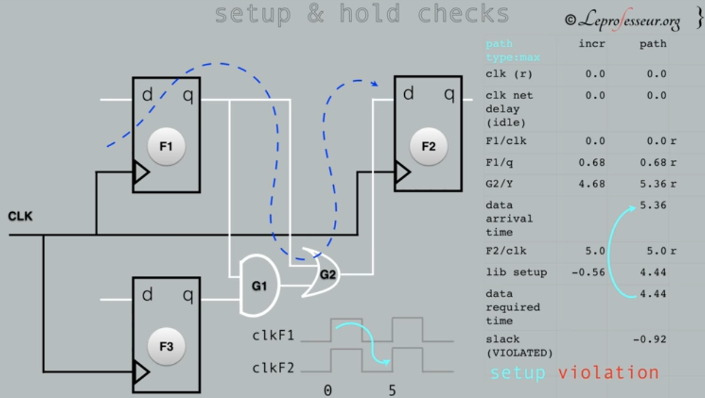
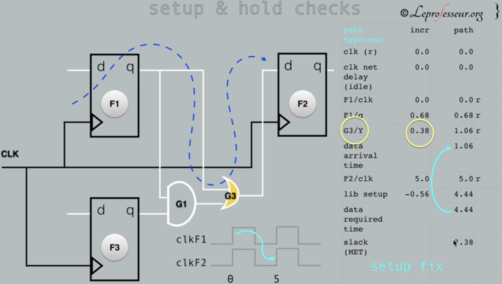
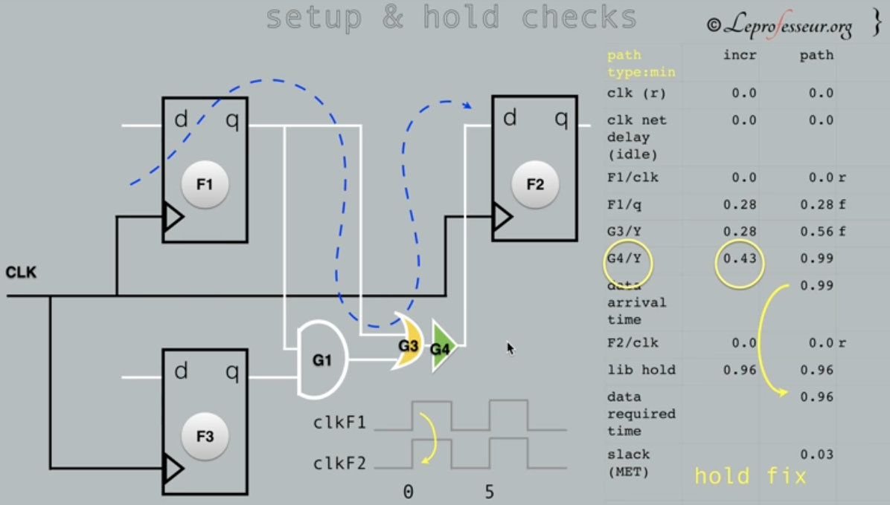

# Static Timing analysis
- source [this](https://www.youtube.com/watch?v=hFGq3XdtgeM&list=PLFhizsGPFKt8gz-bYlKMDCgBKwxMc33H2&index=19&t=0s) tutorial on static timing analysis

## hold and setup time
- setup time is associated with the clock
- hold time is associated with the data
- if hold time isn't satisfied (violated) insert buffers
- hold time violations must be fixed

## Detecting problems in design flow

## static timing analysis

- Timing Paths
    - Blue: data path 1,2 Asynchronized, 3 synchronized
    - Crayn: clock path (clock with combinational logic)
    - violet : reset path

## Example
### 1) Setup Time (max delays)
- Clk delays = 0,
- FF1 propagation delay =0.68 (for d to get to q it needs 0.68time) ->total path till now d->q=0.68
- G2 propagation delay=4.68(from i/p start to get result)-> total path till now=4.68+0.68=5.36
- So input at FF2 d will arrive at 5.36 time,
- F2clock arrives at 5, and its setup time(time required for the input to be present before the clock) is -0.56 (input should  be present before the clock arrives by0.56),
- So input at d should be present at 5-0.56=4.44
- But it is present at 5.36, so we have setup time violation (slack) by 4.44-5.36=-0.92

#### Solution:
1- setup time violations associated with the clock, so we can increase F2 clock time
2- change G2 cell, it takes most of the time, replace it with another cell with less max delay

### 2)Hold Time(min delays)
- FF1 minimum time d->q, (minimum possible time for the data to change)=0.28
- G2 minimum time i/p->Y,=0.28 ->total minimum path time till now=0.56
- So data at FF2 input minimum hold time required = 0.96
- But minimum possible arrival time (minimum time data could change in) is 0.56
- So we have a hold time violation

#### Solution:
- Add a buffer to add more delays at the FF2 input
- But this may corrupt setup time check so do it again and repeat
- Then  do equivalence and functional checks again  and repeat

