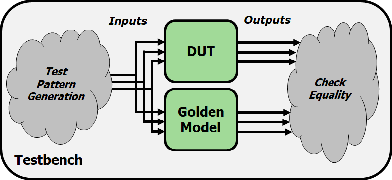

# Timing and verification
- source ([Design of Digital Circuits](https://safari.ethz.ch/digitaltechnik/spring2019/doku.php?id=schedule)| [lecture 8](https://www.youtube.com/watch?v=N7uENNORKB4&list=PL5Q2soXY2Zi8J58xLKBNFQFHRO3GrXxA9&index=9) | ETH Zürich, Spring 2019)

## Golden model
- A golden model represents the ideal circuit behavior
- Must be developed, and might be difficult to write
- Can be done in C, Perl, Python, Matlab or even in Verilog
- Simpler than gate-level description
- Golden model is usually easier to design and understand
- Golden model is much easier to verify

## Automatic Testbench
- The DUT output is compared against the golden model



### Challenge need to generate inputs to the designs
- Sequential values to cover the entire input space --->  TEST COVERAGE
- Random values --> cannot cover all possible cases, generate a test pattern to cover almost all cases

```
    module testbench1();
    ... // variable declarations, clock, etc.

    // instantiate device under test
    sillyfunction dut (a, b, c, y_dut);
    golden_model gold (a, b, c, y_gold);

    // instantiate test pattern generator
    test_pattern_generator tgen (a, b, c, clk);

    // check if y_dut is ever not equal to y_gold
    always @(negedge clk)
    begin
   	 if(y_dut !== y_gold)
   	 	$display(...)
    end
    endmodule
```

### Pros:
- Output checking is fully automated
- Could even compare timing using a golden timing model
- Highly scalable to as much simulation time as is feasible
- Leads to high coverage of the input space
- Better separation of roles
- Separate designers can work on the DUT and the golden model
- DUT testing engineer can focus on important test cases instead of output checking

### Cons:
- Creating a correct golden model may be (very) difficult
- Coming up with good testing inputs may be difficult

### Notes
- Brute force testing is not feasible for most circuits!
- Need to prune the overall testing space
- E.g., formal verification methods, choosing ‘important cases’


## Timing verification
### High-level simulation (e.g., C, Verilog)
- Can model timing using “#x” statements in the DUT
- Useful for hierarchical modeling
- Insert delays in FF’s, basic gates, memories, etc.
- High level design will have some notion of timing
- Usually not as accurate as real circuit timing

### Circuit-level timing verification
- Need to first synthesize your design to actual circuits
- No one general approach- very design flow specific
- Your FPGA/ASIC/etc. technology has special tool(s) for this
- E.g., Xilinx Vivado (what you’re using in lab)
- E.g., Synopsys/Cadence Tools (for VLSI design)

### The Good News
- Tools will try to meet timing for you!
- Setup times, hold times
- Clock skews
- They usually provide a ‘timing report’ or ‘timing summary’
- Worst-case delay paths
- Maximum operation frequency
- Any timing errors that were found

### The Bad News
- The tool can fail to find a solution
- Desired clock frequency is too aggressive
- Can result in setup time violation on a particularly long path
- Too much logic on clock paths
- Introduces excessive clock skew
- Timing issues with asynchronous logic

- The tool will provide (hopefully) helpful errors  
- Reports will contain paths that failed to meet timing
- Gives a place from where to start debugging

### How can we fix timing errors?
- Unfortunately, this is often a manual, iterative process
- Meeting strict timing constraints (e.g., high performance designs) can be tedious
- try synthesis/place-and-route with different options
    - Different random seeds
    - Manually provided hints for place-and-route
- Manually optimize the reported problem paths
    - Simplify complicated logic
    - Split up long combinational logic paths
    - Recall: fix hold time violations by adding more logic!

### Meeting Timing Constraints: Principles
- Let’s go back to the fundamentals
- Clock cycle time is determine by the maximum logic delay we can accommodate without violating timing constraints
- Good design principles
    - Critical path design: Minimize the maximum logic delay
    - Maximizes performance
    - Balanced design: Balance maximum logic delays across different parts of a system (i.e., between different pairs of flip flops)
    - No bottlenecks + minimizes wasted time
    - Bread and butter design: Optimize for the common case, but make sure non-common-cases do not overwhelm the design
    - Maximizes performance for realistic cases

### Summary
- Timing in combinational circuits
    - Propagation delay and contamination delay
    - Glitches
- Timing in sequential circuits
    - Setup time and hold time
    - Determining how fast a circuit can operate
    - Circuit Verification
- How to make sure a circuit works correctly
    - Functional verification
    - Timing verification