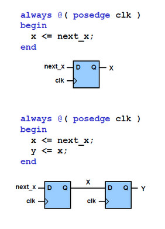
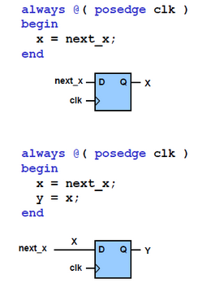

# sequential circuits

source : [Lecture 7](https://www.youtube.com/watch?v=NfqgM3QbiVk&list=PL5Q2soXY2Zi8J58xLKBNFQFHRO3GrXxA9&index=7)- Design of Digital Circuits


## Blocking and non Blocking assignment
- the symbol ‘<=’ is used. It is known as a non-blocking statement, whereas in ‘assign’ statements, we use ‘=’ symbol called the blocking statement. 
- In an ‘always’ block, if we use ‘=’ instead of ‘<=’, the compiler tool will complain.
- '<=' non-blocking statement, to indicate a register sequential circuit
- '=' blocking statement, to indicate a combinational circuit


### Non-blocking (<=)
```
    always @ (a)
    begin
        a <= 2’b01;
        b <= a;
        // all assignments are made here
        // b is not (yet) 2’b01
    end
```
- All assignments are made at the end of the block
- All assignments are made in parallel, process flow is not-blocked



### Blocking (=)
```
    always @ (a)
    begin
        a = 2’b01;
        // a is 2’b01
           b = a;
        // b is now 2’b01 as well
        end
```

- Each assignment is made immediately
- Process waits until the first assignment is complete, it blocks progress




### Why use (Non)-Blocking Statements
- There are technical reasons why both are required
- It is out of the scope of this course to discuss these

- Blocking statements allow sequential descriptions, more like a programming language

- If the sensitivity list is correct, blocks with non-blocking statements will always evaluate to the same result
- This may require some additional iterations

### Rules for Signal Assignment
1- Use always `@(posedge clk)` and non-blocking assignments (<=) to model synchronous sequential logic
```always @ (posedge clk)
      		q <= d; // non-blocking```

2- Use continuous assignments (assign) to model simple combinational logic.
 	 `assign y = a & b;`

3- Use `always @ (*)` and blocking assignments (=) to model more complicated combinational logic.

4- You cannot make assignments to the same signal in more than one always block or in a continuous assignment

------

## Notes
- each of the ‘if’ or ‘else if’ statements would create a nested two input multiplexer and, thereby, slowing the system operation. From experience, we suggest that you don’t exceed four or five such nesting. Smaller

- If you have many signal outputs (registers) in one sequential ‘always’ block, debugging the code will be a frustrating experience. It is, therefore, highly recommended that one should have only one register in one ‘always’ block pipelining

- The logic must normally be put outside the always block using ‘assign’ statements for improving the speed of operation

```
    `define S0 3'd0 // Define a macro
    case(state)
        `S0:
   	    begin
   	    //
   	    end
        default:
   	    //
        end // end case
```