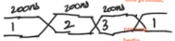
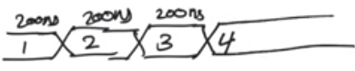

# Wait statement
source [this](https://www.youtube.com/playlist?list=PLyWAP9QBe16p2HXVcyEgGAFicXJI797jK) playlist on VHDL design.

## Wait statement
   - More appropriate, verstail, and more useful way to manage flow in a process
   - It can be used in a process and it  causes a process to wait

## ways to used wait statement
- 4 ways to use wait statement, some uses are unsynthesizable 
### unconditional wait
   - causes a process to freeze until the end of simulation 
   - not synthesizable
   - Special case of wait for - wait forever

```
process
begin
    reset <= '1';
    wait for 200ns;
    reset <= '0';
    wait;
end process;
```

### wait for certain amount of time
   - not synthesizable
```
process
begin
    clk <= '1'
    wait for 200ns;
    clk <= '0';
    wait for 200ns;
end process; -- a clock signal with period = 400ns
```

### wait until condition;
- A condition is written to wait on it becoming true

```
process
begin
    wait until clk'event and clk='1';
    Q <= D;
end process;
```

### wait on list of signals
- A list of signals is written to pause the process till an event happens on them

```
process
begin
    if sel="00" then
        Q <= A;
    elsif sel="01" then
        Q <= B;
    elsif sel="10" then
        Q <= C;
    else
        Q <= D;
    end if;
    wait on sel, A, B, C, D; -- sensitivity list
end process;
```

## Wait statement and senstivity list
When we use a process we can either use a process with a sensitvity list, or a process that contains wait statements, we cannot use a both at the same time mutually exclusive


## Rules to understand about how the process is executed
   - At startup, the process executes, so the process always execute at least once when the process starts up 
   - The process always loops when it ends, it never fails to loop back when it reaches the end process statement
   - The process will freeze at a wait statement
## effect of wait statement on events and transactions
   - A signal assignment in a process is a transaction not an event
   - Transactions become events only when we reach a wait statement
   - If there is wait statements in the process and you reach the end of the process without a wait statement, all transactions that have not turned into event are trashed
   - A process with a sensivity list is a process with wait on statement at the end of the process
   - So the cardinal rule of when transaction turn into an event, is A transaction turns into an event only when it meets wait statement

```
process
begin
    Din <= conv_std_logic_vector(1,4);
    wait for 200ns;
    Din <= conv_std_logic_vector(2,4);
    wait for 200ns;
    Din <= conv_std_logic_vector(3,4);
    wait for 200ns;
    Din <= conv_std_logic_vector(4,4);
end process;
```


```
process
begin
    Din <= conv_std_logic_vector(1,4);
    wait for 200ns;
    Din <= conv_std_logic_vector(2,4);
    wait for 200ns;
    Din <= conv_std_logic_vector(3,4);
    wait for 200ns;
    Din <= conv_std_logic_vector(4,4);
    wait;
end process;
```


## verdict on wait statement 
   - wait for and unconditional wait statements are generally unsynthesizable and should only be used in the test bench
   - wait until statement can be used to create loops or flip flops but there is syntax that is clearer that can do both things
   - wait on statement can be used to create processes that behave as if they have a sensitivity list
