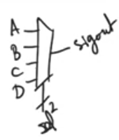

# Multiplexing in VHDL
source [this](https://www.youtube.com/playlist?list=PLyWAP9QBe16p2HXVcyEgGAFicXJI797jK) playlist on VHDL design.

## Mux outside process
- `When .. else` , `with .. select`
- Concurrent code that can be written in the body of an architecture outside the process statement
- Used to describe multiplexer and they are very safe to use
- The last else statement is else not else if and the last condition in with .. select is when others 
    - Cause the type is std_logic_vector can take values of 0,1,x, .. and values other than 0 and 1 so there is other possibilities for a 2 bit mux 
    - The synthesizer has to know what to do when other possibilities happen therefore the last statement has to include everything else, otherwise the synthesizer gonna give you an error because it doesn’t know what to do when the select line is at these other values
    - So it’s important to remember that std_logic types has other values, it’s safe in this case cause the synthesizer gonna give you an error, but it’s not the case in the process 

```
signout <= A when sel="00" else
    B when S="01" else
    C when S="10" else
    D;
```

```
with sel select
signout <= A when "00"
    B when "01"
    C when "10"
    D when others;
```



## Mux inside a process 
- Process statement allows us to use a host of a very flexible syntax
- `if .. else` , and `case` statements, very similar to programming languages and behaves the same way
- Multiplexers are combinational logic, so when implemented in a process we have to have a fully populated sensitivity list
    - Look at the right side of the statements, any signal used in assignment, put it in the list
- Last statement is else not elsif cause the same reason of std_logic can take other values than 0, 1
    - The problem is that you can write if .. else structure that is missing some of the conditions cause having this option is necessary to be able to declare memory statements. 
    - latches, registers require you to declare if … else statements with some missing conditions
    - Same with the last case in case statement, it has to be when others
- Difference between mux using if .. else in process and outside is that in process it’s a priority encoder, the order of conditions matter 
- You can mix ifs and case statements as you like as long as you make sure there is always an exhaustive list of conditions, and fully populated sensitivity list

```
process(sel, A, B, C, D)
begin
    if sel="00" then
        sigout <= A;
    elsif sel="01" then
        sigout <= B;
    elsif sel="10" then
        sigout <= C;
    else
        sigout <= D;
    end if;
end process;
```

```
process(sel, A, B, C, D)
begin
    case sel is 
    when "00" =>
        sigout <= A;
    when "01" =>
        sigout <= B;
    when "10" =>
        sigout <= C;
    when OTHERS =>
        sigout <= D;
    end case;
end process;
```